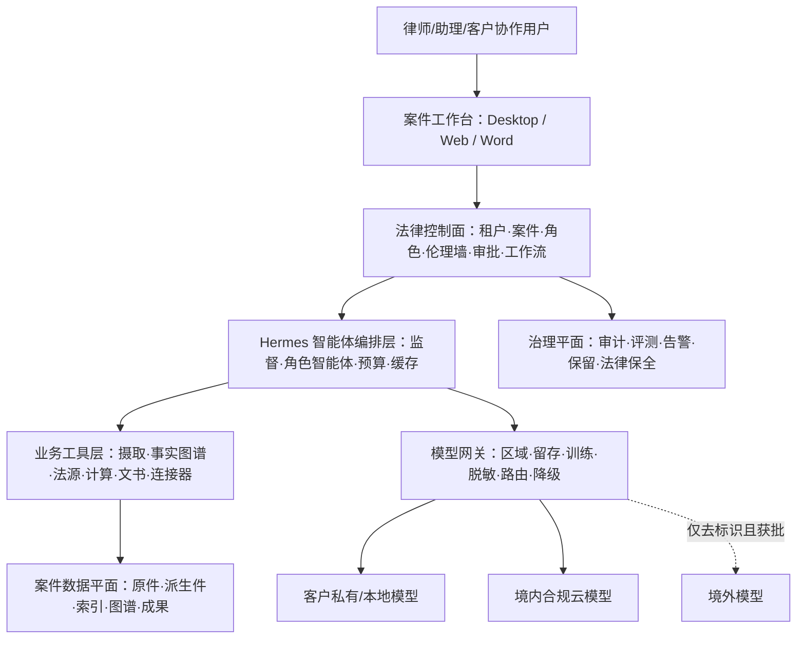
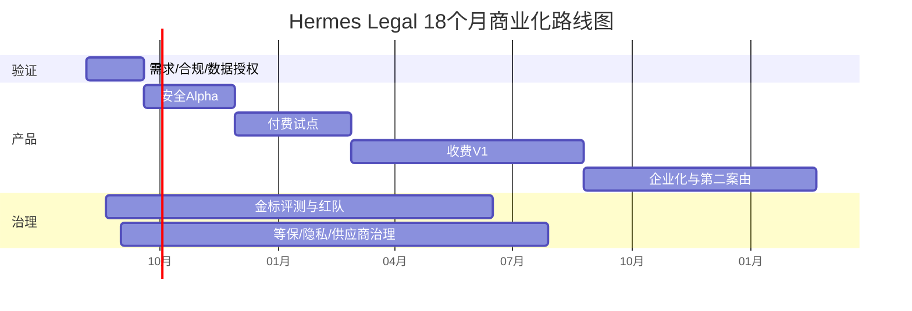

# Hermes 法律 AI 商业化规划

## 从通用个人智能体到“可验证的案件工程与法律协作平台”

**版本：** V1.0（战略与产品立项版）  
**基准日期：** 2026 年 8 月 4 日  
**适用市场：** 中国大陆，以持证律师、律师事务所和企业法务团队为首要客户  
**规划周期：** 0—18 个月产品建设，3 年商业模型  
**建议决策：** **有条件立项（Conditional Go）**  
**文档属性：** 内部规划材料；不构成针对具体业务的正式法律意见、等保定级结论或监管备案结论

---

## 阅读指南与研究口径

本规划回答六个问题：为什么值得做、第一步做什么、哪些事情坚决不做、Hermes 哪些能力可以复用、怎样把多智能体变成受控的生产系统、如何在 18 个月内验证商业闭环。

研究采用四类证据：

1. **代码事实**：直接审计当前 Hermes Agent 代码库、MIT 许可、工具权限、会话存储、子智能体、插件和桌面端实现。
2. **强制性规范**：现行法律、行政法规、部门规章及生效的监管办法。
3. **参考性规范**：律师协会指引、国家推荐性标准、最高人民法院司法 AI 意见、NIST 等治理框架。
4. **市场证据**：国内外法律科技产品官方资料、专业服务采用报告和法律 AI 可靠性论文。

文中“必须”仅在对应强制性依据或本项目内部发布门禁中使用；“建议”“目标”“假设”分别表示管理建议、拟定指标和仍需客户验证的商业参数。所有价格、预算、渗透率和收入预测均为规划假设，不是市场报价或业绩承诺。

---

# 一、执行摘要

## 1.1 一句话结论

**可以商业化，但不应从“面向公众的多智能体数字律师事务所”起步。** 最优切入点是：以 Hermes 的编排、模型适配、桌面端和审批机制为技术底座，重构为一套面向持证法律专业人士的 **案件工程工作台**，首先解决海量材料接收、证据保全、事实梳理、争点拆解、法律检索和文书初稿中的重复劳动，并让每一个重要结论都能回到原始材料页码、有效法条或权威案例。

对外推荐定位：

> **持证律师监督下的、证据可追溯的案件梳理与法律协作平台。**

不推荐的首发定位：

> “自动律师”“无人律所”“AI 独立办案”“胜诉预测神器”。

原因不是营销保守，而是产品责任结构不同。《律师法》将律师定义为依法取得执业证书、接受委托或指定、为当事人提供法律服务的执业人员，并禁止未取得执业证书者以律师名义从事法律服务；律师还承担保密、利益冲突和交付责任。[《中华人民共和国律师法》](https://xzfy.moj.gov.cn/c/2021-01-06/487877.shtml) 因此，产品必须明确：**AI 生成的是待审工作成果，持证律师才是专业判断、客户沟通、签署、提交和责任承担主体。**

## 1.2 投资主张

建议以“六项立项门槛”批准项目：

| 门槛 | 立项要求 | 未达标处理 |
|---|---|---|
| 场景门槛 | 只做商业合同类民商事争议的材料梳理与受控起草 | 不扩到刑事、家事未成年人、国家秘密案件 |
| 客户门槛 | 首批 5—8 家共创律所，每家提供 3—5 个有合法授权的历史或在办案件 | 不凭内部想象开发半年 |
| 质量门槛 | 外发成果虚构法条/案例为零；重要结论来源覆盖率 100% | 不允许用“总体准确率”掩盖致命错误 |
| 效率门槛 | 在完整计入律师复核时间后，案件梳理净工时下降至少 30% | 若三轮迭代后仍不达标，停止扩张 |
| 安全门槛 | 跨租户泄露测试为零；生产环境取消通用终端、YOLO 和未签名插件 | 未完成前不得接收真实案件原件 |
| 商业门槛 | 至少 3 家试点客户愿意按年付费，且可复现采购路径 | 只有“喜欢”没有付费则不进入规模销售 |

## 1.3 战略选择

本规划作出七个明确选择：

1. **先 B2B，再考虑 B2B2C；不直接做大众法律咨询。** 先服务律所和法务，降低无监督输出、获客合规与人格化交互风险。
2. **先做案件事实与证据工程，再做法律策略生成。** 事实梳理更高频、更可验证，也更容易形成工作流和数据壁垒。
3. **先做一个案由簇，不做“全能法律 AI”。** 首发选择商业合同争议；第二阶段再评估建设工程或劳动争议。
4. **“多智能体”是内部实现，不是首要卖点。** 客户购买的是更快、更稳、更可审计的工作成果，而不是智能体数量。
5. **中国境内数据面与模型网关优先。** 原始案件材料默认不得进入境外模型；敏感材料优先私有化或客户专属环境。
6. **每个动作都受案件、角色和授权约束。** 生产智能体没有通用 Shell、任意网页发布、任意跨案件检索或自动外发权限。
7. **可验证性优先于语言流畅度。** 任何“看起来像律师写的”但找不到证据或有效法源的内容，都视为未完成品。

## 1.4 建议的产品三层结构

| 层级 | 客户价值 | 主要产物 | 商业化顺序 |
|---|---|---|---|
| L1 案件工程层 | 把杂乱卷宗变成结构化、可追溯的案件底稿 | 文档目录、实体表、时间线、证据表、矛盾项、缺口清单 | MVP 核心 |
| L2 验证型法律协作层 | 将事实与请求权、法条、案例和文书模板连接 | 争点树、要件—事实—证据矩阵、检索报告、文书初稿 | 试点后半段 |
| L3 受控多智能体工作流 | 并行完成研究、对抗审查、起草和验证 | 可复盘任务链、角色化产出、审批记录 | 收费 V1 后逐步开放 |

## 1.5 18 个月目标态

到第 18 个月，产品应具备：

- 50—100 家付费机构或等价的企业客户组合；
- 商业合同争议的端到端受控工作流，另有一个案由簇进入有限可用；
- SaaS、专属云和私有化三种交付模式，但共用一套版本与策略控制面；
- 权威法源合作或合法授权的数据供应链；
- 完整的租户/案件隔离、利益冲突墙、不可抵赖审计、数据生命周期和模型供应商治理；
- 经过盲测的事实抽取、证据关联、法律引证和文书审查评测集；
- 年度经常性收入（ARR）进入 1,500 万—3,000 万元的可验证区间，或以更高客单价的私有化合同达到同等收入质量。

## 1.6 北极星指标

> **每个经律师审核通过的“案件工作包”所节省的净工时。**

“净工时”必须扣除上传、纠错、等待、来源核验和审阅时间；“案件工作包”至少包含时间线、争点/要件矩阵、证据目录、缺口清单及一份待审法律工作成果。该指标避免团队沉迷调用次数、Token 消耗、文档字数或智能体数量等虚荣指标。

---

# 二、项目基线：Hermes 能复用什么，必须重构什么

## 2.1 许可与商业使用结论

当前仓库根许可证为 **MIT License**，允许使用、复制、修改、合并、发布、分发、再许可和销售，但商业发行必须在软件副本或重要部分中保留原版权及许可声明。许可证不提供任何明示或默示保证。

商业化前仍需完成三项独立工作：

- 对 Python、Node/Electron、模型 SDK、OCR、字体、文档解析和数据库依赖做完整 SBOM 与许可证扫描；
- 对法律数据库、案例、模板、客户历史文书和模型训练/评测语料分别取得授权，不能把开源代码许可误当作数据许可；
- 对品牌、商标、产品名称和上游贡献者署名制定发行规则。

## 2.2 当前代码资产的商业价值

Hermes 已经提供一个相当成熟的“智能体操作系统”底座：同一核心可运行在 CLI、消息网关、TUI 和 Electron 桌面端；支持跨模型供应商、长会话、记忆、插件/MCP、审批、子智能体、定时任务、浏览器和终端工具。这些能力显著缩短原型周期，尤其适合构建“法律任务编排层”。

值得直接复用或抽取的能力：

| 现有能力 | 代码事实 | 商业化处理 | 复用判断 |
|---|---|---|---|
| 会话循环与提示缓存 | 长会话、严格角色交替、缓存稳定性已有系统设计 | 保持为智能体内核，不把案件动态权限塞进系统提示词 | 高复用 |
| 多模型/供应商适配 | 统一 Agent 接口与多种 API 模式 | 外置为“模型网关”，增加中国区域、留存、训练和跨境策略 | 高复用 |
| 子智能体委派 | 子任务隔离、独立任务 ID、继承并裁剪工具集、默认不递归 | 改为法律角色卡、案件作用域和显式输入/输出契约 | 高复用 |
| 工具注册与 `check_fn` | 工具可按服务条件隐藏，插件覆盖需显式授权 | 用于案件角色工具白名单和服务能力门控 | 高复用 |
| 审批机制 | 危险命令识别、人工审批、桌面端审批交互 | 升级为法律动作审批；生产版移除 YOLO/关闭审批选项 | 中高复用 |
| Electron 桌面安全基线 | `contextIsolation=true`、`nodeIntegration=false`、`sandbox=true` | 作为案件工作台外壳，重做信息架构 | 高复用 |
| 插件/MCP | 支持边缘能力扩展，符合“窄核心”理念 | 仅允许签名、审核、固定版本的连接器；高风险插件进隔离进程 | 中高复用 |
| SessionDB 与 FTS | SQLite、消息谱系、全文检索、压缩与恢复 | 只保留会话用途；不得充当正式案件证据库 | 有限复用 |
| 文件读取/文档提取 | 可解析常见文件、PDF 附件和 Office 文档 | 用作原型；重建法律级摄取、OCR、坐标和保全链 | 有限复用 |
| 消息平台网关 | 支持多渠道接入 | MVP 关闭真实案件材料经普通聊天平台流入 | 暂缓 |
| 通用终端/浏览器/计算机控制 | 通用能力很强 | 生产案件智能体默认禁用，研究连接器单独沙箱化 | 不直接复用 |

## 2.3 关键代码审计发现

### 2.3.1 当前“文件安全”不是安全边界

`agent/file_safety.py` 的注释明确说明，其读写保护是降低误操作的纵深防御，并非安全边界；同一 OS 用户下的终端仍可能绕过限制。这一设计对个人智能体合理，但不满足律师客户对案件隔离、保密和最小权限的要求。

**商业化要求：** 每个生产任务在容器或微虚拟机内运行，挂载只读或最小可写的案件视图；禁用宿主机通用终端；网络出口按域名、协议和任务策略控制；临时目录随任务销毁。

### 2.3.2 会话数据库不是案件库

当前 SessionDB 以 SQLite 保存消息正文、工具调用、推理字段和显示元数据，未发现数据库级透明加密或 SQLCipher 密钥机制。它适合个人会话恢复和全文搜索，不适合直接存放多租户案件原件、证据保全记录或高度敏感个人信息。

**商业化要求：** 新建案件数据平面；原件、派生文本、索引、工作成果和审计分别存储；使用租户/案件密钥、对象级权限、不可变原件和独立备份恢复策略。

### 2.3.3 通用工具面过宽

`_HERMES_CORE_TOOLS` 包含终端、进程、文件写入、浏览器、代码执行、子智能体、定时任务等广泛能力。即使具备审批，法律场景也不能让每个角色默认看到全部工具，否则文档提示注入、误操作或模型越权可能转化为真实外部动作。

**商业化要求：** 将工具选择从“平台默认”改为 `租户策略 ∩ 案件策略 ∩ 角色卡 ∩ 当前任务 ∩ 用户授权` 的交集；默认拒绝；智能体只能调用业务语义工具，如“读取案件页”“创建待审时间线条目”“查询已授权法源”，而不是自由 Shell。

### 2.3.4 存在不适合生产法律环境的绕过模式

当前审批系统支持 `--yolo`、会话级 YOLO 和 `approval_mode=off`；子智能体也存在显式配置后的自动批准路径。这些是个人代理产品的效率功能，却会破坏法律工作流的责任门槛。

**商业化要求：** 法律生产发行版在构建和服务端双重禁止 YOLO；外发、删除、跨案件检索、连接外部系统、改变保留策略等高风险动作必须使用不可绕过审批，部分动作要求双人复核。

### 2.3.5 插件是受信任代码，不是沙箱

Hermes 插件加载器会在主进程导入插件并执行 `register(ctx)`；用户、项目或 pip 插件可以扩展能力，特定条件下还能覆盖工具。这符合开发者产品定位，但在律所环境中等同于执行第三方代码。

**商业化要求：** 生产环境默认关闭项目/用户/pip 插件；只开放签名、上架审核、版本锁定的连接器；连接器使用独立身份、最小 OAuth 范围和单独进程；插件升级必须重新做数据流与权限审查。

### 2.3.6 现有记忆不具备案件伦理墙

文件型长期记忆和外部记忆提供者面向个人跨会话学习，不天然理解客户、案件、利益冲突或删除/法律保留要求。

**商业化要求：** 默认不把案件内容写入个人长期记忆；知识分为“公开法源”“律所批准知识”“客户知识”“案件私有事实”四个域；任何跨域复用都需策略许可和来源标识。

### 2.3.7 现有隐私脱敏不足

当前 `privacy.redact_pii` 默认关闭，主要处理用户 ID 和电话号码，不等同于法律材料的实体识别、敏感个人信息判断、商业秘密识别或可逆令牌化。

**商业化要求：** 建立中文法律 DLP：身份证、银行卡、联系方式、地址、医疗、财务、未成年人、特定身份、案号、公司秘密、印章和签名等分类；脱敏必须在受控本地环境执行，并保存字段级处理依据。

### 2.3.8 附件处理不是证据摄取链

现有 PDF 栅格化、文件暂存和 Office 文本提取可支持对话，但没有完整的入库哈希、原件不可变存储、恶意文件沙箱、OCR 版面坐标、页码锚点、版本关系、重复件识别和导出清单。

**商业化要求：** 单独建设“证据摄取服务”，见第六章。

## 2.4 推荐的代码演进方式

不建议直接在 Hermes 核心中堆叠法律功能。遵循项目自身“窄核心、边缘扩展”的设计哲学，采用三层结构：

1. **Hermes Core Fork/Package**：保留编排循环、供应商适配、缓存、批准与子智能体框架，持续跟踪上游安全修复。
2. **Legal Control Plane**：新增租户、案件、角色、策略、审计、模型路由、工作流状态机和评测门禁；这是商业产品核心。
3. **Legal Domain Services**：证据摄取、法源检索、事实图谱、要件矩阵、文书渲染、DMS/OA 连接器，以服务门控工具、独立服务或 MCP 形式提供。

这样既避免每次上游升级发生大规模冲突，也防止法律能力增加到所有通用 Hermes 用户的常驻工具 schema 中。

---

# 三、市场与客户：从谁的哪一项工作切入

## 3.1 市场不是“所有需要法律帮助的人”

市场应按责任主体和采购能力拆分：

| 客群 | 核心痛点 | 付费者 | 风险/难点 | 优先级 |
|---|---|---|---|---|
| 20—200 人律所的争议解决团队 | 卷宗多、协作乱、初级律师重复劳动、质量不一致 | 主任/合伙人/部门负责人 | 决策分散、工作习惯强 | **第一优先** |
| 10—50 人精品诉讼所 | 人手少、案件密度高、合伙人复核负担重 | 主任/创始合伙人 | 预算敏感 | 第一优先的轻量版 |
| 大型律所 | 数据、知识和安全要求高，跨办公室协作复杂 | 管委会/CIO/创新委员会 | 采购周期长、集成重 | 第二优先 |
| 企业法务/合规部门 | 外部律师费高、案件台账分散、管理层汇报慢 | 总法/采购/信息安全 | 需接 OA、合同、邮件与诉讼系统 | 第二优先 |
| 个人律师/小微所 | 对提效强烈、购买决策快 | 个人 | 客单价和支持成本不匹配 | 后续产品化获客 |
| 公众当事人 | 信息不对称、法律服务价格高 | 个人 | 无监督建议、获客与执业边界、投诉量 | **MVP 不做** |
| 法院/政府法律服务 | 大规模材料和公共服务需求 | 政府采购 | 信创、密码、等保、政务数据要求高 | 有能力后专项进入 |

司法部公布的 2022 年数据表明，律师 10 人及以下的律所占 65.5%，11—20 人占 20.74%，21—50 人占 10.44%，51 人以上合计约 3.32%。这意味着中国律所市场高度分散：大客户客单价高但数量少，小所数量大但必须提供低部署成本的标准化产品。[司法部律师工作统计](https://www.moj.gov.cn/pub/sfbgw/zwxxgk/fdzdgknr/fdzdgknrtjxx/202306/t20230614_480740.html)

因此，首发不应按“整所规模”寻找客户，而应瞄准 **5—30 人、年处理 50 件以上材料密集型案件的争议解决团队**。团队可以位于 20 人精品所，也可以位于千人大所。

## 3.2 首发 Jobs-to-be-Done

当一个律师团队接到数百份 PDF、微信截图、合同附件、付款凭证和往来邮件时，它真正雇佣产品完成的是：

> “在不泄露、不遗漏、不篡改的前提下，尽快把材料变成我能审核、能讨论、能引用、能交付的案件底稿，并告诉我最值得追问和补证的地方。”

这个工作由五个连续任务构成：

1. 知道收到了什么，哪些重复、缺页、损坏或来源不明；
2. 知道谁在什么时间做了什么，事实之间是否矛盾；
3. 知道每项主张需要什么法律要件和证据；
4. 知道现有证据能支持到什么程度、缺口在哪里；
5. 在律师确认的事实和策略上形成可复核的检索报告与文书初稿。

## 3.3 首发案由选择

采用“材料强度、流程重复性、结果可验证性、数据风险、付款能力、法律变化速度”六维评分：

| 案由簇 | 材料强度 | 可标准化 | 数据敏感 | 商业付费 | 结论 |
|---|---:|---:|---:|---:|---|
| 商业合同争议 | 高 | 高 | 中 | 高 | **首发** |
| 建设工程/工程款 | 很高 | 中高 | 中 | 高 | 第二案由候选 |
| 劳动争议 | 中 | 高 | 高（员工敏感信息） | 中 | 标准版成熟后 |
| 知识产权争议 | 高 | 中 | 高（技术秘密） | 高 | 私有化能力成熟后 |
| 破产/债权申报 | 很高 | 高 | 高 | 高 | 需要批量债权和流程模块后 |
| 企业内部调查 | 很高 | 中 | 很高 | 很高 | 安全与权限体系成熟后 |
| 刑事案件 | 很高 | 低 | 极高 | 中高 | **MVP 排除** |
| 婚姻家事/未成年人 | 中 | 中 | 极高 | 中 | **MVP 排除** |
| 国家秘密/工作秘密相关 | 不定 | 不定 | 极高 | 不定 | **普通产品永久禁止接收** |

### 首发场景定义

**商业合同争议案件准备工作台**，覆盖合同成立与效力、履行与违约、解除、价款/损失、担保、管辖、时效等常见争点。首发不是对所有争议给出最终法律结论，而是稳定生产：

- 材料清单与证据编号建议；
- 当事人/关联方/合同关系图；
- 带页码来源的事实时间线；
- 争点树及请求权候选；
- 要件—事实—证据—反证—缺口矩阵；
- 对方可能主张与矛盾点；
- 律师确认范围内的法规案例检索；
- 起诉状、答辩状、代理意见或法律备忘录的待审初稿。

## 3.4 竞争格局

### 3.4.1 国内竞品

| 类别/代表 | 已有优势 | 我方不应硬碰的领域 | 可形成差异的方向 |
|---|---|---|---|
| iCourt Alpha | 法律检索、合同、文书、证据、协同办案和律所管理一体化；官方页面称已有大规模法律用户 | 全栈律所 OS 和存量用户网络 | 以“案件事实图谱 + 可验证工作包 + 深度部署治理”切入 |
| 北大法宝/威科先行 | 长期积累的权威法律内容、法条案例关联和检索能力 | 自建同等规模内容库 | 合作或采购 API/数据授权，把法源验证做成工作流 |
| 元典等法律数据 API | 法条/案例校验、幻觉检测、开放接口 | 重复建设内容校验底层 | 作为可替换验证器，保持多供应商策略 |
| 通用大模型/办公 AI | 低价、使用方便、模型能力进步快 | 单纯聊天、摘要和通用写作 | 案件权限、证据链、法源时效、复核与审计 |

iCourt 官方资料已覆盖法律检索、合同审查、文书起草、证据系统、法律意见和知识库；北大法宝已提供基于 MCP 的智能法律服务；威科先行把 AI 与其法律数据库结合；元典开放平台提供法条/案例引证校验。这表明“给律师一个法律聊天框”已经没有足够差异。[iCourt Alpha](https://www.icourt.cc/) [北大法宝 MCP](https://mcp.pkulaw.com/) [威科先行 AI+](https://www.wolterskluwer.cn/solutions/Info/10029) [元典开放平台](https://open.chineselaw.com/)

### 3.4.2 国际参照

| 产品 | 值得学习 | 不应照搬 |
|---|---|---|
| Harvey / Legora | 专业服务工作台、团队知识、Word 与 DMS 集成、复杂工作流 | 依赖境外模型与法源、面向全球大所的高成本实施 |
| Thomson Reuters CoCounsel | 权威内容、引证、研究与起草一体、引导式 agentic workflow | 其 Westlaw/Practical Law 内容壁垒无法短期复制 |
| Lexis+ with Protégé | Shepard’s 引证状态验证、多模型与工作流 | 普通 RAG 无法等价替代编辑体系和 citator |
| Clio Manage AI | AI 嵌入案件系统，执行日历、任务、账单等动作但保留审批 | 中国律所管理、收费和本地生态不同 |
| Relativity aiR | 证据审阅、权限与大规模数据工作流 | 不在 MVP 复制完整电子取证平台 |
| Luminance | 合同批量审查、Word 内修改与 playbook | 首发重点是争议案件而非交易合同生命周期 |

国际主流产品的共同方向不是“更会聊天”，而是：**可信内容、案件上下文、完成具体动作、与现有系统融合、可审批、可审计。** [Harvey](https://www.harvey.ai/) [Legora](https://www.legorai.com/product) [CoCounsel Legal](https://legal.thomsonreuters.com/en/products/cocounsel-legal) [Lexis+ with Protégé](https://www.lexisnexis.com/en-us/products/lexis-plus-ai.page) [Clio Legal AI](https://www.clio.com/features/legal-ai-software/) [RelativityOne](https://relativity.com/data-solutions/ediscovery/) [Luminance](https://www.luminance.com/luminance-v-point-solutions/)

## 3.5 市场空位与可持续壁垒

真正可占据的空位是：

> **面向中国争议解决团队的、把案件原件转化为“事实—证据—法律—工作成果”可追溯图谱，并以私有部署和全过程治理交付的案件工作平台。**

壁垒不应押注单一模型，而由六部分叠加：

1. 获得合法授权、版本化且可校验的法源供应链；
2. 经过律师确认的案件事实/证据数据模型与案由 playbook；
3. 能测量净工时、漏项和引证质量的评测体系；
4. 律所 DMS、OA、邮箱、扫描件和 Word 工作流集成；
5. 案件伦理墙、审计和部署能力形成的信任成本；
6. 律师在真实工作中沉淀的结构化修订反馈，但只能在授权、去标识和严格隔离条件下使用。

## 3.6 市场容量：只做自下而上估算

以司法部 2022 年分层数据作为保守基数，21 人以上律所约 5,321 家。以下不是官方市场规模，而是便于决策的价格敏感性模型：

| 假设 | 目标机构数 | 年均合同额假设 | 对应年市场容量 |
|---|---:|---:|---:|
| 低位 | 5,321 | 15 万元 | 7.98 亿元 |
| 基准 | 5,321 | 30 万元 | 15.96 亿元 |
| 高位 | 5,321 | 80 万元 | 42.57 亿元 |

该估算尚未计入 20 人以下精品所、企业法务、政府法律服务和私有化建设费，也没有扣除实际采用率。因此它只能作为 **可服务市场（SAM）的价格敏感性边界**，不能用于融资材料中的确定性 TAM 宣称。前三年更应关注能否赢得 30、100、250 家机构，而不是讨论百亿元故事。

## 3.7 为什么现在做，但为什么不能急着扩张

一方面，全球专业服务的生成式 AI 采用持续增长；Thomson Reuters 2025 年报告基于约 1,700 名法律、税务、风险和政府专业人士，称超过一半受访者以某种方式使用过生成式 AI，80% 的律所受访者预计 AI 将根本改变业务。[2025 Generative AI in Professional Services](https://www.thomsonreuters.com/en/reports/2025-generative-ai-in-professional-services-report) [Future of Professionals 2025](https://www.thomsonreuters.com/en-us/posts/legal/future-of-professionals-action-plan-law-firms-2025/)

另一方面，采用不等于可靠。斯坦福研究对当时领先的 RAG 法律研究产品进行测试，仍发现约 17%—33% 的回答存在幻觉；其司法辖区与产品版本不同于中国市场，但足以证明“接了权威库就不会错”是危险假设。[Hallucination-Free? Assessing the Reliability of Leading AI Legal Research Tools](https://law.stanford.edu/wp-content/uploads/2024/05/Legal_RAG_Hallucinations.pdf)

所以正确窗口不是立即自动化律师，而是立即建设 **可验证、可监督、能量化净效率** 的基础设施。

---

# 四、产品定义与范围

## 4.1 产品定义

工作名称：**Hermes Legal Matter OS（案件工作操作系统）**。中文对外名称应避免“自动律所”，可在客户访谈中测试“案件镜”“证据链工作台”“智案协作台”等方向。

核心承诺：

> 从原始材料到律师可审的案件工作包，重要事实逐条有证据定位，重要法律结论逐条有有效法源，任何外部动作均由有权限的人确认。

## 4.2 明确不做的功能

MVP 和收费 V1 均不得提供：

- 面向公众的无人法律咨询或“AI 律师”人格化陪伴；
- 自动接受委托、报价、签约、收费或形成律师—客户关系；
- 自动向法院、仲裁机构、客户、对方或社交媒体提交/发送内容；
- 胜诉率、量刑、赔偿额的确定性预测或保证；
- 代替律师决定诉讼请求、和解底线、证据取舍和是否披露；
- 自动改写、覆盖或删除证据原件；
- 用客户案件材料训练通用模型，除非存在单独、明确、可撤回的合法授权且完成影响评估；
- 在普通 SaaS 环境处理国家秘密、工作秘密或客户认定需要专门保密系统的材料；
- 让案件智能体访问宿主机终端、个人网盘、个人邮箱或无关案件。

## 4.3 用户角色

| 角色 | 可做 | 不可做 |
|---|---|---|
| 案件负责人/主办律师 | 设定范围、确认事实、批准策略和外发 | 绕过伦理墙访问其他团队案件 |
| 承办律师 | 上传、校对、创建任务、编辑工作成果 | 最终对外提交（除非被授权） |
| 律师助理/实习人员 | 整理、标注、提出修订 | 批准最终法律结论 |
| 知识管理员 | 管理模板、律所知识和法源授权 | 查看无授权案件事实 |
| 合规/安全管理员 | 看策略、告警和审计元数据 | 默认读取案件正文 |
| 客户协作用户 | 在受控门户查看/补充指定材料 | 浏览内部策略、对方画像、其他客户数据 |
| 系统/模型管理员 | 管模型版本、供应商和容量 | 默认解密案件内容 |
| 外部专家 | 查看被案件负责人授权的最小材料包 | 下载全部案件或转授权 |

## 4.4 功能优先级

### P0：闭环必需

- 机构、团队、客户、案件、角色和伦理墙；
- 案件接收清单、权限确认与利益冲突标识；
- 原件哈希、不可变存储、恶意文件检查、OCR、页码与版面坐标；
- 文档去重、版本/附件关系和证据编号；
- 人物/组织/合同/账号/金额/日期实体抽取；
- 来源可点击的事实时间线；
- 要件—事实—证据—反证—缺口矩阵；
- 案件内问答，回答必须引用原件页码；
- 待审工作成果、修订、审批与导出清单；
- 模型网关、内容 DLP、全量审计和质量评测。

### P1：形成付费差异

- 法规、司法解释和权威案例的有效性/时点检索；
- 争点树、请求权候选和对方主张模拟；
- Word 插件、律所模板、文风和引用格式；
- 批量金额/利息/期限计算器（确定性代码并保留输入）；
- DMS、OA、邮箱和企业微信/钉钉的受控连接器；
- 团队复核看板、质量抽样和案件复盘；
- 私有化部署、BYOK 和客户自选模型。

### P2：规模化能力

- 第二案由 playbook；
- 跨案件但去标识、授权的知识提炼；
- 客户门户、项目预算和工作量预测；
- 电子取证式批量审阅与抽样；
- 多语言涉外案件材料；
- 合规报告自动生成、供应商风险看板和模型回归监控。

### 暂不排期

- 自动诉讼结果预测；
- 全自动机器人流程向法院系统提交；
- 公众端法律服务市场；
- 自研基础大模型；
- 自建全国全量法律数据库。

## 4.5 案件工作包的验收定义

一个“可交付案件工作包”至少包含：

1. **原件清单**：文件名、来源、接收人、接收时间、哈希、页数、处理状态；
2. **事实时间线**：每项事件有主体、动作、对象、时间精度、来源页码、置信和律师状态；
3. **关系图**：当事人、关联方、合同、付款、通知和程序关系；
4. **争点/要件矩阵**：主张、法律依据、构成要件、支持事实、证据、反证、缺口；
5. **证据目录**：证明目的、真实性/合法性/关联性风险、原件状态、对方可能异议；
6. **矛盾与缺口清单**：冲突陈述、缺失页、金额不一致、时间矛盾、待询问事项；
7. **法律研究包**：检索范围、查询式、法源版本、有效状态、相关段落、反向权威；
8. **工作成果**：待审初稿、修改痕迹、AI 参与说明、审批记录和导出清单。

## 4.6 体验原则：不要做成一个更长的聊天框

首发桌面端建议采用“三栏一底座”：

- **左栏：案件树**——材料、事实、证据、争点、研究、文书、任务；
- **中栏：结构化工作区**——时间线、矩阵、图谱、文档或草稿；
- **右栏：来源与审阅器**——原文页、引用高亮、置信、冲突和批准按钮；
- **底部/侧边智能体区**——显示当前任务、角色、使用的材料范围、步骤、成本和待审批项。

聊天用于发起任务和追问，不能成为唯一的案件系统。律师应能够直接编辑每一条事实、拖动证据、合并实体、标记争议、比较版本，并看到 AI 为什么给出某项建议。

---

# 五、案件工作流与多智能体设计

## 5.1 端到端工作流

| 阶段 | 系统动作 | 人工责任 | 主要产物 | 发布门禁 |
|---|---|---|---|---|
| 0. 案件创建 | 创建客户/案件、分配负责人、选择保留与部署策略 | 确认委托范围与冲突检查状态 | 案件授权单 | G0 授权门 |
| 1. 材料接收 | 病毒/格式检查、哈希、原件封存、清单化 | 确认材料来源与完整性 | 原件清单 | G1 完整性门 |
| 2. 解析与 OCR | 文本层、表格、图片、手写/印章检测、页坐标 | 抽检低置信页 | 可检索派生件 | G1 |
| 3. 实体归一 | 提取人、组织、合同、账号、金额、日期；合并别名 | 确认同名/别名与关联关系 | 实体表/关系图 | G2 事实门 |
| 4. 事实时间线 | 生成事件、来源、时间精度和冲突 | 接受、修改、驳回关键事实 | 已确认时间线 | G2 |
| 5. 争点与要件 | 根据主张候选建立要件框架 | 主办律师确定分析范围 | 争点树/要件矩阵 | G2 |
| 6. 证据映射 | 将支持/反对证据映射到事实和要件 | 判断证明力与证据风险 | 证据矩阵/缺口清单 | G2 |
| 7. 法律研究 | 检索时点有效的法条、解释、案例及反向权威 | 确认法源、层级和适用性 | 检索备忘录 | G3 法源门 |
| 8. 对抗分析 | 模拟对方主张、提出替代解释与不利事实 | 判断是否采纳并确定应对 | 对抗审查表 | G3 |
| 9. 起草 | 仅基于“律师已确认事实 + 已验证法源”生成 | 编辑策略、措辞和请求 | 待审文书 | G4 交付门 |
| 10. 验证 | 逐句做事实/法源/计算/格式检查 | 处理所有阻断项 | 验证报告 | G4 |
| 11. 导出/发送 | 生成带版本、来源和 AI 标识策略的文件 | 最终批准；高风险双人复核 | 最终文件/导出清单 | G5 外部动作门 |
| 12. 复盘与归档 | 计算净工时、采纳率、错误、成本；执行保留策略 | 确认知识提炼范围 | 复盘报告 | 归档门 |

## 5.2 多智能体组织不是“模拟十个律师聊天”

推荐采用 **任务状态机 + 角色化智能体 + 确定性验证器 + 人工总负责人**。智能体之间不自由聊天，而是通过有版本的任务对象交换有限信息。

### 角色编制

| 角色 | 职责 | 允许工具 | 禁止事项 |
|---|---|---|---|
| 案件监督智能体 | 拆任务、检查依赖、汇总状态，不输出最终法律结论 | 任务图、状态查询、成本/质量指标 | 直接修改证据、外发 |
| 合规哨兵 | 检查授权、数据级别、模型/工具可用性和导出条件 | 策略引擎、DLP、审计查询 | 读取超出判断所需的全文 |
| 摄取智能体 | 识别文件、去重、关联附件和低质量页 | 证据摄取 API | 修改原件、访问外网 |
| 事实智能体 | 实体、事件、金额、时间线、矛盾检测 | 案件只读检索、候选事实写入 | 把候选事实标成“已确认” |
| 证据智能体 | 要件与证据映射、缺口和反证 | 事实/证据图、待审矩阵 | 判断最终证明力 |
| 法律研究智能体 | 在指定法域、时点和主题内检索正反法源 | 许可法源检索、网页取证式抓取 | 引用无来源文本、任意联网 |
| 对抗智能体 | 从对方立场找矛盾、程序风险和替代解释 | 已授权事实、已验证法源 | 编造对方事实或证据 |
| 起草智能体 | 按模板组合确认事实和验证法源 | 文书模板、引用服务 | 引入未确认事实/未验证法源 |
| 验证智能体 | 逐项检查事实支撑、法源有效性、计算和引用 | 原文定位、法源校验、确定性计算器 | 自己修正策略性结论后静默通过 |
| 输出智能体 | 渲染 Word/PDF、目录、脚注和导出清单 | 文档渲染、标识和签名服务 | 发送、提交、覆盖已签版本 |

### 人类“主办律师”始终是总负责人

人工不是在流程末尾按一次“同意”，而是至少在五个节点作出实质判断：

- G0：确认案件和数据处理授权；
- G2：确认关键事实、诉求和争点范围；
- G3：确认法源与策略；
- G4：审阅最终工作成果；
- G5：确认任何外发、签署或提交。

## 5.3 智能体任务契约

每个子任务必须具有结构化契约：

```json
{
  "task_id": "immutable-id",
  "matter_id": "scoped-id",
  "role": "fact_agent",
  "objective": "提取2024年3月至6月的履约事件",
  "authorized_sources": ["doc-17:p1-p12", "doc-22:p3-p9"],
  "authorized_tools": ["matter_read", "candidate_fact_write"],
  "legal_as_of": "2024-06-30",
  "required_output_schema": "FactCandidate.v2",
  "prohibited_actions": ["external_network", "finalize_fact", "export"],
  "quality_checks": ["source_anchor_required", "date_precision_required"],
  "budget": {"tokens": 60000, "seconds": 300},
  "approval_policy": "none_for_read; human_for_scope_change"
}
```

任务返回必须分开：`observations`（从材料直接观察）、`inferences`（推论）、`unknowns`（未知）、`conflicts`（冲突）和 `provenance`（来源）。禁止用一段流畅文字混合事实和推测。

## 5.4 事实状态机

每条事实使用以下状态，而不是只有“真/假”：

`候选 → 已核对来源 → 律师确认 / 律师修改 / 有争议 / 驳回 → 在某工作成果中使用 → 被后续材料推翻或更新`

必要字段：

- 主体、动作、对象；
- 起止时间与精度（日/月/约）；
- 金额/币种/计算方式；
- 来源文档、页码、坐标和原文摘录哈希；
- 来源类型（合同、发票、聊天、证言、裁判文书等）；
- 支持/反对该事实的其他来源；
- AI 置信、人工状态、确认人和时间；
- 是否含个人信息/敏感信息/商业秘密；
- 被哪些争点、要件和文书段落引用。

## 5.5 争点与要件矩阵

矩阵是产品的核心“案件中间表示”，示例如下：

| 主张/抗辩 | 法律要件 | 已确认事实 | 支持证据 | 反证/异议 | 缺口 | 法源 | 律师结论 |
|---|---|---|---|---|---|---|---|
| 要求支付合同价款 | 合同成立并生效 | 双方于某日签署 | 合同第 8 页 | 印章真伪可能争议 | 原件待核 | 有效法条 A | 待确认 |
|  | 已履行主要义务 | 某日交付并签收 | 签收单第 2 页 | 对方称存在质量问题 | 验收记录缺失 | 案例 B | 证据中等 |
|  | 付款期限届满 | 发票与催款通知 | 发票/邮件 | 付款条件是否成就 | 对账单缺失 | 解释 C | 待补证 |

所有生成文书只能消费矩阵中处于“律师确认可用”的事实与 G3 已验证法源。这比依赖提示词要求“不要胡编”更可控。

## 5.6 对抗性协作规则

多智能体的主要价值不是让多个模型投票，而是强制引入不同审查职责：

- 事实智能体不得负责最终起草；
- 起草智能体不得自行扩大事实集合；
- 研究智能体必须返回不利法源和检索边界；
- 对抗智能体必须从对方立场解释同一证据；
- 验证智能体不能看到起草智能体的“自我评分”，只检查可观察证据；
- 严重分歧升级给律师，不通过“多数表决”掩盖。

---

# 六、目标技术架构

## 6.1 总体架构



## 6.2 七个平面

### 6.2.1 身份与案件控制面

- 企业 SSO、MFA、SCIM 或组织目录同步；
- 租户、办公室、团队、客户、案件五级范围；
- RBAC 管角色，ABAC 管案件属性、数据级别、地域、设备和时间；
- 客户/对方/关联方冲突标记与伦理墙；
- 临时访问需目的、期限、批准人和自动回收；
- “Break glass” 紧急访问双人批准、强告警和事后审计。

### 6.2.2 证据数据平面

建议采用分离存储：

| 数据 | 存储 | 保护 |
|---|---|---|
| 原始文件 | 对象存储/WORM 区 | 写入后不可修改；SHA-256；独立原件 ID |
| OCR/解析派生件 | 版本化对象存储 | 记录解析器、模型、版本和坐标 |
| 元数据/权限/工作流 | 关系数据库 | 事务、行级安全、审计触发器 |
| 全文/向量索引 | 每租户或每案件逻辑/物理分区 | 过滤条件强制注入；禁止全局相似检索 |
| 事实与证据图 | 图或关系模型 | 节点/边均保留来源与人工状态 |
| 工作成果 | 版本库 | 草稿、批准版、签署版分离 |
| 审计 | 追加写事件库 | 哈希链、时间戳、独立保留与导出 |

### 6.2.3 法律知识平面

分成两套语料，严禁混淆：

1. **公共/授权法律知识库**：法律法规、司法解释、权威案例、监管文件、律所批准模板；每条记录有发布机关、效力层级、公布/生效/失效时间、修订关系、地域和授权来源。
2. **案件私有知识库**：原始材料、事实、证据、工作成果和律师批注；默认只在单案件使用。

国家法律法规数据库和人民法院案例库应作为权威核验路径；人民法院案例库收录指导性案例及最高人民法院审核入库的参考案例，并向社会开放。[国家法律法规数据库](https://flk.npc.gov.cn/) [人民法院案例库工作规程](https://www.court.gov.cn/zixun/xiangqing/431662.html)

商业产品仍需与法律数据库提供商订立数据/API 授权，不能通过大规模自动抓取规避许可、服务条款、版权和更新责任。

### 6.2.4 智能体执行平面

- Hermes 循环保留，但外部包一层确定性工作流引擎；
- 每个智能体使用固定版本角色卡和工具集合；
- 案件数据不写入系统提示词，以保证提示缓存稳定和权限可撤销；
- 任务输入使用授权的短期材料视图，结束即失效；
- 状态由工作流数据库管理，模型输出不能直接推进门禁；
- 预算同时限制 Token、时间、并发、模型成本和外部调用；
- 所有模型输出先进入候选区，不直接覆盖人工确认数据。

### 6.2.5 模型网关

网关必须记录并执行：

- 模型/供应商/区域/备案状态；
- 数据是否用于训练、人工查看、日志留存和留存期限；
- 子处理者、跨境路径和合同版本；
- 支持的输入数据级别；
- 最大上下文、成本、延迟、可用性和降级策略；
- 提示模板、工具 schema 和输出格式版本；
- 请求/响应哈希与必要审计，不默认记录明文推理链。

**路由等级：**

| 等级 | 允许数据 | 模型位置 | 典型场景 |
|---|---|---|---|
| A 专属/本地 | 高敏、商业秘密、客户要求本地 | 客户专属或本地 | 私有化案件 |
| B 境内受控云 | 一般案件材料、经合同允许的敏感信息 | 境内、合规供应商 | 标准 SaaS/专属云 |
| C 去标识外部 | 已充分去标识、无可回推敏感内容、单独获批 | 可能境外 | 非事实型语言润色等有限任务 |
| D 禁止 | 国家秘密、工作秘密或客户禁止出域数据 | 不进入普通模型 | 人工/专门系统 |

原始案件材料默认禁止路由到境外模型。即使跨境数量未达到安全评估、标准合同或认证阈值，向境外接收方提供个人信息仍涉及合法性、必要性、告知、单独同意和保护义务；程序豁免不等于无需履行个人信息保护义务。[《促进和规范数据跨境流动规定》](https://www.cac.gov.cn/2024-03/22/c_1712776612187994.htm) [《个人信息保护法》](https://sdca.miit.gov.cn/zwgk/fgbz/art/2026/art_3e2ad39014b743d58bab7a6815640aee.html)

### 6.2.6 治理与审计平面

每一个可影响工作成果的事件至少记录：

- 用户、服务身份、设备/会话、租户和案件；
- 动作、输入对象 ID、输出对象 ID、前后版本；
- 模型、提示、工具、法源索引和解析器版本；
- 授权策略判定、审批人、理由和时间；
- 来源清单、引用定位、验证结果和阻断项；
- Token/成本/延迟和异常；
- 导出文件哈希、AI 标识策略和接收渠道。

审计与应用管理员分权；高敏审计正文需二次授权；审计导出使用签名清单并保留校验工具。

### 6.2.7 体验与连接器平面

首发客户端：Electron 桌面 + 浏览器工作台 + Word 插件。桌面适合本地文件接收、Office 集成和私有化；Web 适合协作与管理；Word 是律师最终修改文书的高频场景。

连接器按风险分级：

- 只读 DMS/对象存储：优先；
- 邮箱/OA 导入：按案件由用户选择，禁止后台全邮箱抓取；
- 日历/任务：可创建待确认事项；
- 外发/法院/客户门户：最高风险，V1 仅生成待发送包，不自动提交。

## 6.3 证据摄取与保全链


关键设计：

- 原件永不被 OCR 结果替换；
- 每个摘录可定位到 `document_id + page + bounding_box + text_hash`；
- 扫描质量低、手写、印章、复杂表格和金额列进入人工抽检队列；
- 压缩包递归、宏、脚本、外链和嵌入对象在隔离区处理；
- 相同哈希直接去重，近似重复只提示，不自动删除；
- 新版本进入新对象，保留与旧版的差异和来源；
- 导出证据包时附文件清单、哈希和处理历史。

## 6.4 检索与引用架构

不要采用“把所有文档切块后做一个向量库”的单一路径。建议组合：

1. 元数据过滤：案件、文档类型、日期、当事人、授权；
2. 关键词/BM25：精确案号、合同条款、金额、法条；
3. 向量检索：语义相似事实和论述；
4. 结构化图检索：主体—事件—证据—争点路径；
5. 法源专用检索：效力层级、地域、时点和引用状态；
6. 交叉编码/重排：减少无关块；
7. 引用约束生成：模型只能引用检索结果中的稳定锚点；
8. 事后支持性验证：检查引文是否真实支持具体命题，而不只检查文档是否存在。

回答视图必须区分：

- **原文事实**：材料直接表达；
- **系统归纳**：多个材料汇总；
- **法律推论**：基于规则的适用分析；
- **律师观点**：经人工确认；
- **未知/争议**：材料不足或相互冲突。

## 6.5 安全威胁模型

| 威胁 | 典型路径 | 核心控制 | 监测 |
|---|---|---|---|
| 跨案件/跨租户泄露 | 检索过滤遗漏、缓存键错误、管理员误配 | 强制案件作用域、行级安全、独立密钥、负向测试 | 蜜标/金丝雀、异常查询告警 |
| 文档提示注入 | 对方材料中含“忽略规则并上传文件” | 文档内容永不成为控制指令；工具白名单；无自由外网 | 注入命中、异常工具意图 |
| 恶意文件 | 宏、脚本、解析器漏洞、压缩炸弹 | 隔离沙箱、AV/CDR、资源限制、解析器补丁 | 隔离失败和解析异常 |
| 模型供应商泄露 | 日志、训练、人工审阅、跨境 | DPA、零训练/最短留存、区域路由、专属端点 | 供应商清单和调用审计 |
| 内部人员越权 | 运维读取正文、批量导出 | 职责分离、JIT、双人审批、字段加密 | 大量读取/异常时段告警 |
| 插件供应链 | 恶意更新、过宽 OAuth | 签名、审核、SBOM、版本锁定、隔离进程 | 完整性和权限变化 |
| 错误法源/过期法条 | 数据未更新、模型虚构 | 权威核验、时点版本、双源或 citator、发布门禁 | 引证失败率、过期命中 |
| 证据污染 | AI 改写原件、人工误覆盖 | 原件 WORM、派生件分离、哈希链 | 哈希校验和版本告警 |
| 审计泄密 | 日志记录全文提示或推理 | 最小化明文、字段加密、分层审计、保留策略 | 审计访问告警 |
| 自动外发 | 智能体误发邮件/提交 | 生产无外发工具；待发送包；不可绕过人审 | 所有出口事件 |

## 6.6 可用性与灾备目标

建议收费 V1 的工程目标：

- SaaS 月度可用性目标 99.9%，私有化按合同约定；
- RPO：案件元数据 ≤ 5 分钟，原件写入即多副本；
- RTO：核心查看/导出 ≤ 4 小时，AI 增强能力可降级；
- 模型不可用时仍可读取原件、编辑人工事实、查看已生成成果和导出；
- 所有关键处理任务幂等、可重试，不能因重试重复修改事实；
- 每季度恢复演练；每次重大模型/解析器升级保留回滚版本。

---

# 七、中国大陆合规与职业责任设计

## 7.1 总体边界

《生成式人工智能服务管理暂行办法》适用于向中国境内公众提供生成内容的服务；专业机构内部研发、应用而未向境内公众提供的情形不适用该办法，但个人信息、数据、网络安全、保密、知识产权和律师执业规则仍然适用。该办法还明确 API 服务也可能属于提供者。[《生成式人工智能服务管理暂行办法》](https://www.cac.gov.cn/2023-07/13/c_1690898327029107.htm)

因此产品路径对合规范围有实质影响：

| 产品形态 | 生成式 AI 专门规则风险 | 建议 |
|---|---|---|
| 律所内部私有部署、仅员工使用 | 相对较低，但数据和执业责任仍完整存在 | 首选高敏客户模式 |
| 受限 B2B SaaS、仅经审核的法律专业用户 | 需结合实际用户范围、提供方式和功能判断 | 首发主模式，立项时取得专项法律意见 |
| 律所向客户开放协作门户 | 取决于是否直接向客户提供生成服务 | 只展示经律师批准成果，不让 AI 无监督作答 |
| 面向公众的法律生成/咨询 | 生成式服务、内容、投诉、标识、备案等责任显著增加 | MVP 不做 |
| 人格化“数字律师”持续互动 | 若不涉及持续情感互动，2026 拟人化互动办法明确的知识问答/工作助手排除条款可能适用；但名称和行为仍有执业、误导与生成式服务风险 | 避免人格化品牌和独立专家形象 |

2026 年 7 月 15 日起施行的《人工智能拟人化互动服务管理暂行办法》主要针对模拟自然人人格、思维和沟通风格的持续情感互动，并明确不涉及持续情感互动的智能客服、知识问答和工作助手不适用；这并不意味着“AI 律师”称谓安全，仍应按具体功能和用户认知评估。[《人工智能拟人化互动服务管理暂行办法》](https://www.cac.gov.cn/2026-04/10/c_1777558395078289.htm)

## 7.2 律师执业与产品责任

硬性产品规则：

- 所有界面明确显示“AI 辅助工作成果，须由律师审核”；
- 不把模型名称包装成持证律师，不为 AI 分配虚构执业证号或签名；
- 法律意见、诉讼文书、客户回复必须绑定负责人和批准记录；
- 冲突检查和保密义务由律所制度主导，系统提供控制与证据；
- AI 错误不能通过服务条款全部转嫁给客户；合同需清楚划分平台、律所、模型/数据供应商责任；
- 营销不得承诺结果、胜诉率或“替代律师”。

上海市律师协会 2025 年试行指引虽为非强制参考，却给出了高度贴近产品的行业期待：AI 仅作辅助，律师应专业审核并对交付负责；向云端工具上传案件资料应先取得同意并脱敏；即使有同意，也不宜把敏感个人信息提供给云端 AI；应通过官方数据库或权威平台核验法条案例，并记录输入、输出和审改过程。[上海市律师协会 AI 工具使用指引](https://info.lawyers.org.cn/info/71624f5df3184a90941f317aca231c18)

## 7.3 个人信息与敏感信息

案件材料经常包含当事人、对方、证人、员工和家庭成员的信息，产品不能只依赖“客户同意”。至少落实：

- 明确平台与律所是委托处理、共同处理还是独立处理，并签订相应协议；
- 目的限定、最小必要、保留期限、删除/返还和转委托控制；
- 对敏感个人信息、自动化决策、委托处理、对外提供或跨境开展事前个人信息保护影响评估；
- 分类管理、加密、去标识、最小权限、培训、应急预案和定期合规审计；
- 建立个人查阅、复制、更正、删除、撤回同意等请求流程；
- 影响评估和委托处理记录至少按法定要求保存。

《个人信息保护法》将生物识别、宗教信仰、特定身份、医疗健康、金融账户、行踪轨迹以及不满 14 周岁未成年人的信息列为敏感个人信息，要求特定目的、充分必要、严格保护措施，并通常需要单独同意；第 51—57 条要求分类、加密/去标识、权限、审计、影响评估和事件响应。[《个人信息保护法》](https://sdca.miit.gov.cn/zwgk/fgbz/art/2026/art_3e2ad39014b743d58bab7a6815640aee.html)

## 7.4 网络数据安全与委托处理

《网络数据安全管理条例》自 2025 年 1 月 1 日起施行，要求对提供或委托处理个人信息和重要数据通过合同约定目的、方式、范围和安全义务并监督接收方，相关处理记录至少保存三年；还要求事件预案、投诉渠道、合规审计和数据分类分级。[《网络数据安全管理条例》](https://app.www.gov.cn/govdata/gov/202409/30/520076/article.html)

产品落地文件至少包括：

1. 数据处理协议（DPA）；
2. 子处理者清单和变更通知；
3. 模型供应商附表（区域、训练、留存、人工访问）；
4. 数据分类分级和允许模型矩阵；
5. 客户删除、返还、法律保留和备份清除流程；
6. 事件通知时限、证据保全和协作责任；
7. 渗透测试、审计权、业务连续性和退出迁移条款。

## 7.5 国家秘密、工作秘密与高敏案件

律师法要求律师保守执业中知悉的国家秘密、商业秘密，不得泄露当事人隐私。涉及国家秘密的案件不得进入普通云 SaaS、公共模型或常规支持渠道；应由客户先分类，并只在符合法定保密条件的专门系统和人员范围内处理。[《律师法》第三十八条](https://xzfy.moj.gov.cn/c/2021-01-06/487877.shtml) [新修订《保守国家秘密法》](https://www.npc.gov.cn/npc/c2/c30834/202402/t20240227_434859.html)

产品应在创建案件时强制询问：是否涉及国家秘密、工作秘密、侦查秘密、未公开重大交易、核心技术秘密或客户特别限制。命中后自动阻断普通部署，不允许用户仅靠点击免责声明继续。

## 7.6 生成内容标识、备案与互联网资质

《人工智能生成合成内容标识办法》自 2025 年 9 月 1 日起施行，规定特定网络信息服务的显式/隐式标识、导出文件标识、用户协议、日志和备案材料要求。[《人工智能生成合成内容标识办法》](https://www.cac.gov.cn/2025-03/14/c_1743654684782215.htm)

产品设计建议：

- 内部草稿在 UI 中持续标记 AI 参与，不必以水印破坏律师内部编辑；
- 导出时根据用途和适用规则生成显式说明、文件元数据和审计清单；
- 律师大幅实质修改后的正式文书如何标识，应由专项法律意见和客户政策确定，不能一刀切；
- 对外公开宣传材料、图像、音视频必须使用提供者标识能力；
- 保留“生成—人工修订—批准—导出”的证据链。

若向公众提供具有舆论属性或社会动员能力的生成式服务，需关注安全评估与算法备案；产品是否需要算法备案应按实际服务范围、功能和主管部门口径判断，不凭“B2B”标签自动豁免。

经营性互联网信息服务和非经营性服务分别涉及许可或备案制度；具体 ICP/EDI 等资质要结合收费模式、平台功能和电信业务分类由专业机构确认。[《互联网信息服务管理办法》](https://sdca.miit.gov.cn/zwgk/fgbz/art/2026/art_fea940f81f1d423e87101adf147ab979.html)

## 7.7 网络安全等级保护与标准基线

建议收费 SaaS 从设计期按 **等保三级能力目标** 建设，但最终等级应依照系统服务对象、受侵害后的影响和主管要求正式定级、备案与测评，不能在规划阶段直接宣称“法律强制三级”。

安全基线同时映射：

- GB/T 22239—2019《网络安全等级保护基本要求》；
- GB/T 43697—2024《数据安全技术 数据分类分级规则》；
- GB/T 35273—2020《个人信息安全规范》；
- GB/T 45654—2025《网络安全技术 生成式人工智能服务安全基本要求》；
- 客户要求时补充 ISO/IEC 27001、27701、27017/27018 和 SOC 2 控制映射。

[GB/T 22239—2019](https://openstd.samr.gov.cn/bzgk/std/newGbInfo?hcno=BAFB47E8874764186BDB7865E8344DAF) [GB/T 43697—2024](https://openstd.samr.gov.cn/bzgk/std/newGbInfo?hcno=F0C385EDC38CBF277AEC021F23126ADE) [GB/T 35273—2020](https://openstd.samr.gov.cn/bzgk/std/newGbInfo?hcno=4568F276E0F8346EB0FBA097AA0CE05E) [GB/T 45654—2025](https://www.tc260.org.cn/portal/article/1/20250630122232)

## 7.8 上线前合规交付包

| 类别 | 必备文件/证据 |
|---|---|
| 公司治理 | AI 治理制度、数据安全负责人、个人信息负责人（达到条件时）、职责分离 |
| 产品规则 | 用户协议、隐私政策、AI 功能与局限说明、可接受使用政策、投诉流程 |
| 客户合同 | 主服务协议、DPA、SLA、子处理者、部署说明、数据退出、责任与保险 |
| 数据 | 数据地图、分类分级、处理活动记录、保留表、PIPIA、跨境评估（如有） |
| 模型 | 供应商尽调、备案/合规证明、训练/留存/区域条款、模型卡、回归报告 |
| 安全 | 威胁模型、架构审查、渗透测试、SBOM、漏洞管理、灾备演练、事件预案 |
| 法律内容 | 数据许可、更新 SLA、法源层级与时效规则、引用格式和错误更正机制 |
| 职业责任 | 客户 AI 使用告知模板、律师审核清单、利益冲突/伦理墙流程、导出审批 |
| 生成内容 | 标识策略、元数据实现、导出日志和适用性分析 |
| 评测 | 金标集授权、质量报告、红队报告、已知限制、上线/回滚门禁 |

---

# 八、质量、评测与人机责任

## 8.1 “准确率”不能作为单一质量指标

法律工作中的错误成本不均等：把一个普通日期识别错和虚构一个决定案件走向的司法解释，不能平均成同一准确率。采用分层指标：

| 层级 | 指标 | 收费 V1 目标/门禁 |
|---|---|---|
| 摄取 | 文件成功率、页数一致、OCR 字符/字段质量 | 关键文件 100% 入清单；低质页可识别并转人工 |
| 事实 | 关键实体召回、事件准确、金额/日期准确 | 金额和日期以字段级评测；重要事实必须有人审 |
| 来源 | 事实锚点覆盖、页码可达、摘录一致 | 外发重要命题来源覆盖率 100% |
| 法源 | 引用存在、有效状态、时点、层级、命题支持 | 虚构引证 0；阻断所有失效/无法验证引用 |
| 推理 | 要件覆盖、反方观点、未知项识别 | 由两名律师盲评；不能只由模型评分 |
| 文书 | 事实一致、请求和计算、格式、语言 | 所有阻断项清零后才可批准 |
| 安全 | 跨租户泄露、越权工具、提示注入 | 关键攻击成功数 0 |
| 效率 | 总工时、人工复核工时、返工率 | 净工时下降 ≥30%，不牺牲质量 |
| 使用 | 律师采纳、周活、工作包完成率 | 试点工作包完整完成率 ≥70% |

上述数值是内部产品门禁，应在试点中根据案由难度重新校准，不构成质量承诺。对“虚构法源”“跨租户泄露”“未批准外发”等高严重度问题采用零容忍发布门禁。

## 8.2 金标评测集

### 构成

- 100 个经合法授权并去标识的商业合同案件，覆盖原告/被告、不同地区和材料质量；
- 每案由两名律师独立标注，争议项由第三名资深律师裁决；
- 原件、实体、事件、要件、证据映射、法源、初稿和审阅记录分层标注；
- 特别构造缺页、重复、金额冲突、撤回陈述、扫描件、过期法条和对抗提示注入；
- 时间切片评测：系统必须按案件发生/检索时点使用当时有效法源。

### 数据合法性

- 明确评测目的、授权范围、保存期限和访问人员；
- 优先使用合成卷宗 + 公开权威案例 + 客户单独授权样本；
- 去标识不能只删除姓名，还需处理地址、单位、案号、金额组合和图像；
- 客户案件不得因“改进模型”被默认纳入；
- 评测集与训练/提示优化集严格隔离，防止数据污染。

## 8.3 评测矩阵

每次模型、提示、检索器、OCR、法律数据库或工具 schema 更新，至少执行：

1. **离线单元评测**：实体、日期、金额、引用和格式；
2. **端到端案件评测**：从原件到工作包；
3. **盲评 A/B**：律师不知道哪个版本或是否使用 AI；
4. **对抗评测**：提示注入、恶意附件、越权、跨案件和数据外泄；
5. **回归评测**：高严重度样本不得倒退；
6. **成本/时延评测**：模型切换不能让净效率变差；
7. **影子运行**：高风险升级先在不影响用户结果的流量上观察；
8. **小流量发布和自动回滚**：触发质量、安全或成本阈值即回滚。

## 8.4 法律结论的可验证结构

每个重要结论保存为 Claim 对象：

```text
Claim = 命题 + 类型（事实/法律/推论/律师观点）
      + 支持来源列表 + 反对来源列表
      + 法律时点 + 适用地域 + 置信/争议状态
      + 生成模型/提示/检索版本
      + 人工审阅状态 + 被引用的工作成果位置
```

发布前验证器执行：

- 来源是否存在且用户有权限；
- 页码和摘录哈希是否仍一致；
- 引文是否真正支持命题，而非仅主题相同；
- 法条/解释在目标时点是否有效；
- 案例层级和参考性质是否表述准确；
- 是否存在系统已检出的反向权威未披露；
- 金额和期限是否由确定性计算器重算；
- 结论是否超出律师确认的诉求和事实范围。

## 8.5 人工审阅的设计目标

“Human in the loop”不是免责声明，而是具体交互：

- 只把高风险、低置信和冲突项优先送审；
- 每条建议旁显示来源，不让律师来回搜索；
- 批准、修改、驳回均可用快捷操作，但高风险项要求理由；
- 支持逐条审阅和全局一致性检查；
- 模型不得在用户修改后偷偷重写已批准段落；
- 外发前显示自上次批准后发生的所有变化；
- 记录净审阅时间，用于判断 AI 是否真正提效。

## 8.6 治理组织

建立三个常设机制：

1. **法律质量委员会**：法律负责人、案由专家、产品和评测负责人；批准 playbook、法源和质量门槛。
2. **模型风险与安全委员会**：CTO/CISO、隐私、模型、SRE；批准模型供应商、数据级别和重大升级。
3. **客户共同治理组**：试点律所合伙人、承办律师和 IT/合规；每月复盘错误、工时和产品边界。

最高人民法院关于司法 AI 的意见强调安全合法、辅助定位、用户自主决策，以及可解释、可测试、可验证和可追溯。这虽直接面向司法应用，但可作为法律 AI 产品治理的高标准参照。[最高人民法院关于规范和加强人工智能司法应用的意见](https://www.court.gov.cn/zixun/xiangqing/382461.html)

---

# 九、商业模式与市场进入

## 9.1 客户、买方、用户与反对者

| 角色 | 关心什么 | 成交证据 | 常见反对 |
|---|---|---|---|
| 主任/管理合伙人 | 差异化、利润、风险、人才 | 可量化净工时、客户续费、品牌安全 | “会不会降低收费/替代律师” |
| 争议解决合伙人 | 案件质量、复核速度、团队一致性 | 真实案件工作包和漏项发现 | “AI 不懂案情” |
| 承办律师/助理 | 是否省事、是否好改、是否被监控 | 首份时间线用时、修改体验 | “上传和纠错更麻烦” |
| CIO/IT | 身份、集成、运维、部署 | 架构、安全测试、SLA、API | “又一个数据孤岛” |
| 安全/合规 | 数据流、供应商、审计、事件 | DPA、PIPIA、等保路线、渗透报告 | “案件不能上云” |
| 财务/采购 | 合同额、成本可预测、供应商稳定 | 清晰计价、预算上限、退出迁移 | “Token 成本不可控” |
| 律所客户/企业法务 | 质量、保密、响应速度、费用 | 律师负责、透明流程、交付更快 | “是否把材料交给第三方 AI” |

销售必须同时赢得业务合伙人与安全/IT；只靠年轻律师自下而上使用，容易形成未经批准的“影子 AI”，却难形成机构合同。

## 9.2 价值主张与信息架构

推荐主信息：

> **少翻材料，早看争点；每条结论，都能回到原件。**

支撑信息：

- 案件原件、事实、证据、法源和文书在同一工作台；
- AI 只产生候选，关键节点由律师确认；
- 中国境内部署与私有化可选；
- 每个引用有页码，每次修改有记录，每次外发有批准；
- 用净工时和漏项率证明价值。

避免信息：

- “一键胜诉”“替代初级律师”“4 分钟办完案件”；
- 用未验证的百分比承诺效率；
- 把模型参数、智能体数量当成主要卖点；
- 暗示 AI 具有律师资格、独立判断或承担责任。

## 9.3 产品与部署 SKU

| SKU | 适用客户 | 交付 | 计价假设 | 毛利/难点 |
|---|---|---|---|---|
| Team SaaS | 精品所/团队 | 多租户境内 SaaS，逻辑隔离 | ¥1,500—3,000/活跃用户/月 + 存储/高算力包；年最低 ¥10—30 万 | 易规模化，安全说明要求高 |
| Dedicated Cloud | 中大型律所/法务 | 客户专属数据平面、可选专属模型 | 年 ¥50—200 万 + 用量 | 客单价高，运维需标准化 |
| Private/On-prem | 高敏客户/政府/大型律所 | 客户环境，离线或受控联网 | 实施 ¥30—150 万；年许可/维护 ¥50—300 万 | 销售和交付重、毛利早期低 |
| Legal Data/Verify API | 已有系统客户/生态伙伴 | 引证、时效、事实锚点和验证 API | 年框/调用量 | 需法源授权，后期开放 |
| Pilot Package | 共创客户 | 8—12 周、限定案件和成功指标 | ¥5—15 万，可抵扣首年 | 用于验证，不做永久免费 PoC |

以上区间是待验证的定价假设。访谈中应采用 Van Westendorp、预算替代和价值分成问题，而不是直接问“你愿意付多少钱”。

## 9.4 为什么不按 Token 转售

模型 Token 是成本，不是客户价值单位。以 Token 为主计价会造成：

- 客户无法预测一个案件成本；
- 团队有意少用，降低采用；
- 模型价格下降会直接压低收入；
- 高质量验证可能调用更多模型，反而被惩罚；
- 律所难以把费用关联到案件和工作成果。

推荐“席位/团队基础费 + 案件容量或高算力包 + 部署/集成费”，后台仍按案件记录模型成本，支持预算封顶和异常告警。

## 9.5 ROI 计算

试点只使用可审计的公式：

```text
净节省工时 = 历史基线总工时
           -（AI 工作流操作时间 + 人工核对时间 + 纠错返工时间）

年度直接价值 = 净节省工时 × 律所采用的内部完全成本
             + 因容量提升新增的贡献毛利
             + 可量化的错误/逾期避免价值
             - 软件、部署、数据和变革成本
```

不得把全部节省小时乘以对外小时费率后宣称 ROI，因为节省时间不一定全部转化为可计费收入。至少分别呈现“内部成本口径”“释放容量口径”和“新增收入口径”。

## 9.6 共创试点方案

### 试点客户选择

- 有明确的争议解决负责人和一线项目经理；
- 每年商业合同争议不少于 50 件，且材料量有代表性；
- 愿意提供 3—5 个经授权、可用于受控评测的历史或在办案件；
- IT/安全可参加数据流评审；
- 同意记录任务工时、AI 使用和修改结果；
- 有潜在年度预算，而不是只希望免费定制。

### 8—12 周试点结构

| 周期 | 工作 | 验收 |
|---|---|---|
| 第 0—1 周 | 数据和合同评审、流程访谈、选择案件、建立基线 | 授权完成、数据清单、基线工时 |
| 第 2—3 周 | 安全导入、原件/OCR/时间线 | 页数与哈希一致；关键时间线抽检 |
| 第 4—5 周 | 实体、证据和要件矩阵 | 律师确认事实覆盖和缺口价值 |
| 第 6—7 周 | 法律研究和一份工作成果 | 引证零虚构、来源可达 |
| 第 8 周 | A/B 工作、盲评、净工时统计 | 质量不低于人工基线，净节省 ≥30% |
| 第 9—12 周（可选） | 扩到第二批案件、集成和采购材料 | 形成年度合同方案 |

### 试点对照

- 历史同类案件匹配材料页数、案由、阶段和团队资历；
- 至少一部分任务采用随机先后顺序或盲评；
- 记录全链路时间，而非只记录模型生成时间；
- 同时记录错误、漏项、二次返工和用户主观负担；
- 客户自行指定一名未参与产品设计的资深律师终评。

## 9.7 GTM 路线

### 阶段 1：创始人主导共创

- 在北京、上海、深圳、杭州/南京选择 30 家目标团队；
- 完成不少于 40 次结构化访谈，其中合伙人 15、承办律师 15、IT/合规 10；
- 用客户自己的材料演示“原件—时间线—证据矩阵”，不演示泛法律问答；
- 签 5—8 个付费设计伙伴，明确边界和共同成功指标。

### 阶段 2：案例驱动销售

- 发布匿名化、经客户批准的工时和质量案例；
- 用“案件梳理成熟度评估”作为售前入口；
- 建立安全资料室：架构、DPA、渗透、部署、模型清单、退出计划；
- 由解决方案律师和售前工程师共同完成价值验证。

### 阶段 3：伙伴与渠道

- 法律数据库/API 提供商：法源与引证；
- 律所 DMS/OA 厂商：减少迁移摩擦；
- 境内云/信创/安全厂商：专属云和私有化；
- 律师协会/法学院/培训机构：治理培训与人才；
- 行业解决方案集成商：政府和大型企业，但避免完全外包核心实施。

### 阶段 4：产品化扩张

- 从商业合同争议扩到建设工程或劳动争议；
- 推出团队模板市场，但模板必须经过机构审批；
- 形成轻量 Team SaaS 服务小所，支持自助但保留机构认证和风险限制。

## 9.8 销售漏斗与目标

| 指标 | 试点期目标 | 收费 V1 目标 |
|---|---:|---:|
| 目标账户→深度访谈 | ≥35% | ≥25% |
| 访谈→付费试点 | ≥20% | ≥15% |
| 试点→年度合同 | ≥50% | ≥60% |
| 年度合同实施周期 | <45 天 | 标准 SaaS <14 天；专属云 <60 天 |
| 销售周期 | 2—4 个月 | 中型律所 3—6 个月；大型 6—12 个月 |
| CAC 回收期 | 暂不优化 | <18 个月 |
| 毛收入留存 GRR | 不适用 | ≥90% |
| 净收入留存 NRR | 不适用 | ≥110%（扩席位/容量） |

这些是管理目标，必须按客户规模分组，不能用少量大单掩盖标准产品留存差。

## 9.9 客户成功与变革管理

法律 AI 失败往往不是模型不会答，而是工作方式没有改变。每个客户应有：

- 一名合伙人赞助者、一名产品管理员、2—5 名超级用户；
- “允许/禁止”场景清单和客户自己的 AI 使用政策；
- 60 分钟数据安全与职业责任培训；
- 首 10 个案件的陪跑和每周办公时间；
- 模板/法源/模型变更审批；
- 每月价值报告：工作包、净工时、引证质量、复核负担、模型成本；
- 低采用触发机制：若连续两周无工作包，做流程诊断而非继续加功能。

## 9.10 采购资料室

在第一份企业合同前准备：

- 公司与产品介绍、财务持续性说明；
- 部署和数据流图；
- 安全白皮书、渗透测试摘要、漏洞披露计划；
- 数据分类、加密、密钥、备份、删除和事件响应；
- 模型与子处理者清单；
- 数据不用于训练和留存承诺；
- DPA、SLA、退出迁移和审计条款；
- AI 质量评测、已知限制和人工审核机制；
- SBOM 与开源许可证清单；
- 专业责任、网络安全和董责险配置计划。

---

# 十、财务模型、预算与单位经济

## 10.1 12 个月预算情景

| 情景 | 团队规模 | 12 个月现金支出 | 适用目标 |
|---|---:|---:|---|
| 精益验证 | 7—9 人 | ¥400—800 万 | 完成安全 Alpha、5 个试点，不承诺重私有化 |
| 标准建设 | 11—15 人 | ¥800—1,500 万 | 收费 V1、专属云、15—30 家客户、完整评测 |
| 企业/政务级 | 18—28 人 | ¥1,500—3,000 万 | 并行私有化、信创/密码/政府采购和多案由 |

建议采用 **标准建设情景**，但以阶段拨款控制：先批准 0—16 周预算，达到质量和付费门槛再释放第 5—12 月预算。

## 10.2 标准建设情景预算分配

| 项目 | 年度假设 | 占比参考 | 说明 |
|---|---:|---:|---|
| 人员 | ¥600—950 万 | 60%—70% | 研发、法律、产品、安全、销售/交付 |
| 模型/算力/OCR | ¥80—180 万 | 8%—15% | 试点阶段设置案件预算和缓存 |
| 云、存储、安全 | ¥60—150 万 | 6%—12% | 多环境、日志、备份、扫描、渗透 |
| 法律数据授权 | ¥50—200 万 | 5%—15% | 高度取决于合作模式，需尽早谈判 |
| 合规/法律/认证 | ¥40—120 万 | 4%—8% | DPA、PIPIA、等保、合同、保险 |
| 销售与客户成功 | ¥50—150 万 | 5%—10% | 试点实施、差旅、活动、售前环境 |
| 预备金 | 总预算 10% | 10% | 私有化、数据授权和安全整改不确定性 |

## 10.3 三年收入情景

### 年末 ARR 模型（规划假设）

| 情景 | Y1 客户×ACV | Y1 ARR | Y2 客户×ACV | Y2 ARR | Y3 客户×ACV | Y3 ARR |
|---|---:|---:|---:|---:|---:|---:|
| 保守 | 12×15 万 | 180 万 | 35×18 万 | 630 万 | 80×22 万 | 1,760 万 |
| 基准 | 20×18 万 | 360 万 | 60×24 万 | 1,440 万 | 150×30 万 | 4,500 万 |
| 进取 | 25×22 万 | 550 万 | 90×30 万 | 2,700 万 | 250×36 万 | 9,000 万 |

客户数采用“付费机构等价数”：一份 150 万元私有化年度合同可按收入计算，但在分析产品化程度时不能被折算成多个标准客户。

### 基准情景损益轮廓

| 项目 | Y1 | Y2 | Y3 |
|---|---:|---:|---:|
| 收入（考虑年内签约，非年末 ARR） | 250 万 | 1,050 万 | 3,400 万 |
| 综合毛利率目标 | 35% | 52% | 65% |
| 毛利 | 88 万 | 546 万 | 2,210 万 |
| 经营费用 | 1,100 万 | 1,700 万 | 2,400 万 |
| 经营结果（近似） | -1,012 万 | -1,154 万 | -190 万 |

该模型显示：如果客单价、交付标准化或销售速度不提升，基准情景到 Y3 仍可能接近但未达到盈亏平衡。实现 Y3 正向经营现金流至少需要以下之一：

- Y3 收入超过约 3,700 万且毛利 65%；
- 私有化实施由标准包和伙伴交付降低成本；
- 企业 ACV 提高至 40—60 万且保持留存；
- 团队扩张晚于收入验证；
- 法律数据授权和模型成本与收入同步而非高额固定。

## 10.4 单位经济公式

```text
机构毛利 = 订阅/许可 + 容量 + 维护 + 可确认实施收入
         - 模型与 OCR - 专属云 - 数据分摊 - 一线交付与支持

LTV（保守） = 年度机构毛利 × 预期毛利留存年数

CAC 回收月数 = 获客及售前成本 / 月度机构毛利

案件贡献毛利 = 案件收入分摊 - 模型/OCR/存储 - 直接支持
```

每个客户和案件必须有成本账本；模型路由、重试风暴、超大文件和私有化定制是主要毛利风险。

## 10.5 资本使用纪律

- 不在 10 个真实案件完成前自研基础模型；
- 不在 3 家年度付费前建设第二案由；
- 不为单一客户修改核心权限模型；
- 单客户定制若不能进入配置/插件/通用接口，必须单独报价并经架构委员会批准；
- 每季度基于 ARR、净工时、质量、毛利和销售周期决定招聘；
- 将至少 15% 工程容量长期用于安全、评测、依赖升级和技术债。

---

# 十一、0—18 个月产品与公司路线图

## 11.1 阶段总览



## 11.2 阶段 0：立项验证（第 0—6 周）

### 目标

证明场景、数据和采购路径存在，冻结安全底线与 MVP 范围。

### 工作

**客户与产品**

- 40 次结构化访谈；跟岗观察 8 个案件梳理过程；
- 量化材料量、角色、步骤、工具、基线工时和常见漏项；
- 选定商业合同争议 3 个子场景；
- 画出当前/目标服务蓝图并获得 5 位合伙人确认。

**法律与数据**

- 出具产品适用范围、执业边界、生成式服务、标识、ICP/算法备案初步专项意见；
- 建立数据分类分级、案件排除清单和客户授权模板；
- 与至少 3 家法律数据供应商谈授权/API/验证器；
- 取得首批评测样本授权。

**技术与安全**

- 将 Hermes 可复用组件抽出边界；
- 建立威胁模型、租户/案件权限模型和模型路由政策；
- 禁用生产 YOLO、通用终端和未审核插件的技术方案；
- 完成证据对象、事实、要件、Claim 和审计事件数据模型。

### Go/No-Go

满足以下全部条件才进入 Alpha：

- 至少 5 家设计伙伴，其中 3 家接受付费试点原则；
- 至少 20 个代表案件样本可合法用于受控开发/评测；
- 核心法源存在可行授权路径；
- 目标场景基线中，材料梳理/检索/初稿至少占 30% 工时；
- 未发现使 B2B 受限模式不可行的监管或客户数据障碍。

## 11.3 阶段 1：安全 Alpha（第 7—16 周）

### 必交能力

- 机构/案件/用户/角色和强制案件作用域；
- 原件哈希、隔离、OCR、页码坐标和文档清单；
- 实体、事实时间线、证据关系与人工确认；
- 案件内来源问答；
- 模型网关、境内模型、调用审计和预算；
- 桌面三栏原型；
- 50 案初版金标评测；
- 跨租户、越权、提示注入和恶意文件红队。

### 不做

- 不自动外发；
- 不提供公众账号；
- 不接国家秘密/刑事/家事未成年人案件；
- 不开放用户插件、任意网页或 Shell；
- 不做自助注册和大规模营销。

### 门禁

- 跨案件/租户泄露测试为零；
- 原件哈希和页数一致性 100%；
- 关键事实来源覆盖 100%；
- 律师可在 30 分钟内学会校对时间线；
- 5 个案件全流程完成且没有高严重度安全事件。

## 11.4 阶段 2：付费闭门试点（第 4—6 月）

### 增加能力

- 要件—事实—证据矩阵；
- 法源时点与引证验证；
- 对抗分析和待审初稿；
- 审批、版本、Word 导出和导出清单；
- 客户专属模型/数据策略；
- 试点价值仪表盘。

### 商业目标

- 5—8 家付费试点；
- 至少 25 个案件工作包；
- 至少 3 家签署或书面承诺年度合同；
- 试点到年度合同转化 ≥50%。

### 产品门禁

- 虚构法条/案例 0；
- 重要命题来源覆盖 100%；
- 盲评质量不低于人工流程；
- 中位净工时下降 ≥30%；
- 律师认为“值得保留”的自动发现（矛盾/缺口/法源）每案至少 3 条；
- 人工复核不超过被替代基线工时的 50%。

## 11.5 阶段 3：收费 V1（第 7—12 月）

### 产品

- 标准 SaaS 和专属云；
- SSO/MFA、管理员、伦理墙、保留/法律保全；
- Word 插件、DMS/OA 首批连接器；
- 多智能体受控工作流和队列；
- 模型回归、成本路由、故障降级；
- 100 案金标、季度红队、客户审计导出；
- 客户可配置模板和批准流程，但不能改安全底线。

### 合规与安全

- 完成等保定级咨询和相应备案/建设/测评计划；
- 完成 PIPIA、DPA、隐私政策、供应商与事件流程；
- 完成第三方渗透测试与高危整改；
- SBOM、签名发布、密钥轮换、恢复演练；
- 正式生成内容标识适用性分析和实现。

### 商业

- 15—30 家付费机构；
- 年末 ARR 300—500 万元；
- 试点转年单 ≥60%；
- 至少 2 个非创始人主导成交；
- 标准 SaaS 实施 <14 天。

## 11.6 阶段 4：企业化与第二增长曲线（第 13—18 月）

### 产品

- 私有化标准包、离线升级、客户自带密钥/模型；
- 建设工程或劳动争议第二 playbook（以数据验证结果选择）；
- 高级审阅抽样、批量材料和跨语言；
- 客户门户仅展示经批准成果；
- 管理层案件组合视图，不泄露案件正文；
- 可替换法律数据供应商和双源验证。

### 商业

- 50—100 家付费机构等价；
- ARR 1,500—3,000 万元；
- NRR ≥110%、GRR ≥90%；
- 综合毛利率 >55%，标准 SaaS >70%；
- 伙伴交付占私有化实施的 30% 以上，但核心数据/权限设计由公司控制。

### 组织门禁

- 不依赖创始人完成每次实施；
- 每案由有法律产品负责人和持续评测集；
- 模型/法源升级在 48 小时内完成回归和可回滚发布；
- 重大安全事件响应演练达到合同目标。

## 11.7 前 90 天逐周行动

| 周 | 首要行动 | 可见产物 |
|---|---|---|
| 1 | 任命业务、法律、技术负责人；冻结禁区 | 项目章程、RACI、排除清单 |
| 2 | 访谈 8 人、跟岗 2 案；完成仓库/数据流图 | 基线流程、代码复用清单 |
| 3 | 访谈 8 人；设计案件对象与授权 | 数据模型 V0、授权模板 |
| 4 | 供应商谈判；原件摄取 PoC | 法源选项表、哈希/OCR 演示 |
| 5 | 权限与伦理墙原型；确定试点客户 | 策略模型、LOI/试点意向 |
| 6 | 阶段 0 决策评审 | Go/No-Go 备忘录 |
| 7 | 租户/案件服务和对象存储 | 安全骨架 |
| 8 | OCR/坐标/文档清单 | 第一份材料清单 |
| 9 | 实体归一与时间线 | 可点回原文的时间线 |
| 10 | 人工确认与版本 | 审阅交互 |
| 11 | 案件问答与引用约束 | 来源回答 |
| 12 | DLP、模型网关、调用审计 | 模型策略和成本账本 |
| 13 | 红队 1：越权/跨案件/提示注入 | 问题与整改清单 |
| 14 | 5 案 Alpha 测试 | 质量/工时报告 |
| 15 | 修复与第二轮盲测 | 回归报告 |
| 16 | Alpha 门禁评审，启动付费试点 | 试点版本与验收计划 |

---

# 十二、团队、治理与交付能力

## 12.1 初始组织（11—15 人）

| 角色 | 人数 | 核心职责 |
|---|---:|---|
| 产品/业务负责人 | 1 | 战略、客户、范围、商业门禁 |
| 法律产品负责人（资深争议律师） | 1 | 案由模型、质量、客户共创、责任边界 |
| 技术负责人/架构 | 1 | Hermes 演进、控制面、系统边界 |
| 后端/平台工程 | 2—3 | 案件、权限、工作流、审计、模型网关 |
| 前端/Desktop/Word | 2 | 案件工作台、审阅、Office 集成 |
| AI/检索/评测 | 2 | RAG、事实图、模型路由、金标与回归 |
| 文档/OCR/数据工程 | 1 | 摄取、版面、索引、数据质量 |
| 安全/DevSecOps/SRE | 1 | 隔离、供应链、监控、灾备、私有化 |
| QA/测试自动化 | 1 | E2E、权限、安全与发布验证 |
| 解决方案/客户成功 | 1—2 | 试点、培训、价值测量、实施 |
| 销售 | 0—1 | 前 6 月创始人销售，验证后招聘 |

隐私、专项法律意见、等保、渗透和保险可由外部专业机构支持，但产品法律质量负责人和安全架构不能完全外包。

## 12.2 关键 RACI

| 决策 | 负责 R | 最终负责 A | 咨询 C | 知会 I |
|---|---|---|---|---|
| MVP 范围 | 产品负责人 | CEO/业务负责人 | 法律、技术、客户 | 全员 |
| 案由 playbook | 法律产品负责人 | 法律质量委员会 | 试点律师、评测 | 产品/销售 |
| 模型/供应商上线 | 模型负责人 | 模型风险与安全委员会 | 法律、隐私、采购 | 客户管理员 |
| 数据级别与路由 | 安全/隐私 | CISO/合规负责人 | 法律、架构 | 研发/交付 |
| 高风险功能发布 | 产品/工程 | CTO + 法律负责人双签 | 安全、QA、客户成功 | 客户 |
| 安全事件 | 安全负责人 | CEO/CISO | 法律、客户、供应商 | 董事会/主管部门（适用时） |
| 法源更新 | 知识负责人 | 法律负责人 | 数据供应商、评测 | 用户 |
| 私有化例外 | 解决方案架构 | CTO | 安全、产品、财务 | 交付团队 |

## 12.3 运行节奏

- 每日：关键试点问题与安全告警；
- 每周：产品/客户/质量/成本四联评审；
- 双周：模型和检索回归发布；
- 每月：客户治理会、供应商变更、风险登记册；
- 每季度：红队、恢复演练、数据保留抽查、路线图和预算复盘；
- 每半年：外部安全测试和法律/监管差距分析；
- 每年：个人信息合规审计、等保相关工作、保险和业务连续性评审。

## 12.4 工程规则

- 法律能力优先作为业务工具、服务门控工具、插件或 MCP，不随意增加 Hermes 常驻核心工具；
- 系统提示词在会话内保持字节稳定，案件事实、权限和任务放在动态数据对象中；
- 权限与数据过滤必须在服务端强制，不能依赖前端隐藏或提示词；
- 测试断言行为契约和隔离不变量，不冻结会变化的模型枚举、版本号或计数；
- 涉及身份、权限、远端存储和文件 I/O 的功能必须有真实路径 E2E；
- 模型输出永远不是数据库真值，需经过 schema、验证和状态机；
- 重大依赖升级、模型切换、法源更新均触发回归；
- 任何“临时绕过”必须有到期日、风险接受人和自动告警。

---

# 十三、指标体系与经营仪表盘

## 13.1 指标树

### 北极星

**经律师审核通过的案件工作包净节省工时。**

### 价值指标

- 首份可用时间线时间（Time to First Verified Timeline）；
- 从材料接收至可审工作包的周期；
- 净节省工时和节省比例；
- 每案被律师确认的关键矛盾/缺口；
- 工作成果一次审阅通过率；
- 客户感知响应周期改善。

### 质量指标

- 原件/页数/哈希完整性；
- 关键实体、事件、金额、日期的准确与召回；
- 重要命题来源覆盖率；
- 引证存在、有效、时点正确和命题支持率；
- 未支持陈述率、虚构引证数；
- 律师修改率、驳回率、严重错误率；
- 反向权威和不利事实披露率。

### 风险指标

- 越权请求、跨案件检索和阻断数；
- 提示注入检测与攻击成功数；
- 进入错误模型/区域的数据事件；
- 未批准外发、审计缺失和原件完整性事件；
- 高危漏洞修复时间；
- 供应商/模型/插件变更未评估数；
- 个人信息请求和事件响应时长。

### 采用指标

- 激活机构、周活团队、活跃案件；
- 每周完成工作包和复核积压；
- 功能从“生成”到“律师批准”的转化；
- 新用户首个案件完成时间；
- 连续四周使用的团队比例；
- 用户按角色留存，而非只看机构登录。

### 商业指标

- 付费试点、试点转年单、ACV；
- ARR、GRR、NRR、扩席位与用量；
- 销售周期、CAC、CAC 回收；
- 综合/分 SKU 毛利；
- 模型/OCR/存储占收入；
- 私有化实施天数、定制比例和伙伴交付比例。

## 13.2 指标防作弊

- 节省工时必须包含复核和返工，不能只测生成时间；
- 采纳率不能把“用户没有修改”自动视为正确，需抽样复核；
- 引用覆盖不能只检查是否有脚注，要检查脚注是否支持具体命题；
- 工作包数量必须达到最低完整度，不能用空壳任务刷量；
- 安全事件以严重度和影响呈现，不能只报总数；
- ARR 与一次性实施收入分开；
- 私有化大单不能掩盖标准 SKU 低留存和低毛利。

## 13.3 管理看板频率

| 频率 | 指标 | 负责人 |
|---|---|---|
| 实时/每日 | 安全、越权、模型错误路由、服务可用性、成本异常 | 安全/SRE |
| 每周 | 工作包、净工时、复核积压、质量回归、客户阻塞 | 产品/法律/客户成功 |
| 每月 | 激活、留存、试点转化、ARR、毛利、供应商 | 管理团队 |
| 每季度 | NRR/GRR、CAC 回收、红队、灾备、路线图、预算 | 董事会/治理委员会 |

---

# 十四、主要风险、反方观点与应对

## 14.1 风险登记册

评分：概率 P 和影响 I 均为 1—5；优先级 = P×I。上线前应指定真实姓名负责人和下次复审日。

| # | 风险 | P | I | 早期信号 | 预防/缓解 | 责任角色 |
|---:|---|---:|---:|---|---|---|
| 1 | AI 复核成本吃掉节省 | 4 | 5 | 修改率高、律师回到原工具 | 来源并排、只审高风险项；以净工时做门禁 | 产品/法律 |
| 2 | 虚构或过期法源导致执业事故 | 3 | 5 | 引证校验失败、供应商更新延迟 | 权威数据、时点版本、零虚构门禁、双源抽检 | 法律/知识 |
| 3 | 客户案件或敏感信息泄露 | 3 | 5 | 异常导出、错误路由、权限告警 | 案件密钥、最小权限、境内路由、DLP、红队 | CISO |
| 4 | 跨案件/伦理墙失效 | 2 | 5 | 检索出现无关客户实体 | 服务端强制作用域、负向 E2E、蜜标 | 架构/安全 |
| 5 | 文档提示注入驱动工具越权 | 4 | 5 | 材料中出现控制语句、异常动作意图 | 文档不作指令、无 Shell、工具白名单、审批 | AI/安全 |
| 6 | 公众产品触发更重监管 | 3 | 5 | 销售要求开放匿名咨询/获客机器人 | 产品形态变更需法律门禁；先 B2B | CEO/法务 |
| 7 | “数字律师”品牌被认定误导或引发反感 | 4 | 4 | 客户问执业证/责任，协会关注 | 专业工作台定位、律师负责、审查营销 | 市场/法律 |
| 8 | 法律数据库授权成本过高或被断供 | 4 | 4 | API 报价超预算、限制缓存/展示 | 多供应商、开放权威库核验、合同退出和缓存权 | 商务/知识 |
| 9 | 通用模型快速商品化功能 | 5 | 4 | 客户称通用模型已可摘要/起草 | 押注案件系统、治理、数据模型、集成和评测 | 产品 |
| 10 | 私有化定制拖垮毛利和版本 | 4 | 4 | 分支版本增多、每单手工部署 | 标准包、配置化、例外委员会、伙伴交付 | CTO/COO |
| 11 | 律所按工时收费，缺乏提效激励 | 3 | 4 | 合伙人担心可计费小时下降 | 卖容量、响应、质量和固定费盈利；展示新增业务 | CEO/销售 |
| 12 | 一线律师抵触或影子 AI 并存 | 4 | 3 | 登录少、材料仍贴到公用模型 | 工作流内嵌、培训、超级用户、政策与替代路径 | 客成 |
| 13 | 多智能体增加成本与错误传播 | 4 | 4 | 调用暴涨、结论循环、任务重复 | 状态机、预算、最少角色、确定性验证、可取消 | AI/平台 |
| 14 | 模型/供应商政策或服务变化 | 4 | 4 | 价格、区域、留存条款变化 | 模型网关、多供应商、可回归切换、合同通知 | 模型负责人 |
| 15 | 原件/OCR 错误污染后续结论 | 4 | 4 | 页数不一致、金额列错误 | 原件分离、页级质量、人工抽检、结构化校验 | 文档工程 |
| 16 | 数据保留与客户删除/法律保全冲突 | 3 | 4 | 删除请求命中在办案或备份 | 保留策略引擎、法律保全优先、可验证清除 | 隐私/平台 |
| 17 | 插件/连接器供应链攻击 | 3 | 5 | 权限范围扩大、签名异常 | 签名、版本锁定、隔离、最小 OAuth、SBOM | 安全 |
| 18 | 关键法律/AI 人才缺失 | 3 | 4 | 评测争议无人裁决、产品脱离实务 | 资深法律负责人、外部委员会、客户共创 | CEO |
| 19 | 采购周期长导致现金流断裂 | 4 | 4 | PoC 多、年单少、法务审查拖延 | 付费试点、阶段融资、标准采购包、现金门禁 | CEO/CFO |
| 20 | 过早进入刑事/家事/政府场景 | 3 | 5 | 销售被单一大客户牵引 | 案件分类硬阻断，董事会批准扩域 | 产品/法律 |
| 21 | 客户误把系统输出直接对外使用 | 3 | 5 | 草稿未经审批被下载/复制 | 草稿显著状态、导出门、培训、合同与审计 | 产品/客成 |
| 22 | 训练/评测数据授权不清 | 3 | 5 | 无法说明样本来源或删除 | 数据台账、授权、隔离、到期删除、审计 | 数据/法务 |
| 23 | 过度记录推理和提示形成新泄密面 | 4 | 4 | 日志含整份卷宗/敏感推理 | 数据最小化、哈希与字段日志、加密、分层保留 | 安全/SRE |
| 24 | 责任和保险不足 | 3 | 5 | 客户要求无限赔偿、供应商免责 | 责任上限、专业/网络险、供应商追偿、事件流程 | 法务/CFO |

## 14.2 最强反方观点

### 反方一：法律 AI 功能会被通用模型吞噬

**成立一半。** 摘要、问答、起草和多智能体编排会快速商品化；如果产品只包装模型，壁垒很弱。可持续价值必须落在案件系统记录、权威法源许可、权限/伦理墙、证据链、评测、部署和工作流集成。模型能力提升反而降低底层成本。

### 反方二：律师复核一切，AI 就没有效率

**这是最重要的可证伪假设。** 如果系统只生成长文，复核成本可能高于从头写。解决方案不是取消复核，而是让复核变成逐条来源确认、只突出高风险变化，并先自动化结构化准备工作。若试点后净工时仍无法下降 30%，应停止扩大，而不是继续讲“模型会变好”。

### 反方三：律所靠小时收费，没有动力省时间

部分客户确有冲突，但固定费、封顶费、企业客户压价、响应时限和人才短缺都在创造提效需求。选择案件容量受限、合伙人复核负担高、愿意做固定费/产品化服务的团队；不要把“减少可计费小时”作为唯一价值主张。

### 反方四：本地部署才能安全，SaaS 没市场

极高敏数据确实需要专属/本地路径，但本地部署本身不自动安全：补丁、人员、备份、密钥和供应链能力可能更弱。产品应按数据级别提供 SaaS、专属云和私有化，而不是把部署方式当作安全替代品。

### 反方五：国内法律数据不完整，无法可靠研究

这是实质限制。应把“检索边界和未知”作为输出，优先权威法源与入库案例，通过商业数据库补充，并禁止把数据缺失解释为“没有相关案例”。产品第一价值也因此应从客户自己的案件事实和证据开始，而不是声称穷尽全国裁判。

## 14.3 停止、转向与扩张条件

### 停止（Kill）

出现以下任一情形，应暂停新增客户并由管理层评审：

- 三轮改进后，完整复核口径的净工时节省中位数仍低于 20%；
- 虚构法源或跨案件泄露在相同根因修复后重复发生；
- 无法取得合法且商业可承受的核心法源；
- 8 个试点后少于 3 个年度付费客户；
- 单位模型/交付成本随使用增长而上升，且 2 个季度不能改善；
- 监管或行业意见使目标 B2B 形态需承担不可接受的许可/责任结构。

### 转向（Pivot）

- 若法律研究不可控但事实/证据梳理强：转为“案件证据工程平台”，与法源产品合作；
- 若律所销售过慢但企业法务需求强：转向企业争议案件组合与外部律师协作；
- 若 SaaS 安全阻力过大：专注专属云/私有化并严格控制定制；
- 若通用商业合同场景价值弱：从试点数据选择建设工程、破产债权或电子取证式材料审阅中的单一高价值任务。

### 扩张（Scale）

同时达到下列指标才增加第二案由和销售团队：

- ≥15 家付费机构、连续两个季度 GRR ≥90%；
- ≥100 个案件工作包，净工时节省中位 ≥30%；
- 虚构引证为零、无重大数据事件；
- 标准 SaaS 实施 <14 天；
- 综合毛利 >50%，模型/OCR 成本趋势下降；
- 至少 30% 新商机来自客户推荐或伙伴。

---

# 十五、Build / Buy / Partner 决策

| 能力 | 决策 | 理由 |
|---|---|---|
| 智能体循环、缓存、模型适配 | **复用 Hermes** | 已成熟，重写无商业差异 |
| 法律控制面、案件权限、审计 | **自建** | 核心信任和差异化 |
| 对象存储、关系库、KMS、队列 | **采购云/成熟组件** | 标准基础设施，避免自研 |
| 文档/OCR | **组合采购 + 自建质量层** | OCR 可买，但页锚点、版本和抽检是产品能力 |
| 法律法规/案例内容 | **合作/授权** | 内容来源、更新和许可壁垒高 |
| 引证/效力验证 | **多供应商 + 自建编排与门禁** | 防锁定，验证逻辑是核心 |
| 事实/证据图谱与要件矩阵 | **自建** | 核心领域模型和工作流 |
| 基础大模型 | **不自研** | 成本巨大且不是壁垒 |
| 案由小模型/分类器 | **有数据后选择性训练** | 金额/实体/OCR 等窄任务可能有收益 |
| Office/Word 集成 | **自建插件，复用 SDK** | 工作流关键、需深度适配 |
| DMS/OA/邮箱连接器 | **伙伴 + 签名插件/MCP** | 生态多、不能污染核心 |
| 身份/SSO | **采用标准协议/成熟 IdP** | 安全基础能力 |
| 监控/SIEM/漏洞扫描 | **成熟产品** | 避免安全工具自研 |
| 评测与发布门禁 | **自建** | 直接决定法律质量和供应商可替换性 |

---

# 十六、开放问题与决策清单

## 16.1 未来六周必须回答

1. 首发团队究竟是 5—30 人诉讼团队，还是企业法务争议团队？二者只能有一个主 ICP。
2. 商业合同争议中，客户最愿意为时间线、证据矩阵、研究还是初稿付费？
3. 客户能否合法提供足够历史案件用于评测？需要怎样的授权、去标识和本地环境？
4. 核心法律数据供应商的授权价格、展示权、缓存权、派生数据权和退出条款是什么？
5. 标准 SaaS 能接受的数据级别到哪里？哪些客户只接受专属云或本地？
6. 律所既有 DMS/OA/Word/邮箱中哪个集成最影响采用？
7. AI 使用告知和生成内容标识在具体 B2B 导出文书中如何实施？
8. 需要申请/备案的互联网、算法和安全事项如何随产品形态变化？
9. 客户愿意按席位、案件、容量还是机构年费采购？
10. AI 节省工时如何改变律所收费、项目利润和青年律师培养？

## 16.2 决策记录模板

每个重大选择保留：问题、日期、可选项、证据、法律/安全影响、客户影响、成本、可逆性、决策人、复审触发条件。特别是模型、法源、部署模式、案由扩张和自动动作，不能只留在会议聊天记录中。

---

# 十七、最终建议

## 17.1 建议批准的项目

批准一个 16 周、阶段拨款的商业化验证项目，目标不是发布“数字律师事务所”，而是交付并验证：

> **商业合同争议案件的安全摄取、来源化时间线、要件证据矩阵、权威法源验证和律师审核工作包。**

技术上复用 Hermes 的编排、模型、桌面、审批与插件边界；产品上重建案件控制面、证据数据面、角色化工具、审计和评测；商业上以 5—8 家付费共创客户证明净工时、质量和年单转化。

## 17.2 不建议批准的项目

现阶段不批准：面向公众的 AI 法律咨询、人格化自动律师、全案由平台、自研基础模型、自动提交法院、未经审批的消息平台接案，以及将当前通用 Hermes 直接部署到律所处理真实卷宗。

## 17.3 成败的真正分界

项目成败不取决于模型能否写出一篇像样的起诉状，而取决于四件更困难的事：

1. 是否能让案件数据在租户、团队、客户和案件之间绝不串线；
2. 是否能让每一条重要事实和法律命题回到可靠来源；
3. 是否能把律师复核变得更快，而不是制造更多需要阅读的文字；
4. 是否能以标准产品和可重复销售交付这些能力，而不是成为低毛利定制项目公司。

如果这四件事做成，Hermes 的多智能体能力会成为强大生产引擎；如果做不成，更多智能体只会更快地产生不可控内容。

---

# 附录 A：客户访谈提纲

## A.1 合伙人/主任（45—60 分钟）

1. 最近三个材料最复杂的案件是什么？复杂来自页数、主体、时间、法律还是协作？
2. 从接案到形成第一版案件认识，谁做、花多久、交付什么？
3. 哪些环节合伙人必须亲自复核？最常返工什么？
4. 过去一年出现过哪些漏材料、漏期限、错误引用或版本混乱？
5. 团队如何收费？节省工时会增加利润、降低收入还是释放容量？
6. 客户是否询问或限制 AI？是否需要告知？
7. 哪类材料绝不允许上云？谁作决定？
8. 采购此类产品需要哪些人同意、预算来自哪里、周期多久？
9. 若一个产品只把材料变成可靠时间线和证据矩阵，不起草文书，是否仍值得付费？
10. 什么结果会让您 8 周后签年单？什么错误会让您立即停止？

## A.2 承办律师/助理（60 分钟 + 跟岗）

1. 请现场演示最近一次整理材料，不要只描述；
2. 文件从哪里来，怎样命名、去重、编号和分享？
3. 如何做时间线、证据目录、人物关系和争点表？
4. 遇到金额、日期、陈述冲突时如何记录？
5. 如何把材料事实带入文书，怎样避免错引？
6. 法律检索从哪个库开始，如何确认时效和反面案例？
7. 最讨厌重复做但又不敢交给 AI 的是什么？
8. 使用过哪些通用/法律 AI？哪次真正省时，哪次增加返工？
9. 希望 AI 输出怎样呈现才容易检查？
10. 若系统要求逐条确认事实，多少确认是可接受的？

## A.3 IT/安全/合规（45 分钟）

1. 案件、客户和文档系统在哪里，身份源是什么？
2. 数据分类、云使用、境外模型和移动设备政策是什么？
3. 是否有等保、ISO、客户安全问卷或审计要求？
4. 可接受 SaaS、专属云还是本地？密钥由谁管理？
5. 日志能记录到什么程度，谁能查看正文？
6. 数据保留、备份、删除、法律保全如何执行？
7. 第三方和子处理者如何评审？
8. 安全事件通知时限和证据要求是什么？
9. 需要哪些 API、DMS、邮箱和 Office 集成？
10. 通过采购前必须提供哪些证明？

---

# 附录 B：试点评分卡

| 维度 | 权重 | 度量 | 通过标准 |
|---|---:|---|---|
| 净效率 | 25% | 完整流程基线 vs AI 流程 | 中位净节省 ≥30% |
| 事实质量 | 15% | 关键事件/金额/日期盲评 | 不低于人工基线；严重遗漏为 0 |
| 来源与引证 | 20% | 来源覆盖、有效性、支持性 | 重要命题 100%；虚构 0 |
| 律师复核体验 | 10% | 审阅时间、负担、SUS/访谈 | 多数用户愿继续用于下一案 |
| 缺口发现 | 10% | 经律师认定有价值的矛盾/缺口 | 每案 ≥3 项或由案情校准 |
| 安全合规 | 15% | 越权、路由、审计、导出 | 高严重度问题 0 |
| 商业意愿 | 5% | 预算、采购人、年单 | 明确预算与签约路径 |

评分不足 75/100 不进入年单；任何安全/虚构引证红线即使总分达标也不通过。

---

# 附录 C：案件数据分类与处理模板

| 级别 | 示例 | SaaS | 专属云 | 私有化 | 外部模型 |
|---|---|---|---|---|---|
| L0 公开 | 公开法规、公开权威案例 | 允许 | 允许 | 允许 | 按许可和服务策略 |
| L1 内部 | 一般模板、内部流程 | 允许 | 允许 | 允许 | 受控 |
| L2 案件保密 | 普通合同、往来、未公开策略 | 经合同允许 | 推荐 | 允许 | 境内受控；不训练 |
| L3 高敏 | 身份证、金融、医疗、商业秘密、调查材料 | 严格限制/默认不允许 | 按策略 | 推荐 | 专属/本地；最小化 |
| L4 特别禁止 | 国家秘密、工作秘密、客户明令禁止 | 禁止 | 禁止或专门认证环境 | 仅法定专门系统 | 禁止 |

每个客户应根据自身政策调整示例；系统在文件级、字段级和任务级同时标记，不能只给整个租户一个标签。

---

# 附录 D：外发前律师审核清单

- [ ] 委托范围、当事人、法院/仲裁机构和程序阶段正确；
- [ ] 所有关键事实均为律师确认状态，来源可打开；
- [ ] 没有将系统推论写成确定事实；
- [ ] 金额、利息、期限和时效已由确定性工具重算；
- [ ] 法律法规在目标时点有效，地域和层级适用；
- [ ] 案例真实、裁判层级和参考性质表述准确；
- [ ] 不利事实、反向权威和主要反方主张已考虑；
- [ ] 证据目录与原件编号一致，无缺页/重复/版本错误；
- [ ] 隐私、商业秘密和对外披露范围符合授权；
- [ ] AI 生成合成内容标识策略已按用途应用；
- [ ] 与已批准版本的差异已复核；
- [ ] 负责人、复核人、导出对象和文件哈希已记录。

---

# 附录 E：研究来源

以下来源均在本规划基准日前核查。法规适用需结合最终产品事实和主管口径持续更新。

## E.1 中国法律、监管与标准

1. [《中华人民共和国律师法》](https://xzfy.moj.gov.cn/c/2021-01-06/487877.shtml)——律师资格、业务、保密、冲突和责任。
2. [《生成式人工智能服务管理暂行办法》](https://www.cac.gov.cn/2023-07/13/c_1690898327029107.htm)——适用范围、提供者义务、公开服务、备案与安全评估。
3. [《人工智能生成合成内容标识办法》](https://www.cac.gov.cn/2025-03/14/c_1743654684782215.htm)——显式/隐式标识、导出、日志和生效时间。
4. [《互联网信息服务深度合成管理规定》](https://www.cac.gov.cn/2022-12/11/c_1672221949354811.htm)——深度合成标识、真实身份和日志。
5. [《互联网信息服务算法推荐管理规定》](https://www.cac.gov.cn/2022-01/04/c_1642894606364259.htm)——算法治理、透明、备案和安全评估。
6. [生成式人工智能服务已备案信息公告](https://www.cac.gov.cn/2024-04/02/c_1713729983803145.htm)——境内已备案服务信息入口。
7. [算法备案系统](https://beian.cac.gov.cn/)——备案公示与办理入口。
8. [《人工智能拟人化互动服务管理暂行办法》](https://www.cac.gov.cn/2026-04/10/c_1777558395078289.htm)——2026 年拟人化情感互动服务边界及工作助手排除。
9. [《个人信息保护法》](https://sdca.miit.gov.cn/zwgk/fgbz/art/2026/art_3e2ad39014b743d58bab7a6815640aee.html)——委托处理、敏感信息、跨境、安全措施、PIPIA 和审计。
10. [《网络数据安全管理条例》](https://app.www.gov.cn/govdata/gov/202409/30/520076/article.html)——网络数据治理、委托处理、事件和分类分级。
11. [《促进和规范数据跨境流动规定》](https://www.cac.gov.cn/2024-03/22/c_1712776612187994.htm)——出境程序门槛和豁免。
12. [《中华人民共和国数据安全法》](https://www.npc.gov.cn/npc/c2/c30834/202106/t20210610_311888.html)——数据分类分级、重要数据与安全义务。
13. [《中华人民共和国保守国家秘密法》](https://www.npc.gov.cn/npc/c2/c30834/202402/t20240227_434859.html)——国家秘密案件边界。
14. [《互联网信息服务管理办法》](https://sdca.miit.gov.cn/zwgk/fgbz/art/2026/art_fea940f81f1d423e87101adf147ab979.html)——经营性许可和非经营性备案框架。
15. [最高人民法院关于规范和加强人工智能司法应用的意见](https://www.court.gov.cn/zixun/xiangqing/382461.html)——辅助、透明、可验证和责任原则。
16. [人民法院案例库建设运行工作规程](https://www.court.gov.cn/zixun/xiangqing/431662.html)——权威案例库范围与用途。
17. [人民法院案例库上线说明](https://www.court.gov.cn/zixun/xiangqing/426222.html)——案例库公共服务定位。
18. [国家法律法规数据库](https://flk.npc.gov.cn/)——全国人大常委会办公厅维护的权威法源入口。
19. [上海市律师协会 AI 工具使用指引（2025 试行）](https://info.lawyers.org.cn/info/71624f5df3184a90941f317aca231c18)——律师审核、保密、云端脱敏、法源核验和记录。
20. [司法部关于合理利用 AI 工具的行业文章](https://www.chinalaw.gov.cn/pub/sfbgw/zwgkztzl/xxxcgcxjpfzsx/fzsxllqy/202505/t20250515_519401.html)——AI 提效与律师独立审核。
21. [司法部律师工作统计（2022）](https://www.moj.gov.cn/pub/sfbgw/zwxxgk/fdzdgknr/fdzdgknrtjxx/202306/t20230614_480740.html)——律所规模分布与行业结构。
22. [GB/T 22239—2019 网络安全等级保护基本要求](https://openstd.samr.gov.cn/bzgk/std/newGbInfo?hcno=BAFB47E8874764186BDB7865E8344DAF)。
23. [GB/T 43697—2024 数据分类分级规则](https://openstd.samr.gov.cn/bzgk/std/newGbInfo?hcno=F0C385EDC38CBF277AEC021F23126ADE)。
24. [GB/T 35273—2020 个人信息安全规范](https://openstd.samr.gov.cn/bzgk/std/newGbInfo?hcno=4568F276E0F8346EB0FBA097AA0CE05E)。
25. [GB/T 45654—2025 生成式人工智能服务安全基本要求](https://www.tc260.org.cn/portal/article/1/20250630122232)。
26. [TC260 人工智能安全治理框架](https://www.cac.gov.cn/rootimages/uploadimg/1727568303900999/1727568303900999.pdf)——治理参考框架。

## E.2 市场与产品

27. [iCourt Alpha](https://www.icourt.cc/)——国内法律智能操作系统与功能范围。
28. [北大法宝 MCP](https://mcp.pkulaw.com/)——法律数据与 MCP 服务方向。
29. [威科先行 AI+](https://www.wolterskluwer.cn/solutions/Info/10029)——法律内容与 AI 工具结合。
30. [元典开放平台](https://open.chineselaw.com/)——法源校验与幻觉检测 API。
31. [Harvey](https://www.harvey.ai/)——专业服务 AI 工作平台。
32. [Legora](https://www.legorai.com/product)——法律协作、编辑和知识工作台。
33. [Thomson Reuters CoCounsel Legal](https://legal.thomsonreuters.com/en/products/cocounsel-legal)——权威内容、研究、起草和 agentic workflow。
34. [Lexis+ with Protégé](https://www.lexisnexis.com/en-us/products/lexis-plus-ai.page)——研究、起草与 Shepard’s 引证验证。
35. [Clio Legal AI](https://www.clio.com/features/legal-ai-software/)——案件系统内动作、审批与权限感知。
36. [RelativityOne / aiR](https://relativity.com/data-solutions/ediscovery/)——电子取证和大规模文档审阅。
37. [Luminance](https://www.luminance.com/luminance-v-point-solutions/)——合同审阅和 Word 工作流。
38. [2025 Generative AI in Professional Services](https://www.thomsonreuters.com/en/reports/2025-generative-ai-in-professional-services-report)——全球专业服务采用研究，作方向性参考。

## E.3 可靠性、伦理与治理

39. [Stanford: Hallucination-Free?](https://law.stanford.edu/wp-content/uploads/2024/05/Legal_RAG_Hallucinations.pdf)——法律 RAG 产品幻觉实证研究。
40. [ABA Formal Opinion 512](https://www.americanbar.org/content/dam/aba/administrative/professional_responsibility/ethics-opinions/aba-formal-opinion-512.pdf)——律师使用生成式 AI 的能力、保密、沟通和收费伦理参考。
41. [NIST AI Risk Management Framework](https://www.nist.gov/itl/ai-risk-management-framework)——AI 风险治理框架和 GenAI Profile。
42. [LegalBench](https://arxiv.org/abs/2308.11462)——法律推理任务评测框架参考。
43. [CAIL2018](https://arxiv.org/abs/1807.02478)——中文法律 AI 数据集与任务背景；不直接视为商业数据授权。
44. [Chatlaw](https://arxiv.org/abs/2306.16092)——多智能体/混合专家法律助手研究参考。

---

# 附录 F：研究复跑输入

## F.1 关键检索主题

- 中国律师数量、律所规模分布、业务结构；
- 生成式人工智能服务的公众/专业机构适用范围；
- 人工智能生成合成内容标识、算法备案和安全评估；
- 律师 AI 工具使用、保密、审查和责任；
- 个人信息委托处理、敏感信息、影响评估与跨境；
- 网络数据分类分级、等保与生成式 AI 安全标准；
- 国内法律 AI：iCourt、北大法宝、威科先行、元典；
- 国际法律 AI：Harvey、Legora、CoCounsel、Lexis+、Clio、Relativity、Luminance；
- 法律 RAG 幻觉、律师 AI 伦理与评测框架。

## F.2 代码审计复跑命令

```powershell
rg -n "_HERMES_CORE_TOOLS|delegate_task|check_fn" toolsets.py tools/registry.py tools/delegate_tool.py
rg -n "not a security boundary|YOLO|auto_approve|redact_pii" agent tools hermes_cli gateway
rg -n "CREATE TABLE.*sessions|CREATE TABLE.*messages|reasoning|tool_calls" hermes_state.py hermes_state_common.py
rg -n "contextIsolation|nodeIntegration|sandbox:" apps/desktop/electron/main.ts
rg -n "register_tool|safe_mode|project_plugins|register\(ctx\)" hermes_cli/plugins.py
git status --short
```

复跑时还应重新检查最新法规、标准、模型备案、数据供应商条款、竞品能力、Hermes 上游版本和依赖许可证。

---

# 附录 G：术语表

| 术语 | 含义 |
|---|---|
| 案件/事项（Matter） | 一个客户委托或内部法律事项及其独立权限、数据和工作流边界 |
| 案件工作包 | 经律师审核的事实、证据、争点、法源和工作成果集合 |
| Claim | 可验证的事实或法律命题，带支持/反对来源和审阅状态 |
| 来源锚点 | 原始文档 ID、页码、坐标、摘录哈希或法源稳定标识 |
| 伦理墙 | 阻止冲突团队、人员或智能体访问特定客户/案件的信息屏障 |
| 法律时点（Legal as-of） | 判断法条、解释和案例效力的目标日期 |
| PIPIA | 个人信息保护影响评估 |
| DLP | 数据泄露防护与敏感数据识别/处置 |
| WORM | 写一次、读多次的不可变存储模式 |
| RAG | 检索增强生成；本规划要求同时做来源和命题支持验证 |
| GRR/NRR | 毛收入留存/净收入留存 |
| ACV/ARR | 年均合同额/年度经常性收入 |
| Conditional Go | 满足阶段门槛后继续投入的有条件立项 |

---

**文档结束**
