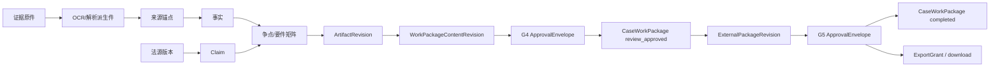

# Hermes Legal Matter OS 详细功能需求分析

| 文档属性 | 内容 |
|---|---|
| 文档版本 | V2.0-draft |
| 编制日期 | 2026 年 8 月 12 日 |
| 文档状态 | 详细需求候选基线；关闭文末 P0 决策项并完成联合评审后方可冻结 |
| 当前治理结论 | **No-Go / P0 Open**：`SD-ALPHA-001`、Alpha 前 ADR、资源预算和 50 案数据取得尚待正式批准 |
| 适用阶段 | 立项验证、安全 Alpha、付费闭门试点、收费 V1、企业化 |
| 产品范围 | 中国大陆商业合同争议案件工作台 |
| 产品代号 | Hermes Legal Matter OS |

> 本文档定义“需要建设什么、由谁使用、遵循什么业务规则、失败时如何处理、如何验收”。它不是对当前仓库已经实现法律业务能力的声明，也不替代概要设计、详细设计、安全设计、数据保护影响评估或专项法律意见。

---

## 目录

0. 文档摘要
1. 编制范围与依据
2. 产品定位、目标与边界
3. 用户、组织与职责
4. 核心领域对象与唯一语义
5. 统一工作流、门禁与失效传播
6. 详细功能需求
7. 权限动作—资源矩阵
8. 关键异常与恢复需求
9. 数据需求与一致性
10. 接口与事件需求
11. 非功能需求
12. 部署形态与功能差异
13. 发布范围与依赖闭环
14. 测试与验收
15. 需求追踪矩阵
16. 必须批准的 ADR 与开放决策
17. 基线批准条件
18. 最终需求结论
19. 附录

---

## 0. 文档摘要

### 0.1 结论

Hermes 当前仓库已经具备通用智能体循环、多模型适配、工具与工具集、技能、MCP、插件、会话、审批、子任务、CLI/TUI、Electron Desktop、消息网关、定时任务和日志等通用基础能力；但当前分支的法律产品主要仍处于商业规划、功能需求与概要设计阶段，尚不能把通用 Hermes 的会话库、工具显隐、线程式子智能体或受信任插件直接视为法律生产系统的案件隔离、动态授权、执行沙箱或连接器安全边界。

本产品应建设为“律师监督下、证据可追溯、法源可验证、权限可撤销、成果可失效、外发必须人工批准”的案件工作系统，而不是面向公众的法律聊天机器人。首发闭环是：


### 0.2 本版相对 V1 的关键补充

本版在既有 V1 功能需求基础上，重点补齐以下可执行定义：

1. 唯一商业计量对象 CaseWorkPackage、八类构件、内容修订与防刷量计数规则；
2. G0—G5 及归档状态的统一状态机；
3. 上游证据、事实、法源、权限、策略或验证器变化后的依赖失效传播；
4. 动作—资源—范围权限目录、能力令牌和逐调用服务端授权；
5. 利益冲突候选、材料摄取、时效期限、成果与租户生命周期状态机；
6. L4 数据晚发现、模型故障、撤权、部分提交、重复消息等异常流程；
7. 商业权益、试用、续费、到期、暂停、只读和客户退出；
8. 数据主体权利、法律保全、删除和备份冲突处理；
9. 可测量的性能、可用性、安全、兼容性和无障碍最低门槛；
10. 数据准备门、评测协议、逐项需求追踪和验收证据要求；
11. Prototype Alpha 与 Security Alpha 的范围消歧、50 案数据门和资源重基线决定；
12. G4/G5 ApprovalEnvelope、预渲染 ExternalPackageRevision 与一次性 ExportGrant，消除批准对象自引用；
13. Cache Epoch、签名正向工具/Skill Manifest、扩展唯一解析和 Alpha 禁用外部 MCP/非内置 Plugin；
14. 全辅助模型唯一出口、EffectiveConfigSnapshot、一次性内容绑定审批和案件会话持久化 Allowlist；
15. 可追踪 NFR、审计与遥测分离、软件供应链、可观测性和生产部署硬化基线。

### 0.3 规范性用语

- **必须/不得：** 强制要求；不满足即需求未完成。
- **应/应当：** 原则上强制；偏离时必须有书面风险接受和替代控制。
- **可以：** 可选能力，不作为当前阶段验收阻断项。
- **P0：** Security Alpha 闭环、安全或合规不变量所必需。
- **P1：** 付费试点或收费 V1 的产品化能力。
- **P2：** 企业化、规模化或第二增长阶段能力。

每个需求 ID 只能有一个优先级和一个目标阶段。复合能力必须拆分为多个原子需求。

---

## 1. 编制范围与依据

### 1.1 编制目的

本文档供产品、法律产品、研发、架构、AI/检索、文档/OCR、安全、SRE、测试、合规、商业运营和客户成功团队共同使用，目标是：

- 将商业化构想转换为可排期、可设计、可测试、可采购和可验收的功能条目；
- 明确每项能力的用户、前置条件、输入、处理、输出、状态、权限、异常和审计要求；
- 约束 Hermes 通用能力的复用方式，避免把便利机制误当成生产安全边界；
- 为后续概要设计 V2、ADR、数据模型、API 契约、测试计划和试点合同提供统一输入。

### 1.2 本地基线资料

1. [Hermes 法律 AI 商业化规划](./hermes-legal-ai-commercialization-plan-zh.md)
2. [Hermes Legal Matter OS 功能需求分析说明书 V1](./hermes-legal-ai-functional-requirements-spec-zh.md)
3. [Hermes Legal Matter OS 概要设计说明书](./hermes-legal-ai-high-level-design-zh.md)
4. [需求分析与概要设计评审报告](./hermes-legal-ai-requirements-design-review-zh.md)
5. 仓库根目录 `AGENTS.md`、`README.zh-CN.md` 及当前代码结构。

### 1.3 当前实现边界

| 能力 | 当前 Hermes 可复用程度 | 本产品要求 |
|---|---|---|
| 智能体对话循环、模型调用、工具调度 | 可条件复用 | 外包裹确定性案件工作流；模型唯一经受控网关出口 |
| 工具集、技能、MCP、插件 | 可条件复用 | Alpha 仅允许批准并锁定摘要的内置法律工具/Skill；外部 MCP、用户/项目/Entry Point Plugin 均禁用；试点后扩展仍须逐调用授权、签名、唯一解析和进程隔离 |
| 会话与搜索 | 仅参考 | 当前 Hermes 每个 `HERMES_HOME/Profile` 使用一个跨会话共享的 `state.db`，虽含 Source/User/Chat/Thread 等字段，但没有生产所需 Tenant/Matter/RLS 语义；法律会话须另建受控数据面 |
| 子智能体与并行委派 | 仅参考 | 生产法律任务使用独立进程/容器/微虚拟机执行器；宿主线程不是安全沙箱 |
| CLI/TUI/Desktop/网关 | 交互与 transport 可参考 | Desktop 是独立 Electron/React 表面；当前 Web Dashboard 的主聊天是 PTY 内嵌 TUI，并非 Desktop Web 版；法律 Web 工作台须单独设计，普通消息平台不得作为真实案件材料入口 |
| 命令审批与回滚 | 机制可参考 | 法律门禁由服务端工作流管理；生产构建禁用 YOLO、自动批准和绕过路径 |
| 记忆与技能学习 | 默认禁用案件正文 | 案件内容不得进入个人长期记忆或自动生成通用技能 |
| Cron/自动化 | 可用于内部低风险任务 | 不得自动批准、外发、删除或改变法律策略；高风险任务必须人工门禁 |
| 通用 Hermes 日志 | 仅可复用为运维诊断 | 当前按 Profile 轮转的 agent/errors/gateway/gui 日志不是租户/案件级、事务原子、追加签名或法律保全审计账本，不得替代 `FR-AUD-*` |

Hermes Profile、工作目录、Managed Scope、工具未展示和客户端进程环境变量都不能单独构成案件安全边界。Hermes Profile 仅是本地配置与状态命名空间，不能映射为租户、案件或部署安全域；本文统一使用 `deployment_class` 表示 SaaS、专属云和私有化等部署类别。

Desktop/Web 的 Surface Capability 只能用于交互能力装配。生产 `source`/surface 声明必须由已认证 Transport 在服务端赋值或签发，客户端自报值不得激活特权表面；即使来源可信，也必须在每次服务调用和数据访问时重新执行案件授权，不能以“当前进程由 Desktop 启动”或“当前工具 schema 中没有该工具”作为授权证明。

### 1.4 约束与假设

- 首发只支持商业合同争议；刑事、婚姻家事/未成年人、国家秘密或需专门保密系统的事项不进入普通产品。
- 首发没有法院直连、自动邮件发送、自动客户回复或无人法律咨询。
- 当前仓库未包含已实现的法律控制面和领域服务；本文功能均为拟建需求。
- 法源、模型、OCR、对象存储、KMS、IdP 等可采购能力需通过授权、合同和安全评审后接入。
- 合规条款需在上线前由具备相应资质的人员结合最终部署、服务对象、数据流和合同复核。

---

## 2. 产品定位、目标与边界

### 2.1 产品定位

产品是一套“案件工作操作系统”：将授权范围内的原始材料转化为可审阅的事实、证据、争点、法源、期限和文书成果，并保留从最终命题回溯至原始来源、处理版本和人工决定的完整链条。

### 2.2 核心价值目标

| 目标 | 正式定义 | 收费 V1 建议门槛 |
|---|---|---|
| 质量 | 外发成果的重要事实和法律命题均可验证 | 重要命题来源覆盖率 100%；虚构法条/案例 0 |
| 安全 | 任何身份只能访问被明确授权的租户、案件、对象和动作 | 预定义关键越权攻击成功数 0 |
| 效率 | 在不降低质量的前提下降低全体参与人的有效人工投入 | 经复杂度分层后，中位人工工时下降不少于 30% |
| 复核负担 | 复核、纠错、重跑和二次审批的有效人工时间 | 不高于被替代基线人工工时的 50% |
| 可用性 | AI 不可用时仍能完成核心人工工作 | 可读取原件、编辑人工数据、查看既有成果、完成批准与导出 |
| 可治理 | 每个高风险决定、模型调用、权限判定和导出可追溯 | 审计事件覆盖率 100%，关键事件不可静默丢失 |

### 2.3 计量口径

| 指标 | 定义 |
|---|---|
| 基线人工工时 | 无 AI 流程中所有参与人的有效投入时间总和 |
| AI 后人工工时 | 使用产品后所有参与人的操作、复核、纠错、返工和审批有效时间总和 |
| 节省人工工时 | 基线人工工时 − AI 后人工工时 |
| 节省率 | 节省人工工时 ÷ 基线人工工时 |
| 端到端周期 | 工作包启动至达到 `completed` 的自然时间 |
| 系统等待时间 | OCR、模型、队列、渲染和外部服务处理时间 |
| 复核负担 | 核验、纠错、重跑、处理阻断项和二次审批的人工时间 |
| 单位工作包成本 | 人工、模型、OCR、法源、存储、基础设施和实施摊销成本之和 |
| 商业工作包数量 | 事前登记、满足 §4.2 八类最低构件且达到 `completed` 的唯一 `commercial_work_package_key` 数；StageBundle/导出/归档/重跑均不计 |
| 工作包完成率 | 完成的事前登记 commercial key ÷ 同窗口达到最小输入条件的事前登记 commercial key；分母变更需追加批准 |

所有试验必须定义计时起止、闲置识别、并行工作分摊、案件复杂度层级、样本量、缺失数据、异常值和置信区间。不得把“用户未修改”自动计为采纳或正确。

### 2.4 范围内能力

- 组织、身份、商业权益、案件、冲突与伦理墙；
- 材料接收、隔离、哈希封存、解析/OCR、版本和来源锚点；
- 实体、事实、时间线、证据目录、争点树、要件矩阵和缺口；
- 时效与程序期限的结构化计算及不确定性管理；
- 案件内问答、法源检索、时点验证和对抗分析；
- 待审文书生成、逐命题验证、版本比较和律师审批；
- 案件工作包、批准并导出待发送包、复盘与归档；
- 受控多智能体、工具治理、模型网关、DLP、审计、评测和运维；
- Desktop/Web 主工作台，收费 V1 增加 Word 深度协作和受控连接器。

### 2.5 明确禁止或暂不排期

1. 对公众提供无人法律咨询或人格化“AI 律师”；
2. 自动接受委托、报价、签约、收费或形成律师—客户关系；
3. 自动向法院、仲裁机构、客户、对方、邮箱或社交平台提交/发送内容；
4. 自动决定诉讼请求、和解底线、证据取舍、披露范围或案件策略；
5. 给出确定性胜诉率、量刑或赔偿保证；
6. 覆盖、改写或自动删除证据原件；
7. 未经独立明确授权，将客户案件内容用于通用模型训练、个人记忆或通用技能学习；
8. 允许案件智能体使用宿主机通用终端、自由互联网、个人网盘、个人邮箱或无关案件资源；
9. 在普通 SaaS/专属云处理 L4 特别禁止数据；
10. 首发自建基础大模型、全国全量法律数据库或法院自动提交网络。

---

## 3. 用户、组织与职责

### 3.1 主要用户角色

| 角色 | 核心目标 | 允许的关键行为 | 明确限制 |
|---|---|---|---|
| 机构管理员 | 开通机构、配置组织和基础策略 | 用户、团队、SSO、模板、权益、默认策略 | 默认不得读取案件正文 |
| 案件负责人/主办律师 | 对委托范围、策略和外发成果负责 | 创建案件、确认范围、批准 G0/G2/G3/G4/G5 | 不得绕过伦理墙；不得批准自己无资格的事项 |
| 承办律师 | 完成案件研究、审阅和起草 | 上传、校对、建立矩阵、编辑成果、发起审批 | 未获得最终批准权时不得完成 G5 |
| 律师助理/实习人员 | 整理和标注材料 | 上传、纠正 OCR、候选事实、缺口、草稿修订 | 不得最终确认法律结论或外发 |
| 知识管理员 | 维护机构知识资产 | 法源授权、模板、playbook、引用格式 | 不得默认查看案件事实和策略 |
| 合规/安全管理员 | 管理策略、事件和审计 | 查看判定元数据、告警、审计和保全流程 | 查看正文需二次授权且最小化 |
| 系统/模型管理员 | 维护模型、容量和部署 | 模型注册、版本、网关、容量和回滚 | 不得默认解密案件内容 |
| 客户协作用户 | 提供材料并查看获批内容 | 上传指定材料、查看律师批准的请求与成果 | 不得访问内部策略、对抗分析和其他案件 |
| 外部专家 | 在授权范围内提供意见 | 查看最小材料包、提交意见 | 不得转授权、全量下载或访问未授权对象 |
| 审计员 | 独立核验证据链和控制执行 | 查看获批审计范围、验证签名和导出清单 | 不得修改业务状态 |
| 服务账号/任务身份 | 运行单一受控任务 | 仅执行能力令牌列明的动作和对象 | 不得继承人类全部权限，不得交互登录 |

### 3.2 职责分离规则

- 作者不得单独批准自己生成或实质修改的高风险成果；双人复核必须由两个不同自然人完成。
- 系统管理员、模型管理员、数据库管理员和审计管理员不得因运维角色自动获得案件正文读取权。
- 冲突豁免、Break-glass、L4 处置、保留策略缩短、批量导出和客户退出删除必须由不同职责角色审批。
- 智能体不能成为 G0—G5 的批准人，不能把自身置信度作为批准依据。

---

## 4. 核心领域对象与唯一语义

### 4.1 核心对象

| 对象 | 定义 | 最小必需字段 | 记录真源 |
|---|---|---|---|
| Tenant | 合同、隔离、权益和配置边界 | `tenant_id`、状态、SKU、区域、密钥策略 | 法律控制面 |
| Matter | 单一客户委托或内部事项的权限与数据聚合根 | `tenant_id`、`matter_id`、负责人、案由、legal-as-of、状态、数据级别 | 案件服务 |
| Party/Entity | 当事人、关联方、人、组织、合同、账号等规范化实体 | 规范名称、别名、版本、来源、人工状态 | 实体/事实服务 |
| EvidenceObject | 接收到的原始材料及其保全元数据 | 原件 ID、哈希、来源、页数、版本、隔离状态 | 证据服务 + 不可变对象存储 |
| Derivative | OCR、版面、缩略图、结构化表格等派生件 | 输入原件版本、处理器版本、页坐标、质量 | 证据服务 |
| SourceAnchor | 从命题返回原始材料的稳定定位 | 文档版本、页码、坐标、摘录、摘录哈希 | 证据服务 |
| Fact | 可被证据支持或反对的结构化事实 | 主体、动作、对象、时间/精度、金额、来源、人工状态 | 事实服务 |
| LegalAuthority | 法规、解释、案例或授权知识条目 | 稳定标识、层级、地域、有效期、授权、版本 | 法律知识服务 |
| Claim | 工作成果中的可验证命题 | 类型、正文、支持/反对来源、legal-as-of、验证和审阅状态 | Claim/验证服务 |
| IssueMatrix | 主张/抗辩、要件、事实、证据、反证、缺口、法源和律师结论的结构 | 版本、单元格引用、律师状态 | 矩阵服务 |
| Deadline | 时效、除斥期间或程序期限对象 | 类型、触发事实、规则、事件、区间、法源、责任人 | 期限服务 |
| TaskContract | 智能体或确定性任务的授权执行合同 | 目标、输入、允许动作、对象范围、预算、输出 schema | 工作流/任务服务 |
| Artifact | 备忘录、时间线、矩阵、文书、报告等版本化成果 | 类型、版本、哈希、输入版本集、状态 | 成果服务 |
| GateDecision | 对 G0—G5 的版本绑定决定 | 门禁、对象版本、决定、理由、批准人、策略版本 | 工作流服务 |
| CaseWorkPackage | 按案件+约定里程碑/委托范围登记的完整商业交付与计量单元 | commercial key、八类必选构件、内容修订、派生状态、计量 | 工作包服务 |
| WorkPackageContentRevision | CaseWorkPackage 的不可变内容快照 | 构件版本集、输入版本集、内容/清单哈希、legal-as-of | 工作包服务 |
| ExternalPackageRevision | G5 所批准的不可变预渲染待发送字节 | 文件/清单、接收方、内容哈希、输入/策略版本；明确不包含 G5 决定 | 成果服务 |
| ExportGrant | 对一个已获 G5 批准的 ExternalPackageRevision 的一次性导出授权 | revision ID、G5 ApprovalEnvelope、主体/受众、期限、nonce、消费状态 | 工作流服务 |
| AuditEvent | 对业务、授权、模型和导出的不可变事件记录 | 全局事件 ID、主体、动作、对象、前后版本、时间、签名 | 审计服务 |

所有案件子对象必须带不可变的 `tenant_id + matter_id`，并通过复合外键、对象路径、索引分区或等效机制保证归属，不得只依赖调用方传参。

### 4.2 案件工作包定义

`CaseWorkPackage` 是本产品唯一的核心交付、验收、北极星和商业计量对象，不等同于一次对话、一次模型运行、一份文件、一个任务或一个阶段子包。本文其他章节出现“工作包”而未加限定时，均指 `CaseWorkPackage`。

#### 4.2.1 必选构件组与派生包

下列前八项是一个 `CaseWorkPackage` 内的 `StageBundle/DeliverableBundle`，不能各自作为工作包计数；后两项是派生对象，也不增加北极星分子、分母或商业额度。

| 构件组/派生包 | 使用阶段 | 最低内容 | 商业计量 |
|---|---|---|---|
| 原件清单组 | 收案与准备 | 文件名、来源、接收人/时间、哈希、页数、处理状态 | 同一 CaseWorkPackage 构件，不单计 |
| 事实时间线组 | 事实整理 | 主体、动作、对象、时间精度、来源页码/锚点、置信和律师状态 | 同上 |
| 关系图组 | 实体归一 | 当事人、关联方、合同、付款、通知和程序关系及来源 | 同上 |
| 争点/要件矩阵组 | 策略准备 | 主张、法律依据、构成要件、支持事实、证据、反证和缺口 | 同上 |
| 证据目录组 | 证据分析 | 证明目的、真实性/合法性/关联性风险、原件状态、对方可能异议 | 同上 |
| 矛盾与缺口组 | 全流程 | 冲突陈述、缺页、金额/时间矛盾和待询问事项 | 同上 |
| 法律研究组 | 法律研究 | 检索范围/查询式、法源版本/效力、相关段落、反向权威和验证报告 | 同上 |
| 工作成果组 | 起草与复核 | 待审稿、修改痕迹、Claim 报告和 AI 参与说明；G4 ApprovalEnvelope 是独立派生条件，不进入本内容组 | 同上；达到全部完成条件后整个 CaseWorkPackage 计 1 |
| ExternalPackageRevision | 对外提交前 | 预渲染确定字节、证据/引用/计算/隐私清单、标识策略、接收方和哈希 | 派生版本，不单计 |
| ArchiveBundle | 结案 | 最终版本索引、保留/保全状态、复盘、价值计量、返还清单 | 生命周期派生，不单计 |

#### 4.2.2 工作包状态

```text
draft → assembling → ready_for_review → under_review → review_approved(G4)
review_approved → export_prepared → completed(G5)
   ↘ blocked       ↘ rejected → assembling
completed → stale → reopened → assembling
completed → withdrawn / superseded / archived
```

上述状态是聚合根根据 `WorkPackageContentRevision + ExternalPackageRevision + 当前有效 GateDecision/ApprovalEnvelope + 风险状态` 计算并持久化版本的业务状态；GateDecision 是独立记录，不得通过把决定正文追加进内容修订或待发送字节来“完成”工作包。

#### 4.2.3 完成规则

一个 CaseWorkPackage 只有同时满足以下条件才能进入 `completed`：

1. 上述八类必选构件均存在且绑定同一不可变 `WorkPackageContentRevision`；
2. 每类构件达到其最低质量状态；
3. 所有 P0 阻断项清零；
4. G0—G4 已对当前内容哈希、输入版本集和策略版本通过；G4 决定存于独立 ApprovalEnvelope，不进入被批准内容哈希；
5. 不存在 `stale`、`quarantined`、`revoked` 或未处理高风险项；
6. 所有构件的租户、案件和 legal-as-of 一致；
7. 已生成不可变 ExternalPackageRevision，且 G5 对确切文件字节、清单哈希、接收方和策略版本通过；G5 ApprovalEnvelope 与导出清单作为聚合引用存在但不进入被批准字节；
8. 完成事件和计量起止已记录。

G5 是商业 CaseWorkPackage 进入 `completed` 的派生条件，但不是 `WorkPackageContentRevision` 或 `ExternalPackageRevision` 的内容构件。G4 后聚合进入 `review_approved`，系统据此生成不可变 ExternalPackageRevision；G5 批准其确切文件字节、清单哈希、接收方和策略后，聚合派生为 `completed` 并只能签发一次性 ExportGrant/下载，不得重新渲染或改写已批准字节。该口径与商业规划中“审批记录和导出清单属于可交付工作包”的完成点一致，同时避免批准对象包含批准自身。

#### 4.2.4 计数规则

- 同一 CaseWorkPackage 重跑、修改、重新审批或重新导出不增加工作包数量，只增加内容/派生版本。
- `superseded` 工作包不重复计入完成率；其继任者完成后按同一逻辑业务实例计数。
- `commercial_work_package_key` 由“案件 + 合同/试点开始前登记的约定里程碑或委托范围”稳定生成；一个案件只有在确有多个独立约定交付且事前登记时才可有多个商业工作包，每个都必须满足八类最低完整度。
- StageBundle、ExternalPackageRevision、ArchiveBundle、单项成果、模型任务和内部重跑均不得计为工作包。
- `withdrawn`、`stale`、`rejected` 和仅有模型草稿的工作包不得计为完成。
- 完成率分母为试点/统计窗口开始前登记且达到最小输入条件的 `commercial_work_package_key`；新增/剔除须追加理由和独立批准，不得事后选择性创建、拆分空包或改变粒度扩大分母/分子。

### 4.3 Claim 与来源规则

- Claim 类型只允许：`fact`、`law`、`inference`、`lawyer_opinion`。
- `fact` 必须引用至少一个可打开的案件来源锚点；`law` 必须引用时点有效、地域和层级明确的法源版本。
- `inference` 必须列出输入 Claim，不得伪装为原始事实；`lawyer_opinion` 必须显示责任律师和审阅状态。
- 重要命题的定义由成果模板列明；模板不得通过降低重要命题范围规避验证。

### 4.4 期限对象规则

- 系统必须分别表达确定日期、日期区间、未知和存在争议，不得把缺失事实推断为确定日期。
- 每个期限结果必须显示触发事实、规则版本、适用法源、legal-as-of、计算输入、节假日版本和人工确认状态。
- 新证据或事实修改可能改变期限时，必须立即标记受影响的提醒、矩阵和成果为 `stale`。

---

## 5. 统一工作流、门禁与失效传播

### 5.1 案件主状态

```text
proposed → conflict_checking → authorized → active → closing → archived
    ↘ rejected              active ↔ suspended
    active → quarantined → migrated/returned/cleared/terminated
    archived → reopened（需批准并生成新活动版本）
```

### 5.2 G0—G5 门禁目录

| 门禁 | 名称 | 责任角色 | 自动检查 | 人工判断 | 通过后的能力 |
|---|---|---|---|---|---|
| G0 | 委托、冲突与数据边界门 | 案件负责人；冲突豁免另需合规批准 | 身份、权益、冲突检查完成、高敏问卷、保留策略 | 委托范围、团队、法律时点、风险接受 | 允许接收材料 |
| G1 | 材料完整性与可用性门 | 承办律师/助理；高风险材料由负责人 | 哈希、页数、病毒、格式、OCR 质量、缺页/重复 | 来源真实性、关键材料完整性、低质页处置 | 允许进入事实抽取正式队列 |
| G2 | 事实、争点与期限门 | 主办律师 | 来源可达、字段完整、冲突、计算器重算 | 事实确认、争点范围、证明目的、期限不确定性 | 允许正式法律研究和起草输入冻结 |
| G3 | 法源与策略门 | 主办律师/指定复核律师 | 法源存在、有效性、层级、时点、反向权威 | 适用性、策略、是否采纳不利观点 | 允许生成受控待审成果 |
| G4 | 成果质量门 | 有资格且非唯一作者的律师 | 逐 Claim、计算、引用、隐私、版本和 stale 检查 | 内容、逻辑、措辞、请求和披露 | 允许形成外发准备包 |
| G5 | 批准并导出门 | 案件负责人；高风险时双人复核 | CaseWorkPackage 为 `review_approved/export_prepared`、G0—G4 当前、预渲染字节/清单哈希、接收对象和导出策略 | 最终责任确认、披露范围、渠道选择 | 聚合派生为 completed；对确切 ExternalPackageRevision 签发一次性 ExportGrant，只允许下载“待发送包” |
| A0 | 归档与处置状态 | 案件负责人 + 数据治理角色 | 未结任务、保全、返还、保留、删除冲突 | 是否可关闭、知识提炼范围 | 归档只读并执行生命周期策略 |

### 5.3 门禁决定状态机

```text
not_ready → ready → pending → approved
               ↘ rejected → remediating → ready
               ↘ cancelled
pending → expired
approved → invalidated → ready
approved → revoked（仅具备权限的人工决定）
```

门禁决定必须绑定：对象版本/哈希、输入版本集合、策略版本、验证器版本、决定人、职责资格、决定时间、理由、差异集和审计事件。并发决定使用版本号或 ETag；旧版本批准必须失败，不得“最后写入覆盖”。

### 5.4 依赖与失效传播

系统必须维护如下不可变依赖关系：



以下变化必须计算受影响闭包并标记下游为 `stale`：

- 原件版本、哈希、页数或权限变化；
- OCR 重跑、人工修订导致文本、页码或坐标变化；
- 实体合并/拆分、事实修改/驳回或新增矛盾证据；
- 法源修订、失效、授权撤销或 legal-as-of 变化；
- 期限输入、节假日、规则或计算器版本变化；
- 伦理墙、用户权限、数据级别或导出策略变化；
- 提示、模型、检索器、验证器或模板发生影响语义的版本变化。

`stale` 对象不得作为“已确认输入”继续使用，不得批准或导出。系统必须回退至最早受影响门禁，向责任人展示原因、影响范围和建议动作，并在重新验证后生成新版本，绝不静默覆盖原批准版。

---

## 6. 详细功能需求

### 6.1 组织、身份与商业权益

**模块目标：** 建立租户、用户、机器身份、合同权益和生命周期的共同边界。

| ID | 功能要求 | 优先级 | 阶段 | 关键规则与验收 |
|---|---|---:|---|---|
| FR-ID-001 | 创建租户并分配全局唯一 ID、区域、`deployment_class`、密钥和默认数据策略 | P0 | Alpha | 未完成必填字段时不得激活；任何业务对象不得无租户归属 |
| FR-ID-002 | 支持本地受控账号与 OIDC 企业 SSO | P0 | Alpha | 登录、登出、会话撤销和 IdP 不可用路径可测试；密码仅在选择本地账号时存在 |
| FR-ID-003 | 对特权角色和所有 G4/G5 批准人强制 MFA | P0 | Alpha | MFA 失效或风险登录时拒绝高风险动作 |
| FR-ID-004 | 管理团队、办公室、客户和案件五级组织范围 | P0 | Alpha | 每个授权都能落到明确资源范围；父级权限不默认穿透伦理墙 |
| FR-ID-005 | 管理人类角色、服务账号和任务身份 | P0 | Alpha | 服务账号不可交互登录；凭证有受众、期限和轮换记录 |
| FR-ID-006 | 用户禁用、离职和紧急撤权 | P0 | Alpha | 撤权事件须终止活动会话/令牌/任务；目标传播时间 P95 ≤60 秒 |
| FR-ID-007 | SCIM/目录同步和调岗回收 | P1 | V1 | 同步失败告警；禁止因目录重复数据扩大权限 |
| FR-ID-008 | 临时委托与代理授权 | P1 | 试点 | 需目的、范围、批准人、起止时间；到期自动失效，不允许递归转委托 |
| FR-ID-009 | Break-glass 紧急访问 | P1 | V1 | 双人批准、最短期限、强告警、只读优先、事后复核工单；禁止自批 |
| FR-ID-010 | 定义基础 SKU、席位、并发任务、案件、存储、OCR、模型与导出权益 | P0 | Alpha | Alpha 可使用人工配置；权益不足时给出可解释阻断，且不能以超额为由破坏读取、返还和合规导出 |
| FR-ID-011 | 支持试用、有效、宽限、暂停、只读、终止状态 | P1 | 试点 | 状态迁移留痕；到期后优先只读，不得突然使客户无法取回数据 |
| FR-ID-012 | 用量明细和合同权益对账 | P1 | V1 | 模型/OCR/存储计量可追溯到租户和 `commercial_work_package_key`；账单争议不修改原始计量事件 |
| FR-ID-013 | 私有化离线许可证及离线宽限 | P2 | 企业化 | 客户断网时核心人工工作可继续；许可证不影响依法返还和导出 |

### 6.2 案件创建、利益冲突与伦理墙

| ID | 功能要求 | 优先级 | 阶段 | 关键规则与验收 |
|---|---|---:|---|---|
| FR-MAT-001 | 案件创建向导采集客户、案由、负责人、阶段、legal-as-of、团队、部署和保留策略 | P0 | Alpha | G0 未通过时状态只能为 `proposed/conflict_checking` |
| FR-MAT-002 | 创建前执行委托范围与数据处理依据确认 | P0 | Alpha | 记录来源文件/批准人；缺失时不得接收材料 |
| FR-MAT-003 | 规范化冲突检查名称，覆盖曾用名、别名和拼音/繁简变体 | P0 | Alpha | 原始输入与规范化结果均留版本 |
| FR-MAT-004 | 检查当前/历史客户、潜在客户、对方、关联企业、实际控制人、关键证人和对方律师 | P0 | Alpha | 检查范围和数据版本写入结果，服务不可用时 fail-closed |
| FR-MAT-005 | 冲突候选状态机：`unreviewed → possible_match → cleared/conflict/waived → superseded` | P0 | Alpha | 只能由有资格人员裁决；模型仅提供候选和依据 |
| FR-MAT-006 | 支持冲突豁免及客户知情同意证据 | P1 | 试点 | 豁免绑定实体/规则/团队版本；新增当事人后自动重检并可能失效 |
| FR-MAT-007 | 创建和维护伦理墙 | P0 | Alpha | 对读、写、搜索、向量、导出、队列和会话均服务端强制；前端隐藏不算控制 |
| FR-MAT-008 | 高敏/L4 问卷与创建硬阻断 | P0 | Alpha | 命中禁止类型不得通过免责声明继续 |
| FR-MAT-009 | 当事人、团队、冲突规则或数据级别变化时重评 G0 | P0 | Alpha | 立即暂停新任务和导出，计算受影响成果并通知负责人 |
| FR-MAT-010 | 案件暂停、恢复、关闭、归档、重开 | P0 | Alpha | 归档默认只读；重开生成新活动版本并重评权限、冲突、法源时点和保留策略 |
| FR-MAT-011 | 案件模板与 playbook 选择 | P1 | 试点 | 模板只能建议结构，不得预先确认事实或法律结论 |

### 6.3 材料接收、隔离与证据保全

**摄取状态机：**

```text
initiated → uploading → received → quarantined → scanning → sealed_pending_metadata
→ parsing → quality_review → active

任一处理态 → failed_retryable / failed_terminal / cancelled
quarantined → rejected / manually_cleared
active → superseded（原版本仍不可变）
```

| ID | 功能要求 | 优先级 | 阶段 | 关键规则与验收 |
|---|---|---:|---|---|
| FR-ING-001 | 支持 Desktop/Web 本地上传和受控批量导入 | P0 | Alpha | Alpha 不依赖 P2 客户门户；普通聊天网关禁止接收真实案件材料 |
| FR-ING-002 | 分片上传、断点续传、取消和幂等重复提交 | P0 | Alpha | 相同幂等键不生成重复原件；中断后能校验已收分片 |
| FR-ING-003 | 接收时记录提交人、渠道、时间、声明来源和客户端文件元数据 | P0 | Alpha | 服务端时间为准；客户端元数据不作为真实性证明 |
| FR-ING-004 | 文件类型识别不得只依赖扩展名 | P0 | Alpha | MIME、魔数和解析器一致性异常进入隔离 |
| FR-ING-005 | 恶意文件、宏、脚本、外链、嵌入对象、压缩包递归和解压炸弹检测 | P0 | Alpha | 可疑文件不得进入主数据面或模型；解析器受资源限制 |
| FR-ING-006 | 支持密码保护、加密、损坏和不支持格式的人工队列 | P0 | Alpha | 密码不得写入普通日志；解除需具名用户和审计 |
| FR-ING-007 | 对原件计算 SHA-256、独立原件 ID、页数和字节数并封存 | P0 | Alpha | 原件写入后不可修改；哈希和页数不一致为阻断项 |
| FR-ING-008 | 原件元数据与对象封存采用可恢复的一致性流程 | P0 | Alpha | 对象成功/数据库失败不得产生可见孤儿；需对账和补偿 |
| FR-ING-009 | 相同哈希自动去重，近似重复只提示 | P0 | Alpha | 近似件不得自动删除；用户可建立版本或附件关系 |
| FR-ING-010 | 建立版本、附件、邮件正文和压缩包父子关系 | P0 | Alpha | 所有关系带来源和操作版本；子件继承范围但仍独立授权检查 |
| FR-ING-011 | 生成材料清单和上传回执 | P0 | Alpha | 含文件名、原件 ID、哈希、页数、状态和失败原因；可独立校验 |
| FR-ING-012 | 定义“关键材料”规则与缺件清单 | P0 | Alpha | 规则来自案件 playbook 并由律师确认；系统不能声称未上传材料不存在 |
| FR-ING-013 | 支持误报申诉和隔离解除 | P1 | 试点 | 需双重权限、原因、重新扫描和限制性处理环境 |
| FR-ING-014 | 支持大文件和批量摄取配额、背压与进度 | P1 | 试点 | 超限时可暂停/排队，不得无界占用内存或重复扣费 |

### 6.4 OCR、版面解析与来源锚点

| ID | 功能要求 | 优先级 | 阶段 | 关键规则与验收 |
|---|---|---:|---|---|
| FR-OCR-001 | 提取已有文本层并按需执行 OCR | P0 | Alpha | 不重复 OCR 可用文本；记录处理器、模型、参数和版本 |
| FR-OCR-002 | 保留页码、段落、表格、图片、印章、手写和版面坐标 | P0 | Alpha | 每个摘录能定位到文档版本、页码和 bounding box |
| FR-OCR-003 | 输出页级和字段级质量分数 | P0 | Alpha | 金额、日期、案号、签名/印章等高风险字段单独评分 |
| FR-OCR-004 | 建立低置信页和高风险字段人工复核队列 | P0 | Alpha | 达阈值的高风险项 100% 入队；阈值版本可追溯 |
| FR-OCR-005 | 支持人工修订 OCR 文本并保留原值/新值/修订人 | P0 | Alpha | 不改原件；修订产生新派生版本 |
| FR-OCR-006 | 生成稳定来源锚点和摘录哈希 | P0 | Alpha | 锚点点击可打开正确页并高亮；无权限时不得通过深链接泄露 |
| FR-OCR-007 | OCR 重跑后重建锚点映射并检测失效 | P0 | Alpha | 无法映射的下游事实/Claim 自动 stale，不得假定坐标仍有效 |
| FR-OCR-008 | 表格结构化结果与原始版面对照 | P1 | 试点 | 合并单元格、跨页表和金额列必须可回看原图 |
| FR-OCR-009 | 解析失败、超时和崩溃可重试且幂等 | P0 | Alpha | 重试不产生重复派生件；超过阈值转人工并保留诊断元数据 |

### 6.5 实体、事实与时间线

| ID | 功能要求 | 优先级 | 阶段 | 关键规则与验收 |
|---|---|---:|---|---|
| FR-FACT-001 | 提取人、组织、合同、账号、金额、日期、地点、通知和程序行为候选 | P0 | Alpha | 每个候选带来源锚点、抽取版本和置信度 |
| FR-FACT-002 | 实体别名合并、拆分和关系维护 | P0 | Alpha | 合并/拆分必须人工确认；变更传播至冲突检查、事实和关系图 |
| FR-FACT-003 | 事实状态机区分候选、已核源、已确认、已修改、有争议、驳回、stale | P0 | Alpha | 智能体不得把事实置为律师确认；所有迁移留痕 |
| FR-FACT-004 | 事实记录主体、动作、对象、时间精度、金额/币种/算法和来源 | P0 | Alpha | 缺来源不得进入已核源；未知字段必须显式为空/未知 |
| FR-FACT-005 | 支持多个支持来源、反对来源和来源可靠性意见 | P0 | Alpha | 系统不得用数量投票替代律师对证明力的判断 |
| FR-FACT-006 | 生成可筛选事实时间线并点击回原文 | P0 | Alpha | 重要事实来源覆盖率 100%；排序显示日期不确定性 |
| FR-FACT-007 | 检测主体、日期、金额、履行状态和陈述冲突 | P0 | Alpha | 冲突进入待处理队列，不得自动选择“更可信”版本 |
| FR-FACT-008 | 允许逐条编辑、批注、标争议、接受和驳回 | P0 | Alpha | 用户修改后模型不得静默覆盖；支持撤销和版本比较 |
| FR-FACT-009 | 构建最小来源化关系图，覆盖当事人、关联方、合同、付款、通知和程序关系 | P0 | Alpha | 每条边带来源、版本和人工状态；满足 CaseWorkPackage 关系图组，不要求高级图分析 |
| FR-FACT-010 | 新证据进入后进行增量抽取与差异审阅 | P0 | Alpha | 仅展示新增/变更/冲突；自动触发依赖失效，不重写已批内容 |
| FR-FACT-011 | 提供大型关系图聚类、路径分析、布局和高级可视化 | P1 | 试点 | 高级算法结果标为分析建议，不改变基础来源边和律师状态 |

### 6.6 争点、要件、证据与缺口矩阵

| ID | 功能要求 | 优先级 | 阶段 | 关键规则与验收 |
|---|---|---:|---|---|
| FR-MTX-001 | 根据首发案由 playbook 生成争点和请求权候选 | P0 | Alpha | 仅为候选；主办律师确认范围后方可进入 G2 |
| FR-MTX-002 | 管理主张、抗辩、构成要件、举证责任和证明标准字段 | P0 | Alpha | 规则来源必须引用法源或经批准 playbook 版本 |
| FR-MTX-003 | 建立要件—事实—证据—反证—缺口—法源—律师结论矩阵 | P0 | Alpha | 单元格引用对象 ID/版本，不复制无来源自由文本作为真值 |
| FR-MTX-004 | 建立证据到事实和要件的双向支持/反对映射 | P0 | Alpha | 映射表示关联和意见，不自动确定证据能力或证明力 |
| FR-MTX-005 | 生成证据目录、证明目的和真实性/合法性/关联性风险项 | P0 | Alpha | 目录与原件编号、页数和版本一致 |
| FR-MTX-006 | 生成材料缺失、事实未知、矛盾、待询问和待补证清单 | P0 | Alpha | 每项有责任人、状态、截止时间和影响对象 |
| FR-MTX-007 | 律师可拖放映射、批量筛选、比较版本和锁定范围 | P0 | Alpha | 直接操作全部产生结构化命令和审计，不绕过验证 |
| FR-MTX-008 | 所有起草只能消费矩阵中“可用于成果”的当前版本对象 | P0 | Alpha | 直接传入未确认事实或未验证法源的调用必须被服务端拒绝 |
| FR-MTX-009 | 展示争点覆盖、证据覆盖和缺口严重度 | P1 | 试点 | 指标必须显示分母和规则版本，不将覆盖率等同案件胜算 |

### 6.7 时效与程序期限

| ID | 功能要求 | 优先级 | 阶段 | 关键规则与验收 |
|---|---|---:|---|---|
| FR-DUE-001 | 创建诉讼时效、除斥期间和程序期限对象 | P0 | Alpha | 三类期限分别建模，不允许以单一“截止日”混同 |
| FR-DUE-002 | 绑定触发事实、证据锚点和 legal-as-of | P0 | Alpha | 触发事实未确认时结果显示为候选区间或未知 |
| FR-DUE-003 | 表达起算、中止、中断、延长、重新起算和顺延事件 | P0 | Alpha | 每个事件有法源、输入和人工状态 |
| FR-DUE-004 | 使用确定性规则计算最早/最晚日期和不确定性 | P0 | Alpha | 计算器版本、节假日版本和输入完整保存；模型不得直接算最终期限 |
| FR-DUE-005 | 期限冲突和临近提醒 | P0 | Alpha | 高风险提醒需责任人确认；提醒不是法律结论或自动承诺 |
| FR-DUE-006 | 事实、法源或规则变化时失效期限并重算 | P0 | Alpha | 旧期限不得继续显示为已确认；受影响成果同步 stale |
| FR-DUE-007 | 期限报告和人工复核清单 | P1 | 试点 | 报告列出所有假设、未知和对结果最敏感的输入 |

### 6.8 案件内检索与问答

| ID | 功能要求 | 优先级 | 阶段 | 关键规则与验收 |
|---|---|---:|---|---|
| FR-QA-001 | 只在当前授权案件和当前用户可见对象内检索 | P0 | Alpha | SQL、全文、向量、图和缓存均执行案件级 PEP；跨案结果为 0 |
| FR-QA-002 | 回答必须区分原文事实、系统归纳、法律推论、律师观点和未知/争议 | P0 | Alpha | 五种类型有稳定数据字段和可辨 UI，不仅依赖措辞 |
| FR-QA-003 | 事实性陈述展示可点击来源锚点 | P0 | Alpha | 无来源内容不得显示为确定事实；锚点权限在点击时重新校验 |
| FR-QA-004 | 回答展示检索范围、覆盖材料、排除项和数据截止时间 | P0 | Alpha | 不得把“未检索到”表述为“不存在” |
| FR-QA-005 | 支持按材料、日期、实体、事实状态和证据类型筛选 | P1 | 试点 | 筛选条件进入审计和可复现查询记录 |
| FR-QA-006 | 对冲突事实并列展示，不自动消解 | P0 | Alpha | 回答必须提示冲突及其来源，允许创建审阅任务 |
| FR-QA-007 | 问答结果可转为候选 Fact/Claim/缺口，但不得直接成为真值 | P0 | Alpha | 转换需 schema 校验、来源和人工状态 |
| FR-QA-008 | 无权限、索引延迟或部分检索失败时给出明确降级 | P0 | Alpha | 不得用模型常识填补不可访问或未完成索引的案件内容 |

### 6.9 法律研究与法源治理

| ID | 功能要求 | 优先级 | 阶段 | 关键规则与验收 |
|---|---|---:|---|---|
| FR-LAW-001 | 维护法源注册表：来源、授权、展示/缓存/派生权、地域和可用状态 | P0 | Alpha | 未授权或授权过期的数据不得进入正式研究结果 |
| FR-LAW-002 | 检索法律法规、司法解释和首发范围内的权威案例 | P0 | Alpha | Alpha 可先接单一授权源，但必须保留稳定标识和完整出处 |
| FR-LAW-003 | 支持标题、发文机关、效力层级、地域、公布/生效/失效时间和 legal-as-of 过滤 | P0 | Alpha | 时间和层级过滤由结构化字段执行，不只由模型理解 |
| FR-LAW-004 | 维护修订、替代、废止和引用关系 | P0 | Alpha | 研究结果能说明目标时点适用版本 |
| FR-LAW-005 | 组合关键词/BM25、元数据、向量、图关系和重排 | P1 | 试点 | 检索策略版本化；不得把全部内容无差别放入单一全局向量库 |
| FR-LAW-006 | 检索不利法源、反向权威和替代解释 | P0 | Alpha | 研究任务不得仅返回支持用户预设立场的材料 |
| FR-LAW-007 | 生成可复现检索备忘录 | P0 | Alpha | 包含问题、查询式、范围、时间、数据源版本、命中/排除和边界 |
| FR-LAW-008 | 验证引用存在性、有效性、时点、层级、地域和命题支持性 | P0 | Alpha | 无法验证、已失效或不支持命题的引用为 G3/G4 阻断项 |
| FR-LAW-009 | 支持律师确认、驳回、批注和锁定法源版本 | P0 | Alpha | 确认绑定法源内容哈希和 legal-as-of；上游更新时自动重评 |
| FR-LAW-010 | 法源不可用时保留已授权快照并显示新鲜度 | P0 | Alpha | 不得在快照过期时伪装为实时结果；禁止未授权持久缓存 |
| FR-LAW-011 | 支持第二法源交叉核验 | P1 | V1 | 关键引用不一致进入人工队列；不能自动以多数决定正确版本 |
| FR-LAW-012 | 法源供应商切换、退出和派生数据处置 | P1 | V1 | 合同终止后按授权要求停止展示/缓存并触发受影响对象扫描 |

### 6.10 对抗分析与未知项管理

| ID | 功能要求 | 优先级 | 阶段 | 关键规则与验收 |
|---|---|---:|---|---|
| FR-ADV-001 | 基于已确认事实和已验证法源生成对方可能主张 | P1 | 试点 | 不得创造不存在的证据、程序行为或当事人陈述 |
| FR-ADV-002 | 针对同一证据给出替代解释、真实性/关联性争议和证明力弱点 | P1 | 试点 | 每项说明依赖对象和推论类型 |
| FR-ADV-003 | 标识不利事实、反向法源、未决冲突和信息缺口 | P1 | 试点 | 不能把未知项隐藏在自然语言总结中 |
| FR-ADV-004 | 输出结构化对抗审查表 | P1 | 试点 | 至少含主张、依据、影响、严重度、应对选项和律师决定 |
| FR-ADV-005 | 严重分歧升级人工，不使用智能体多数表决 | P1 | 试点 | 升级记录保留各观点及来源，最终决定由有资格律师完成 |
| FR-ADV-006 | 对抗分析不能自动改变 G2/G3 已确认内容 | P1 | 试点 | 只能提出候选变更；接受后按正常失效传播重新审批 |

### 6.11 文书起草、编辑与渲染

| ID | 功能要求 | 优先级 | 阶段 | 关键规则与验收 |
|---|---|---:|---|---|
| FR-DRF-001 | 基于当前有效矩阵和模板生成法律备忘录待审稿 | P0 | Alpha | 输入仅限 G2/G3 已通过对象；产物状态始终从 `draft` 开始 |
| FR-DRF-002 | 生成起诉状、答辩状和代理意见待审稿 | P1 | 试点 | 文书类型逐一通过模板、字段、验证和律师评审后开放，不做通用自由生成 |
| FR-DRF-003 | 管理机构模板、条款块、文风、引用和落款格式 | P1 | 试点 | 模板有审批、版本、适用范围和回滚；不得修改系统安全底线 |
| FR-DRF-004 | 文书中的重要命题自动拆分并绑定 Claim | P0 | Alpha | 无法绑定的段落进入阻断队列，不因语言流畅而放行 |
| FR-DRF-005 | 律师在结构化编辑器中直接修改并保留差异 | P0 | Alpha | 人工修改标识作者；修改重要命题后重新验证，而非强制回退为 AI 文本 |
| FR-DRF-006 | 版本比较显示事实、法源、计算、模板和人工文本变化 | P0 | Alpha | G4/G5 复核必须看到自上次批准后的全部实质差异 |
| FR-DRF-007 | 使用确定性计算器计算金额、利息、期间和汇总 | P0 | Alpha | 保存输入、规则、结果、舍入和版本；模型不得输出不可复算的最终数值 |
| FR-DRF-008 | 渲染基础 DOCX/PDF 并生成目录、脚注、页码和引用格式 | P0 | Alpha | Alpha 至少提供一个批准模板；渲染后进行页数、字体、脚注、缺字和哈希校验 |
| FR-DRF-009 | 草稿、批准版、导出版和签署版分离 | P0 | Alpha | 导出版不可覆盖批准版；签署版仅作为外部回传材料接收 |
| FR-DRF-010 | 应用 AI 参与说明和生成内容标识策略 | P0 | Alpha | 标识策略按用途和租户政策版本执行并进入导出清单 |
| FR-DRF-011 | 支持用户撤销、恢复和分支版本 | P1 | 试点 | 分支不继承旧批准；合并时重新计算差异和 stale 状态 |

### 6.12 Claim 验证与成果质量门

| ID | 功能要求 | 优先级 | 阶段 | 关键规则与验收 |
|---|---|---:|---|---|
| FR-VAL-001 | 创建、更新和版本化 Claim | P0 | Alpha | 包含类型、正文、支持/反对来源、时点、地域、生成和人工状态 |
| FR-VAL-002 | 检查来源存在、当前权限和对象版本 | P0 | Alpha | 来源被撤权、删除或替代时 Claim 立即 stale |
| FR-VAL-003 | 检查页码、坐标、摘录和哈希 | P0 | Alpha | 摘录不一致为阻断项，不能仅检查文档存在 |
| FR-VAL-004 | 检查法源效力、层级、地域、时点和引用准确性 | P0 | Alpha | 虚构或无法验证引用不得降级为普通警告 |
| FR-VAL-005 | 检查来源是否实质支持命题 | P0 | Alpha | 主题相近不等同支持；失败必须定位命题与证据差异 |
| FR-VAL-006 | 检查反向权威和不利事实是否披露 | P0 | Alpha | 只验证是否被审阅和处理，不替代律师决定写入方式 |
| FR-VAL-007 | 检查金额、利息、期限和引用编号可复算 | P0 | Alpha | 结果与确定性计算器/目录不一致即阻断 |
| FR-VAL-008 | 检查成果未超出 G0/G2/G3 范围 | P0 | Alpha | 新增主张、事实或法源范围须先回到相应门禁 |
| FR-VAL-009 | 生成逐句/逐命题验证报告并绑定成果哈希 | P0 | Alpha | 报告展示通过、警告、阻断、未验证及规则版本 |
| FR-VAL-010 | 阻断项必须清零才能进入 G4 | P0 | Alpha | 前端、API、批处理和管理员路径均不可绕过 |
| FR-VAL-011 | 验证器变更触发影响分析和回归 | P0 | Alpha | 对安全或语义有影响的规则版本变化使相关成果待重验 |

### 6.13 人工审阅、门禁、工作包与导出

| ID | 功能要求 | 优先级 | 阶段 | 关键规则与验收 |
|---|---|---:|---|---|
| FR-REV-001 | 为 G0—G5 和 A0 建立统一审批对象与状态机 | P0 | Alpha | 不存在遗漏 G1 或另造“未编号门禁”的实现 |
| FR-REV-002 | 审阅队列按风险、低置信、冲突、期限临近和影响范围排序 | P0 | Alpha | 排序可解释；用户可查看未显示项总数，不能因排序丢项 |
| FR-REV-003 | 来源与候选内容并排展示并支持点击定位 | P0 | Alpha | 审阅不要求用户在多个窗口手工寻找来源 |
| FR-REV-004 | 支持批准、修改、驳回、退回、豁免、取消和超时 | P0 | Alpha | 豁免仅适用于明确可豁免规则；安全红线不得豁免 |
| FR-REV-005 | 高风险决定强制填写理由并支持附件证据 | P0 | Alpha | 理由不可为纯空白或默认值；原决定不可改写，只能追加新决定 |
| FR-REV-006 | 执行作者自批准禁止和双人复核独立性 | P0 | Alpha | API 直接调用、自助调角色和管理员路径负测均须失败 |
| FR-REV-007 | 使用乐观锁防止旧版本和并发审批覆盖 | P0 | Alpha | 对过期 ETag/版本返回明确冲突并展示新差异 |
| FR-REV-008 | 门禁超时、代理人和升级规则 | P1 | 试点 | 代理授权必须已存在且未过期；超时不自动批准 |
| FR-REV-009 | 事前登记、组装、验证和完成 CaseWorkPackage | P0 | Alpha | 严格遵循 §4.2 八类构件与唯一商业计量口径；服务端计算完整度和派生状态，StageBundle 不可单计 |
| FR-REV-010 | 工作包 stale、重开、撤回、作废和替代 | P0 | Alpha | 保留原版本和原批准；重新完成不重复计数 |
| FR-REV-011 | 生成“待发送包”而非执行发送 | P0 | Alpha | 生产构建中不存在邮件、法院、客户自动提交工具；负向测试覆盖 |
| FR-REV-012 | 导出前展示接收对象、包含范围、隐私检查、标识策略和差异 | P0 | Alpha | G5 决定绑定上述字段和导出版本 |
| FR-REV-013 | 导出文件、清单、来源和批准信息计算哈希并签名 | P0 | Alpha | 可使用独立校验器验证完整性；下载链接短期、单用途、可撤销 |
| FR-REV-014 | Security Alpha 对高风险 G5 强制双人独立复核 | P0 | Alpha | 高风险目录由批准策略固定，至少覆盖 L3、重大披露和特定接收方；执行人不得自批，不能由导出人临时降级或拆分规避 |
| FR-REV-015 | 记录导出但不记录产品外部实际发送成功 | P0 | Alpha | 产品不得把“已导出”展示为“已提交法院/已送达” |
| FR-REV-016 | G4/G5 决定与被批准内容修订分离 | P0 | Alpha | GateDecision/ApprovalEnvelope 只引用内容/输入/策略/接收方哈希，不写入被批内容；任一字节、输入版本、策略或接收方变化均失效，附加决定本身不改变内容哈希 |
| FR-REV-017 | G5 批准预渲染确定字节、完成 CaseWorkPackage 并只签发 ExportGrant | P0 | Alpha | 批准后不得重新渲染；下载/签名封装不改变已批正文与清单；同一批准凭证仅一次有效且不增加工作包数量 |
| FR-REV-018 | 配置批量导出阈值、水印和高级双人复核策略 | P1 | 试点 | 策略变更预览受影响对象并需独立批准；不得降低 Alpha 固定高风险目录的控制 |

### 6.14 多智能体任务与隔离执行

| ID | 功能要求 | 优先级 | 阶段 | 关键规则与验收 |
|---|---|---:|---|---|
| FR-AGT-001 | 定义摄取、事实、证据、研究、对抗、起草、验证和输出角色卡 | P0 | Alpha | 每张角色卡列明允许输入、工具、输出、禁止动作和人工责任人 |
| FR-AGT-002 | 每个任务创建版本化 TaskContract | P0 | Alpha | 必含租户/案件/任务/角色/目标/时点/来源/动作/output schema/预算/审批策略，以及 `cache_epoch_id/system_prompt_hash/tool_schema_hash/extension_manifest_digest/handler_binding_digest/registry_generation/effective_config_digest` |
| FR-AGT-003 | 每个角色/任务启动新会话并一次性装配静态 `legal-*` 工具清单 | P0 | Alpha | 同一 Cache Epoch 内 Canonical System Prompt 与有序 Tool Schema 字节稳定；压缩、注册表变化、运行时切换或恢复 Hash 不符时开启新 Epoch/新任务会话并审计，禁止静默续用旧缓存 |
| FR-AGT-004 | 模型返回 `observations/inferences/unknowns/conflicts/provenance` 结构 | P0 | Alpha | schema 校验失败不得进入候选区；推论不得写入 observations |
| FR-AGT-005 | 所有模型输出先写候选区 | P0 | Alpha | 不直接修改已确认 Fact、Claim、Matrix、Gate 或 Artifact |
| FR-AGT-006 | 生产任务运行于独立进程、容器或微虚拟机 | P0 | Alpha | 不共享父进程对象、供应商凭证、插件内存或宿主文件系统；仅发放短期 Model Gateway Token 与最小案件视图，当前线程式 delegate 不作为隔离实现 |
| FR-AGT-007 | 向任务发放短期、最小能力令牌和只读/最小可写案件视图 | P0 | Alpha | 任务结束、取消、撤权后令牌失效；令牌不可跨任务重放 |
| FR-AGT-008 | 网络出口按任务、域名、协议和数据级别限制 | P0 | Alpha | 默认无自由互联网；仅模型网关和批准的领域服务可达 |
| FR-AGT-009 | 强制 CPU、内存、磁盘、时间、并发、调用次数和成本限额 | P0 | Alpha | 超限确定性停止；部分输出标记不完整，不自动重试风暴 |
| FR-AGT-010 | 支持取消、暂停、撤权强杀和确定性销毁 | P0 | Alpha | 销毁后临时目录和短期凭证不可恢复；保留必要审计元数据 |
| FR-AGT-011 | 任务重试使用幂等键和输入版本 | P0 | Alpha | 重试不重复创建事实、费用或批准；输入过期时拒绝重试 |
| FR-AGT-012 | 角色之间通过结构化对象交换，不自由互聊 | P0 | Alpha | 所有交接可审计并执行接收方 schema/权限校验 |
| FR-AGT-013 | 运行时镜像签名、SBOM、固定摘要和补丁治理 | P0 | Alpha | 未批准镜像不能处理案件；安装/启动验证签名和撤销状态，支持紧急 Kill Switch |
| FR-AGT-014 | 隔离执行器不可用时确定性 fail-closed | P0 | Alpha | 不可达、容量满、镜像未验证或令牌签发失败时只能 queued/blocked/failed；不得回退通用 `delegate_task`、宿主线程或同进程同步执行 |

### 6.15 工具、授权与插件治理

| ID | 功能要求 | 优先级 | 阶段 | 关键规则与验收 |
|---|---|---:|---|---|
| FR-AUT-001 | 以业务语义工具代替通用文件、终端和浏览器动作 | P0 | Alpha | 如“读取已授权案件页”“创建候选事实”；生产法律 toolset 不含自由终端 |
| FR-AUT-002 | `check_fn` 仅用于非授权性的服务前置条件、部署/Profile 级 Operator Opt-in 和粗粒度可用性提示 | P0 | Alpha | 结果允许短时陈旧；Handler、PEP 和下游逐调用重验可达性与授权；禁止作为用户、租户、案件、角色、任务或对象级开关 |
| FR-AUT-003 | 每次工具调用由不可绕过的服务端 PEP 判定 | P0 | Alpha | registry 直接 dispatch、内部 API、批处理和重放同样受控 |
| FR-AUT-004 | PDP 计算 deny-overrides 的租户∩案件∩角色∩任务∩授权策略 | P0 | Alpha | 任一上下文缺失、策略不可达或版本过期时 fail-closed |
| FR-AUT-005 | 能力令牌绑定主体、租户、案件、任务、工具、动作、对象范围、策略版本、受众、期限和 nonce | P0 | Alpha | 签名、受众、期限、重放和撤销均验证 |
| FR-AUT-006 | 领域服务和存储继续执行对象级/RLS 授权 | P0 | Alpha | 工具层允许不替代下游检查，避免单点绕过 |
| FR-AUT-007 | 权限撤销、伦理墙或任务取消使活动令牌和调用失效 | P0 | Alpha | 长调用需在关键提交点重新校验；撤权后不得提交结果 |
| FR-AUT-008 | 生产硬拒绝 YOLO、`approvals.mode=off`、`approvals.cron_mode=approve` 和子智能体自动批准 | P0 | Alpha | 覆盖 `--yolo`、`/yolo`、`HERMES_YOLO_MODE`、`delegation.subagent_auto_approve`、恢复旧会话、直接 Handler/Registry 和管理员路径；不依赖 Managed Scope 实现 |
| FR-AUT-009 | 插件/连接器要求签名、清单、版本锁定、权限声明和上架审核 | P1 | 试点 | 权限增加视为重新授权，不静默继承 |
| FR-AUT-010 | 高风险插件运行于独立进程并使用独立身份 | P1 | 试点 | 当前宿主内 Python 插件加载不作为生产连接器隔离 |
| FR-AUT-011 | 检测文档提示注入、参数注入和异常工具意图 | P0 | Alpha | 文档内容永不进入控制指令；命中时停止危险路径并告警 |
| FR-AUT-012 | 隔离单个插件、MCP 或生命周期 Hook 的异常 | P1 | 试点 | 单扩展加载/调用失败不得拖垮主代理或其他扩展；记录来源和可诊断状态 |
| FR-AUT-013 | 生产法律环境只启用经审核、签名和版本锁定的 Skill | P0 | Alpha | Alpha 仅允许随批准 Artifact 发布的内置法律 Skill；禁止案件正文自动生成/改写通用 Skill；试点后外部 Skill 也须批准 Catalog、隔离扫描和重新授权后启用 |
| FR-AUT-014 | 法律执行器使用服务端签名的正向 Tool Manifest | P0 | Alpha | 按工具名、有序 Schema Hash、Handler Artifact/Code Digest、Owner/Source、版本和 Registry Generation 精确匹配；禁止默认/Coding Posture、平台自动补集、`all/*` 或“全启用再禁用”；terminal、execute_code、browser、project、desktop_ui、cronjob、delegate_task、动态 MCP 等未知/额外工具使启动失败 |
| FR-AUT-015 | Alpha 构建与启动阶段禁用一切非内置 Plugin 和外部 MCP | P0 | Alpha | 用户目录、项目目录、Python Entry Point、同名覆盖、`allow_tool_override`、旧配置/旧会话恢复及动态注册均做负向检查；只允许批准 Manifest 内的内置法律扩展 |
| FR-AUT-016 | 使用批准注册表唯一解析生产扩展 | P0 | Alpha | 记录扩展 ID、来源、版本、完整内容摘要、签名者、能力、权限和有效配置；未知来源、同名冲突、路径影子、内置工具/命令覆盖或权限增量一律 fail-closed，禁用规则优先 |
| FR-AUT-017 | Skill 签名覆盖完整 Bundle 和全部引用文件 | P0 | Alpha | 拒绝绝对路径、穿越、符号链接/Junction 逃逸；只读挂载，不运行时自改/同步升级；更新产生新摘要，新任务重新批准，TaskContract 记录实际内容摘要 |
| FR-AUT-018 | 法律高风险审批使用一次性、内容绑定的批准凭证 | P0 | Alpha | 绑定规范化请求摘要、主体、租户、案件、动作、对象/版本、策略、接收方、nonce、到期和可信 UI 来源；参数/版本/策略变化重新批准，重放、自批、断线超时均拒绝；不得复用命令模式、会话或永久 Allowlist |
| FR-AUT-019 | 工具 dispatch 使用不可变 Handler 绑定并消除 Registry TOCTOU | P0 | Alpha | 每任务固定不可变 Handler 快照，或在每次 dispatch 前原子比对 Registry Generation + Handler Digest/Source；模型返回 tool call 后若发生同名覆盖、注销或代码变化，执行前 fail-closed 并开启新 Cache Epoch/任务，不得调用新 Handler |

### 6.16 模型网关与数据路由

| ID | 功能要求 | 优先级 | 阶段 | 关键规则与验收 |
|---|---|---:|---|---|
| FR-MDL-001 | LCP 维护唯一模型注册表和策略真源 | P0 | Alpha | Core 和领域服务不维护独立供应商策略表 |
| FR-MDL-002 | Core、领域服务和所有辅助模型调用只调用 `ModelGatewayClient` | P0 | Alpha | 运行进程除网关外不持有供应商凭证；基础设施 egress 阻止旁路 |
| FR-MDL-003 | 注册区域、服务资质、留存、训练、人工查看、子处理者、成本、上下文和可用性 | P0 | Alpha | 未完成注册或合同过期的模型不可路由 |
| FR-MDL-004 | 按租户、案件、任务、数据级别、地域和用户授权判定路由 | P0 | Alpha | 原始案件数据默认不出境；L4 永不路由外部模型 |
| FR-MDL-005 | 网关执行本地 DLP、最小化、令牌化和请求裁剪 | P0 | Alpha | 处理发生在受控边界内；记录处理规则和字段，不默认存明文 |
| FR-MDL-006 | 供应商凭证、请求发送、流式接收、计费和审计只有网关执行 | P0 | Alpha | 网络策略证明只有网关可访问供应商端点 |
| FR-MDL-007 | 对每次调用保存策略快照、请求/响应哈希、模型和成本 | P0 | Alpha | 默认不保存明文推理链；必要正文使用分级和独立权限 |
| FR-MDL-008 | 定义任务级 fallback 列表且不得降低数据安全等级 | P0 | Alpha | 错误区域、过期策略或不合规备用模型必须拒绝 |
| FR-MDL-009 | 模型不可用时采用功能级降级 | P0 | Alpha | 停止新 AI 生成，但允许原件读取、人工编辑、既有成果查看、审批和导出 |
| FR-MDL-010 | 流式中断、部分响应和超时不产生完整成果 | P0 | Alpha | 标记 incomplete；费用可对账；重试须使用幂等语义 |
| FR-MDL-011 | 模型/提示/schema 版本变更触发回归和可回滚发布 | P0 | Alpha | 未通过对应数据集门禁不得进入生产 |
| FR-MDL-012 | 支持客户专属模型、私有模型和 BYOK | P1 | V1 | 凭证隔离、轮换、不可导出和客户退出流程明确 |
| FR-MDL-013 | 生成、Embedding、Rerank、Vision、标题、辅助评审、压缩、Fallback、子任务和插件辅助 LLM 均走同一网关策略 | P0 | Alpha | 每条路径执行数据分级、区域、训练/留存、最小化、计费和审计；自动化扫描与 egress 负测证明无旁路 |
| FR-MDL-014 | 法律 Worker 禁用供应商直连 Adapter、Credential Pool 和本地 Fallback Credential | P0 | Alpha | 构造阶段拒绝非网关 Base URL/API Key；模型切换不复用旧 `api_mode`/凭证，恢复旧会话不恢复直连路由；跨 Origin 跳转不携带原凭证 |

### 6.17 DLP、隐私与数据主体权利

| ID | 功能要求 | 优先级 | 阶段 | 关键规则与验收 |
|---|---|---:|---|---|
| FR-PRI-001 | 在文件、字段和任务三级标记 L0—L4 | P0 | Alpha | 数据级别有来源、规则版本和人工覆盖记录 |
| FR-PRI-002 | 识别身份证、银行卡、联系方式、地址、医疗、财务、未成年人、案号、商业秘密、印章和签名 | P0 | Alpha | 评测按字段类别报告召回/误报，不以总准确率掩盖高风险类别 |
| FR-PRI-003 | 在受控本地边界内去标识、令牌化和图像遮罩 | P0 | Alpha | 保留映射须独立加密和最小访问；抽检不可直接回推 |
| FR-PRI-004 | L4 晚发现时立即暂停解析、索引、模型和导出 | P0 | Alpha | 冻结派生件/成果、收窄权限、登记事件并通知指定安全角色 |
| FR-PRI-005 | L4 处置支持经批准的迁移、返还、清除或转专门系统 | P0 | Alpha | 处置前不得继续普通流程；每一步有链路证据和重新开放条件 |
| FR-PRI-006 | 公开法源、机构知识、客户知识和案件事实四域隔离 | P0 | Alpha | 跨域检索和复用需明确策略；案件正文不写个人长期记忆 |
| FR-PRI-007 | 受理查阅、复制、更正、删除、撤回等权利请求 | P1 | V1 | 支持请求人/代理身份核验、范围定位、状态和答复 SLA |
| FR-PRI-008 | 权利请求与法律保全、律师保密和他人权利冲突处理 | P1 | V1 | 拒绝或延期需理由、批准和申诉路径；法律保全优先但不静默 |
| FR-PRI-009 | 将更正/删除传播至索引、缓存、模型供应商和下游处理者 | P1 | V1 | 支持完成证明和未完成例外清单 |
| FR-PRI-010 | 维护委托处理、子处理者和数据处理活动记录 | P1 | V1 | 供应商变化触发客户通知/审批规则和影响评估 |
| FR-PRI-011 | 非必要产品遥测和个人行为分析显式 opt-in | P0 | Alpha | 默认关闭向第三方发送；不得暗中建立律师个人绩效画像 |

### 6.18 审计、告警与治理

| ID | 功能要求 | 优先级 | 阶段 | 关键规则与验收 |
|---|---|---:|---|---|
| FR-AUD-001 | 为业务状态变更和审计事件使用事务内 outbox | P0 | Alpha | 高风险业务提交前 outbox 必须成功；审计服务暂时不可用时可安全补投 |
| FR-AUD-002 | 审计身份、会话、租户、案件、动作、对象、前后版本和时间 | P0 | Alpha | 关键字段缺失的事件进入异常队列并阻断对应高风险动作 |
| FR-AUD-003 | 审计模型、提示、工具、法源、解析器、策略和验证器版本 | P0 | Alpha | 可复现某成果使用的技术版本，不要求保存完整隐式推理链 |
| FR-AUD-004 | 审计审批、理由、差异、导出对象、文件哈希和标识策略 | P0 | Alpha | G0—G5 与导出均 100% 有关联事件 |
| FR-AUD-005 | 采用追加写、序列号、签名/哈希链和外部时间锚定 | P1 | 试点 | 能检测删除、插入、重排、分叉和恢复回滚；不夸大为绝对不可抵赖 |
| FR-AUD-006 | 审计访问分权和正文二次授权 | P0 | Alpha | 查看高敏正文产生新的审计和告警 |
| FR-AUD-007 | 检测跨案尝试、大量读取、异常时段、蜜标、注入、错误路由和未批准导出 | P0 | Alpha | 告警有严重度、责任人、状态、SLA 和关联事件 |
| FR-AUD-008 | 支持安全事件登记、证据保全、处置和复盘 | P1 | 试点 | 事件关闭需根因、影响范围、补救、通知判断和验证证据 |
| FR-AUD-009 | 客户/监管审计导出 | P1 | V1 | 按授权范围脱敏，附签名清单和独立校验工具 |
| FR-AUD-010 | 周期性对账业务库、对象、索引、图、队列和审计 | P0 | Alpha | 发现孤儿、错属、漏事件和版本漂移；修复过程留痕 |
| FR-AUD-011 | 建立版本化 Auditable Action Catalog 作为审计覆盖率分母 | P0 | Alpha | 覆盖状态迁移、授权允许/拒绝、模型/工具、审批、导出、配置、Secret、扩展、Break-glass 和生命周期；CI 校验每个高风险命令/迁移有事件映射，故障注入证明“业务成功但事件缺失”不可能 |
| FR-AUD-012 | 强制安全/业务审计与可选产品遥测分离 | P0 | Alpha | 关闭全部 Telemetry/OTLP 或完全离线时，outbox、授权拒绝、门禁和生命周期审计仍 100%；外发遥测 schema 不含 Prompt、消息、工具参数/结果、正文、完整案号和个人标识 |

### 6.19 保留、法律保全、删除与客户退出

| ID | 功能要求 | 优先级 | 阶段 | 关键规则与验收 |
|---|---|---:|---|---|
| FR-LCM-001 | 案件创建时选择基础保留策略并禁止提前删除 | P0 | Alpha | 没有有效策略不得通过 G0；缩短策略需高风险审批 |
| FR-LCM-002 | 按对象类型计算保留到期时间 | P1 | V1 | 原件、派生件、会话、审计、成果和备份分别定义，不用单一租户期限 |
| FR-LCM-003 | 创建、变更和解除法律保全 | P1 | V1 | 保全对象、依据、批准人、范围和期限清晰；保全优先于普通删除 |
| FR-LCM-004 | 删除采用 `requested → authorized → propagating → verified/exception` 状态机 | P1 | V1 | 禁止无审计硬删除；每个数据平面返回处置结果 |
| FR-LCM-005 | 处理备份中的到期删除 | P1 | V1 | 明确自然轮换或恢复后重删机制；删除证明列明仍受保全/备份约束的副本 |
| FR-LCM-006 | 客户退出前导出原件、成果、元数据、配置和审计清单 | P1 | 试点 | 使用开放格式和校验清单；读取/返还不因许可证到期被阻断 |
| FR-LCM-007 | 客户退出执行冻结、返还确认、删除传播和证明 | P1 | 试点 | 支持争议/保全例外；完成前租户状态可只读但不可重新处理数据 |
| FR-LCM-008 | KMS 密钥撤销/销毁与数据删除协同 | P1 | V1 | 防止仅删数据库记录而对象仍可解密；密钥动作需职责分离 |
| FR-LCM-009 | 案件知识提炼采用明确范围、去案件化和律师批准 | P1 | V1 | 默认不把案件内容复制到机构知识；撤回和来源追踪可执行 |

### 6.20 Desktop、Web 与 Word 工作台

| ID | 功能要求 | 优先级 | 阶段 | 关键规则与验收 |
|---|---|---:|---|---|
| FR-UI-001 | Desktop 提供案件树、结构化工作区、来源审阅器和任务/审批区 | P0 | Alpha | 聊天不是唯一入口；时间线、矩阵、原文和审批可直接操作 |
| FR-UI-002 | 独立法律 Web 工作台提供案件协作、审阅、审批和管理的 P0 子集 | P0 | Alpha | 明确功能一致性矩阵；只复用批准的服务 API/共享 Transport，不假定现有 PTY Dashboard、Desktop 页面/Store 或本地文件能力可直接移植 |
| FR-UI-003 | 原文查看器支持页码、缩放、搜索、高亮和锚点跳转 | P0 | Alpha | 大文档分页加载；无权限深链接返回通用拒绝，不泄露对象存在性 |
| FR-UI-004 | 时间线、矩阵、缺口和 Claim 支持直接编辑与批量操作 | P0 | Alpha | 键盘和鼠标均可完成核心流程；批量操作预览影响范围 |
| FR-UI-005 | 全局显示 AI 辅助、待审、stale、争议、阻断和数据级别状态 | P0 | Alpha | 状态不能只靠颜色；不得给 AI 虚构执业身份或签名 |
| FR-UI-006 | 显示模型任务的目标、材料范围、阶段、成本、时间和待审批项 | P0 | Alpha | 不展示内部隐式推理链；用户能取消任务 |
| FR-UI-007 | 断线恢复、草稿自动保存和冲突合并 | P0 | Alpha | 本地缓存加密且按案件隔离；重连时不得覆盖服务器新版本 |
| FR-UI-008 | Desktop 安全基线 `contextIsolation=true`、`nodeIntegration=false`、`sandbox=true` | P0 | Alpha | IPC/JSON-RPC 参数校验、导航和下载限制纳入测试 |
| FR-UI-009 | Word 插件查看来源、修订待审文书并回写版本 | P1 | V1 | Word 内批准仍调用同一服务端门禁；离线修改回传时重新验证 |
| FR-UI-010 | 团队复核看板、积压、SLA 和抽样 | P1 | 试点 | 默认只显示必要元数据；管理者无案件权限时不可展开正文 |
| FR-UI-011 | 客户协作门户仅展示律师批准的请求和成果 | P2 | 企业化 | 客户用户不可与案件 AI 无监督对话，不可见内部策略 |
| FR-UI-012 | 导出/下载显示文件类型、范围、敏感提示和水印 | P0 | Alpha | 高风险下载二次确认；下载链接过期后不能重放 |

### 6.21 外部连接器

| ID | 功能要求 | 优先级 | 阶段 | 关键规则与验收 |
|---|---|---:|---|---|
| FR-CON-001 | 连接器注册清单包含厂商、版本、数据流、权限、区域和 Owner | P1 | 试点 | 未登记连接器不可生产启用 |
| FR-CON-002 | 首发 DMS/对象存储连接器默认只读、按用户选择导入 | P1 | 试点 | 禁止后台全库抓取；每次导入明确目标案件 |
| FR-CON-003 | 邮箱/OA 导入只处理用户选择的邮件和附件 | P1 | V1 | 禁止长期全邮箱监控；导入后进入统一隔离摄取链 |
| FR-CON-004 | OAuth 使用最小 scope、独立服务身份和短期令牌 | P1 | 试点 | 权限升级需重新批准；刷新令牌加密并可撤销 |
| FR-CON-005 | 连接器运行在独立进程/服务并通过受控 RPC | P1 | 试点 | 崩溃或入侵不获得宿主进程全部凭证和内存 |
| FR-CON-006 | 连接器升级进行签名、SBOM、权限差异和数据流复审 | P1 | V1 | 未通过版本保持禁用或回滚 |
| FR-CON-007 | 连接器故障、限流、重复事件和乱序事件可恢复 | P1 | V1 | 使用幂等键、游标和死信；不得重复导入或重复扣费 |
| FR-CON-008 | 只生成外发包，不提供法院/邮箱自动提交连接器 | P0 | Alpha | 核心和插件目录均有负向发布检查 |
| FR-CON-009 | 通过 MCP 接入的连接器默认按不可信服务治理 | P1 | 试点 | `readOnlyHint` 仅为提示而非安全证明；调用仍执行本产品 PEP、对象授权和必要审批 |
| FR-CON-010 | MCP 使用显式服务器/工具 Allowlist 和版本化 Schema Snapshot | P1 | 试点 | 缺失/未知 trust 按拒绝处理；`tools/list_changed`、缓存 Hash 或新工具不得加入活动 TaskContract，须复审策略并开启新任务会话；缓存绑定配置指纹、Schema 摘要和批准版本 |
| FR-CON-011 | MCP transport、子进程、OAuth 和出口执行安全基线 | P1 | 试点 | stdio 使用批准绝对路径/摘要且不经 Shell并继承最小环境；HTTP/SSE 仅 HTTPS 批准 Host/端口，解析后阻断私网、环回、链路本地、云 Metadata、用户信息和混淆 IP；防 DNS Rebinding，解析变化和每次重定向逐跳重验 scheme/host/IP/凭证；Token 按 Tenant/Server/Audience 隔离轮换撤销；诊断脱敏并有超时、退避、熔断 |
| FR-CON-012 | 租户/案件专属 MCP 或连接器不注册到共享 Worker 全局 Registry | P1 | 试点 | 独立 Broker/进程暴露固定、锁版本的法律 Tool Contract；重连、租户切换和恢复不得导致凭证串用、名称碰撞或活动 Schema 漂移 |
| FR-CON-013 | 普通消息平台在服务端硬拒绝案件 ID、材料和附件入口 | P0 | Alpha | 法律生产配置不加载普通消息 Adapter；在媒体落盘/OCR 前拒绝；仅允许低敏最小化通知，旧配置、插件 Adapter 和直接 Gateway API 不可绕过 |

### 6.22 数据准备、评测与发布质量

| ID | 功能要求 | 优先级 | 阶段 | 关键规则与验收 |
|---|---|---:|---|---|
| FR-EVL-001 | 建立 Data Readiness Gate | P0 | 立项 | 数据数量、案情复杂度、材料类型、授权、去标识、标注和隔离均达门槛后才能声称评测有效 |
| FR-EVL-002 | 建立 train/dev/test/盲评集物理或逻辑隔离 | P0 | 立项 | 测试集不可用于提示调优；访问和变更留审计 |
| FR-EVL-003 | 法律专家双人标注与资深裁决 | P0 | Alpha | 标注指南、分歧和裁决保留；报告标注一致性 |
| FR-EVL-004 | 构造缺页、重复、冲突、扫描件、过期法条、注入和越权样本 | P0 | Alpha | 每类风险有最小样本量和严重度，不以自然案件偶然覆盖替代 |
| FR-EVL-005 | 执行 OCR/字段、检索、Claim 支持性、期限和文书单元评测 | P0 | Alpha | 每层指标报告分母、置信区间和错误类型 |
| FR-EVL-006 | 执行端到端 CaseWorkPackage 盲评 | P1 | 试点 | 与人工基线按复杂度配对；八类构件和 G0→G5 完整，质量不低于基线且效率达标 |
| FR-EVL-007 | 执行提示注入、跨租户、撤权、重放、模型旁路和自动批准安全负测 | P0 | Alpha | 预定义关键攻击成功数 0；失败阻断发布 |
| FR-EVL-008 | 模型、提示、OCR、检索器、法源、工具 schema 或策略变更自动选择回归集 | P0 | Alpha | 变更与测试覆盖映射可审计；未通过不得生产发布 |
| FR-EVL-009 | 支持影子、小流量、自动阻断和人工回滚 | P1 | 试点 | 法律成果不因影子运行改变真值；回滚恢复完整版本集合 |
| FR-EVL-010 | 供应商/模型切换可在约定窗口完成回归 | P1 | V1 | 切换不改变数据区域或安全等级，不以可用性为由绕过评测 |
| FR-EVL-011 | 建立版本化扩展面 Conformance Suite | P0 | Alpha | Alpha 验证 Tool/Handler Manifest、模型响应至 dispatch 间同名替换/注销 TOCTOU、Skill Bundle、Provider/配置/日志/部署；试点启用 Plugin/MCP 前再验证来源冲突、Override、Transport、Trust/OAuth、动态 Schema、熔断和异常隔离 |

### 6.23 价值计量、遥测与复盘

| ID | 功能要求 | 优先级 | 阶段 | 关键规则与验收 |
|---|---|---:|---|---|
| FR-MET-001 | 记录 CaseWorkPackage、StageBundle、人工活动和系统等待的起止事件 | P0 | Alpha | 计量归集到 commercial key；默认记录流程事件而非键盘监控，人工可修正异常计时 |
| FR-MET-002 | 区分人工工时、自然周期、系统等待和复核负担 | P0 | Alpha | 按 §2.3 统一计算，报表显示分母和缺失率 |
| FR-MET-003 | 按 commercial key 计算 CaseWorkPackage 采纳率、返工、阻断、错误和成本 | P1 | 试点 | StageBundle 仅作归因，不单独扩大样本；未修改不自动视为正确，需抽样复核或明确确认 |
| FR-MET-004 | 生成试点价值报告和案件复盘 | P1 | 试点 | 同时报告效率、质量、安全和负担，不能只展示正向指标 |
| FR-MET-005 | 对个人行为计量进行告知、目的限定、最小化和保留控制 | P0 | Alpha | 禁止默认用于个人绩效考核；敏感分析需租户明确开启 |
| FR-MET-006 | 产品外发遥测默认关闭并允许租户/`deployment_class` 控制 | P0 | Alpha | 私有化可完全离线；不得用环境变量暗中开启非必要遥测 |
| FR-MET-007 | 对异常值、并行工作和缺失计时提供修正规则 | P1 | 试点 | 原始事件不可改写；修正使用追加记录和批准 |

### 6.24 管理、配置、通知与支持

| ID | 功能要求 | 优先级 | 阶段 | 关键规则与验收 |
|---|---|---:|---|---|
| FR-ADM-001 | 管理用户、角色、案件策略、审批流程、模板和数据级别 | P0 | Alpha | 客户配置不能关闭租户隔离、外发门禁、L4 阻断或审计底线 |
| FR-ADM-002 | 配置模型、法源、OCR、连接器和 `deployment_class` | P0 | Alpha | 配置有草稿、校验、批准、生效、回滚和版本 |
| FR-ADM-003 | 配置通知渠道和严重度 | P1 | 试点 | 通知正文最小化，不把案件敏感内容发送到普通消息平台 |
| FR-ADM-004 | 管理任务队列、容量、预算、配额和降级开关 | P0 | Alpha | 暂停 AI 不影响人工读取和合规导出；全局紧急停止留审计 |
| FR-ADM-005 | 提供健康、依赖、版本、策略新鲜度和积压看板 | P0 | Alpha | 健康探针不泄露租户数据；高风险依赖失效触发功能级降级 |
| FR-ADM-006 | 生成脱敏诊断包 | P1 | 试点 | 上传外部支持前预览和批准；默认移除正文、凭证和个人信息 |
| FR-ADM-007 | 支持配置导入/导出和环境迁移 | P1 | V1 | 密钥不明文导出；导入前做版本兼容和安全差异检查 |
| FR-ADM-008 | 管理变更、维护窗口和客户通知 | P1 | V1 | 影响模型/法源/权限/导出的变更列明回归、回滚和数据影响 |
| FR-ADM-009 | 管理层组合视图只展示获授权聚合指标 | P2 | 企业化 | 无案件权限时不得下钻正文；小样本聚合需防重识别 |
| FR-ADM-010 | 配置原子写入、损坏备份和 last-known-good 恢复 | P0 | Alpha | 写入中断不得留下截断配置；不得静默覆盖损坏原文件 |
| FR-ADM-011 | 配置与秘密分离并支持受控 Secret Provider | P0 | Alpha | 非秘密配置进入配置服务/`config.yaml`；凭证不明文写入普通配置、日志或导出 |
| FR-ADM-012 | 升级前快照、签名校验、失败回滚和本地改动保护 | P1 | V1 | 更新失败可恢复配置、密钥引用、会话、任务和数据状态，不使用破坏性重置 |
| FR-ADM-013 | 每个任务绑定不可变 EffectiveConfigSnapshot | P0 | Alpha | 对非秘密关键值记录规范值、来源、版本和摘要；TaskContract 引用快照摘要，普通配置热更新只影响新任务，撤权/吊销走独立即时通道；快照不得保存 Secret 明文、密文或由 Secret 值直接计算的确定性摘要 |
| FR-ADM-014 | 明确配置优先级并锁死安全底线 | P0 | Alpha | 法律控制面/管理员批准的安全底线优先于用户、插件、环境变量和旧会话；冲突、缺值、未知键或恢复后不满足底线时 fail-closed |
| FR-ADM-015 | Secret 引用按 Tenant、Workload、Provider/Server 和 Audience 隔离 | P0 | Alpha | 快照仅保存不透明引用 ID、Secret Provider、版本/轮换 Epoch、Audience 和解析策略摘要；Secret 值只在获授权 Workload 最小生命周期内解析且不可导出；轮换/撤销后缓存客户端失效，恢复备份重验版本、撤权和安全底线 |
| FR-ADM-016 | 限制 `.env` 和进程环境的可写/继承面 | P0 | Alpha | 用户面非秘密行为设置只进控制面/`config.yaml`；`.env` 仅凭证；程序化写入拒绝 PATH/PYTHONPATH/LD_PRELOAD/HERMES_HOME 等运行时控制键；部署内部环境桥接不得成为授权来源 |

---

## 7. 权限动作—资源矩阵

### 7.1 判定模型

每个动作必须在版本化 Action Catalog 中声明 `actor_type`、`required_context_schema`、资源定位方式和审批要求。人工、机器任务和根对象创建采用不同的必需上下文，不允许为通过通用公式而伪造 TaskContract 或尚不存在的对象 ID。

```text
human_effective_permission = deny_overrides(
  租户基线策略
  ∩ 案件/伦理墙策略
  ∩ 主体角色与资格
  ∩ 显式授权/委托
  ∩ 数据级别/地域/设备/时间条件
  ∩ 当前对象状态与门禁状态
)

machine_effective_permission = human_effective_permission
  ∩ TaskContract
  ∩ 短期能力令牌
```

- **人工交互：** 必须有主体、租户、角色/资格、授权和动作声明要求的案件/对象上下文；不要求 TaskContract 或机器能力令牌。
- **智能体/服务任务：** 在同等基础控制上强制 TaskContract 与短期能力令牌，二者任一缺失或不匹配即拒绝。
- **根对象创建：** 平台创建 Tenant、机构管理员创建 Matter 等动作使用独立 bootstrap/org scope；目标 ID 由服务端生成，不能要求客户端提供尚不存在的 tenant/matter ID。
- **默认拒绝：** 缺少该动作 `required_context_schema` 声明为必需的字段、策略不可达/过期、对象归属不一致或机器令牌无效时拒绝；不得把“并非本动作所需的上下文缺失”解释为授权旁路。

最低契约测试必须证明：人工确认 Fact 在无 TaskContract 时可按人工策略通过；机器身份缺 TaskContract 必须失败；Matter 创建无旧 `matter_id` 可通过；普通案件读取缺 `matter_id` 必须失败。

### 7.2 核心动作矩阵

| 资源 | 动作 | 默认允许角色 | 额外条件 | 双人复核 |
|---|---|---|---|---|
| Matter | create | 机构管理员/有资格律师 | 有权益、完成冲突检查入口 | 否 |
| Matter | authorize G0 | 案件负责人 | 不得处于确认冲突；高敏问卷通过 | 冲突豁免时是 |
| Evidence | upload | 案件团队/指定客户用户 | 目标案件 active 且有写权限 | 否 |
| Evidence | read/download | 明确授权人员 | 每次校验伦理墙和数据级别 | 批量/高敏时是 |
| Evidence | delete | 数据治理角色 + 案件负责人 | 无保全、满足保留、影响分析 | 是 |
| Fact | propose/edit | 案件团队 | 只能写候选或人工编辑版本 | 否 |
| Fact | confirm/reject | 有资格律师 | 已核源且版本当前 | 高风险可配置 |
| Matrix | edit | 承办/主办律师 | G2 前后按变更规则处理 | 否 |
| LegalAuthority | approve for use | 指定律师 | 已验证时点、层级、授权 | 高风险可配置 |
| Artifact | generate | 受控任务/案件团队 | G2/G3 当前有效 | 否 |
| Artifact | approve G4 | 有资格复核律师 | 非唯一作者、阻断项为 0 | 模板规定时是 |
| ExternalPackageRevision | approve/export G5 | 案件负责人 | CaseWorkPackage review_approved/export_prepared；当前 G0—G4、字节/清单哈希和接收对象明确 | 高风险时是 |
| Policy | modify | 机构/安全管理员 | 预览影响、变更审批 | 降低控制时是 |
| Audit | read metadata | 审计/合规角色 | 最小范围 | 否 |
| Audit | read sensitive body | 特别授权审计员 | 目的、期限、事件单 | 是 |
| AccessGrant | break-glass | 指定高管/安全角色 | 事故/业务连续性理由、最短期限 | 是 |

### 7.3 授权生命周期

```text
requested → approved → active → expired/revoked
                     ↘ suspended
active → superseded（策略或范围变化）
```

授权不得通过修改原记录延长；续期生成新版本。离职、伦理墙、冲突变化、案件暂停、任务取消或 L4 晚发现必须能即时撤销短期令牌并阻止尚未提交的写操作。

---

## 8. 关键异常与恢复需求

| 异常场景 | 系统必须执行 | 系统不得执行 | 恢复条件 |
|---|---|---|---|
| 上传中断/重复提交 | 保存已校验分片、返回幂等状态、支持继续/取消 | 创建多个原件或重复计费 | 完整字节和哈希一致 |
| 恶意/未知文件 | 隔离、停止解析、告警、保留最小证据 | 放入主索引或传模型 | 人工批准解除并重新扫描 |
| L4 晚发现 | 停任务、冻派生件/成果、收窄权限、登记事件 | 继续 OCR、索引、模型或导出 | 批准的迁移/返还/清除完成 |
| OCR 重跑 | 生成新派生版本、重映射锚点、传播 stale | 覆盖旧文本并保留旧批准 | 锚点/下游重验并重新审批 |
| 新证据推翻事实 | 新建事实版本、标冲突、计算影响闭包 | 静默更新文书 | 从最早受影响门禁复核 |
| 权限/伦理墙撤销 | 撤令牌、停任务、阻断读写导出、清客户端缓存 | 等待旧会话自然过期 | 新授权和完整重评 |
| 模型网关不可用 | 停新生成、保留人工读取/编辑/审批/导出 | 路由到不合规备用模型 | 网关及策略新鲜度恢复 |
| 法源服务不可用 | 使用合法快照并显示新鲜度或阻断新结论 | 把未验证常识当法源 | 服务恢复或律师明确改用授权快照 |
| 审计服务不可用 | 业务事务写 outbox；高风险动作无法保证 outbox 时拒绝 | 静默完成无审计动作 | outbox 可持久化并完成补投 |
| 消息重复/乱序 | 全局事件 ID、幂等消费、版本检查、死信 | 重复事实、审批、导出或计费 | 对账一致后重放 |
| 对象存储成功/数据库失败 | 标记/扫描孤儿并补偿或完成元数据 | 向用户暴露无归属对象 | 对账完成且归属/哈希验证 |
| 客户许可证到期 | 进入宽限/只读并允许返还 | 锁死读取、审计和合规导出 | 续费或退出完成 |
| 客户删除与法律保全冲突 | 暂停删除、告知限制、记录理由 | 绕过保全或声称已完全删除 | 保全解除后继续传播 |
| Desktop/Web 断线并发编辑 | 本地加密草稿、重连差异和冲突合并 | 最后写入静默覆盖 | 用户解决冲突并提交新版本 |
| 隔离执行器不可用/容量满 | 保持 queued/blocked 或明确失败，告警并保留幂等状态 | 回退线程式 delegate、宿主进程或继承父凭证执行 | 已验证执行器、镜像、令牌和容量全部恢复 |
| 审批 UI 断线/凭证重放/对象变化 | 拒绝提交、消费或作废一次性审批，重新展示最新差异 | 复用会话/永久 Allow、修改参数后沿用旧批准 | 新对象/策略版本完成独立批准 |
| Tool/Skill/Handler/扩展清单漂移 | 阻止新任务；dispatch 前原子校验 Registry Generation 与 Handler Digest，活动任务不吸收变更，确定性终止并开启新 Cache Epoch | 动态刷新活动任务 Schema、执行被同名替换/注销后的 live Handler 或接受覆盖 | 新清单、签名、实现摘要、权限差异和回归获批 |

---

## 9. 数据需求与一致性

### 9.1 数据分类处理矩阵

| 等级 | 示例 | SaaS | 专属云 | 私有化 | 模型策略 |
|---|---|---|---|---|---|
| L0 公开 | 公开法规、公开案例 | 允许 | 允许 | 允许 | 按法源授权和供应商策略 |
| L1 机构内部 | 模板、内部流程 | 允许 | 允许 | 允许 | 受控、最小化 |
| L2 案件保密 | 普通合同、往来、未公开策略 | 经合同和租户策略 | 推荐 | 允许 | 境内受控、不训练、限制留存 |
| L3 高敏 | 身份证、财务、医疗、商业秘密、调查材料 | 默认限制 | 按专项策略 | 推荐 | 专属/本地、字段最小化 |
| L4 特别禁止 | 国家秘密、工作秘密、客户明令禁止进入普通系统的数据 | 禁止 | 禁止或转专门认证环境 | 仅法定/客户批准专门系统 | 禁止 |

### 9.2 数据平面、所有权与隔离

| 数据平面 | 唯一业务真源 | 隔离要求 | 一致性要求 |
|---|---|---|---|
| 原始证据对象 | 证据服务元数据 + 不可变对象 | 案件级对象前缀、受限 URL、KMS encryption context | 对象与元数据通过状态机/outbox 对账 |
| OCR/解析派生件 | 证据服务 | 输入原件版本和案件归属不可变 | 新版本追加，不覆盖；锚点失效传播 |
| 身份/权限/策略 | 法律控制面 | 非 owner/NOBYPASSRLS、服务端 PEP | 权限版本和撤销事件强一致提交 |
| 案件/工作流/门禁 | 案件与工作流服务 | `tenant_id + matter_id` 复合归属 | 状态和 outbox 同事务 |
| 实体/事实/矩阵/Claim | 对应领域服务 | 对象/边/引用均带案件归属 | 单聚合单写入者；跨聚合事件驱动 |
| 全文/向量/图索引 | 派生索引，不是真源 | 每租户/案件分区或不可绕过过滤 PEP | 最终一致；显示索引新鲜度；可从真源重建 |
| 会话/消息/工具结果 | 法律会话服务 | 每条记录强制非空 `tenant_id + matter_id` 并执行 RLS/PEP；租户物理隔离时仍须案件/伦理墙授权 | 纳入保留、保全、导出、删除和搜索授权 |
| 工作成果 | 成果服务 | 草稿/批准/导出/签署版本分离 | 内容寻址、输入版本集合和 stale 状态 |
| 审计 | 审计服务 | 独立权限和保留，正文分级 | outbox 幂等消费、签名顺序和对账 |
| 队列/缓存 | 派生运行面 | 消息/键必须含租户案件上下文 | TTL、幂等、连接上下文清理、禁止错租户复用 |
| 备份 | 备份系统 | 与生产同等级加密和访问控制 | 恢复后重放保全/删除并执行隔离扫描 |

### 9.3 会话数据特别要求

生产法律会话必须选择并经 ADR 批准以下一种部署方式；二者都必须保留案件级授权：

1. **统一数据面：** 会话和消息进入 LCP 管理的关系存储，`tenant_id`、`matter_id` 非空且执行 RLS；或
2. **物理隔离：** 每租户独立数据库、密钥和进程边界，且租户内每条记录仍强制非空 `matter_id`、执行伦理墙/对象级 PEP；高敏场景可进一步每案件物理隔离。必须从代码和 OS/进程权限两层移除跨 Profile/跨库搜索路径，不能只隐藏 UI。

无论采用哪种方式，会话正文、模型上下文、工具参数/结果、附件引用和必要 replay 状态都属于案件数据，必须纳入分类、授权、伦理墙、保留、法律保全、客户返还、可验证删除和备份恢复。持久化采用字段 Allowlist：默认不落盘明文 CoT/Reasoning，Provider Replay State 仅在确有协议需要时短期加密保存；工具参数/结果先做字段分类和 Secret/DLP 清理；受限参数与 Reasoning 不进入全文索引；Session Search、导出和诊断包使用同一安全投影。

当前通用 Hermes 的 `state.db` 以 `HERMES_HOME/Profile` 为边界，并存在跨 Profile 搜索能力，不能直接作为生产法律会话库，也不能通过仅禁用入口来证明物理隔离。

### 9.4 跨存储一致性

- 所有业务事件使用全局 `event_id`、聚合 ID、聚合版本、幂等键、租户/案件和发生时间。
- 关系事务内同时写业务状态与 transactional outbox；消费者幂等更新索引、图、审计、缓存和通知。
- 为部分提交定义 saga/补偿、死信、重放、孤儿扫描、索引重建和周期对账。
- 删除、授权撤销、门禁推进、导出和密钥动作属于高风险操作；无法持久化 outbox 时必须拒绝提交。
- 消费者接收到旧版本或错误案件归属的事件必须拒绝并告警，不得覆盖新状态。

### 9.5 数据字典最低要求

每个正式数据对象必须定义：字段名称、类型、必填性、枚举、语义、来源、敏感等级、租户/案件归属、可写角色、记录真源、版本规则、保留规则、索引方式、加密方式、审计方式和删除传播方式。自由文本字段不得替代可用于授权、状态或验收的结构化字段。

---

## 10. 接口与事件需求

### 10.1 接口原则

1. 外部客户端只能通过版本化 API/JSON-RPC 访问控制面和领域服务，不直接连接数据存储。
2. 每个请求携带动作 `required_context_schema` 要求的经验证主体、现有作用域 ID、请求 ID、策略版本和幂等键（读取请求可按需）；根对象创建使用 bootstrap/org scope，目标 tenant/matter ID 由服务端生成。
3. 服务端从令牌和受信上下文推导租户/案件，不接受客户端自由覆盖安全上下文。
4. 写接口使用乐观锁；返回新对象版本和相关事件 ID。
5. 批量接口逐项返回成功/失败，不允许一条越权对象导致其存在性泄露。
6. 错误响应使用稳定错误码、可本地化消息、可重试标志和关联 ID；不得包含凭证、SQL、绝对路径或其他案件信息。
7. 长任务返回任务 ID、状态、进度、预算和取消接口，不以长连接成功作为业务提交成功。
8. 内部服务优先使用明确 schema 的命令/查询/事件；模型输出必须先通过 schema 校验。
9. `source`、Surface Capability 和 Transport 身份由认证网关在服务端派生并签名；客户端字段只能作为不可信提示，不得触发特权工具或绕过案件 PEP。

### 10.2 代表性 API 目录

| 领域 | 代表性命令/查询 | 强制控制 |
|---|---|---|
| 身份/租户 | 创建租户、分配角色、撤权、查询权益 | 特权 MFA、职责分离、全量审计 |
| 案件/冲突 | 创建案件、运行冲突检查、裁决候选、维护伦理墙 | G0、fail-closed、版本绑定 |
| 证据 | 初始化上传、完成分片、封存、查询页、修订 OCR | PEP、哈希、幂等、隔离状态 |
| 事实/矩阵 | 创建候选、确认事实、更新矩阵、计算影响闭包 | 对象版本、律师资格、stale 传播 |
| 法源 | 查询、验证、锁定版本、报告边界 | 授权、legal-as-of、稳定标识 |
| 任务/模型 | 创建 TaskContract、运行/取消任务、查询成本 | 短期能力、唯一网关、硬预算 |
| 审批 | 提交门禁、批准/驳回、重开、查询差异 | 自批禁止、ETag、策略版本 |
| CaseWorkPackage | 事前登记、组装、验证、提交 G4、查询派生状态 | 八类构件、G0—G4、ContentRevision 哈希、唯一计量 key |
| ExternalPackage/导出 | 预渲染、G5 批准、将 CaseWorkPackage 派生为 completed、签发 ExportGrant、下载校验 | 确定字节/清单哈希、接收方、一次性短期授权 |
| 生命周期 | 保全、删除、返还、退出、删除证明 | 双人审批、传播状态、例外清单 |

### 10.3 关键事件目录

下表只展示跨域代表事件，不能作为“审计覆盖率 100%”的分母。完整分母必须由 `FR-AUD-011` 的版本化 Auditable Action Catalog 生成，并覆盖每个高风险动作、允许/拒绝判定和状态迁移。

| 事件 | 主要消费者 | 预期行为 |
|---|---|---|
| `identity.access_revoked` | PEP、任务执行器、会话、客户端 | 撤销令牌、停任务、清缓存、阻断提交 |
| `matter.scope_changed` | 冲突、权限、工作流、依赖图 | 重评 G0、计算 stale 闭包 |
| `evidence.sealed` | OCR、材料清单、审计 | 启动解析但不修改原件 |
| `derivative.superseded` | 锚点、事实、Claim、成果 | 重映射或标记 stale |
| `fact.version_changed` | 矩阵、期限、成果、门禁 | 影响分析并回退相关门禁 |
| `authority.status_changed` | Claim、研究、成果 | 重验时点/支持性，阻止旧引用外发 |
| `gate.decision_recorded` | 工作包、通知、审计 | 仅对绑定版本生效 |
| `artifact.invalidated` | 工作包、审批、客户端 | 阻止批准/导出并展示原因 |
| `export.package_created` | 审计、计量 | 记录哈希和下载策略，不声称已送达 |
| `legal_hold.changed` | 删除、备份、退出 | 暂停或恢复处置 |
| `tenant.lifecycle_changed` | 登录、权益、任务、导出 | 按 active/grace/read-only/terminated 执行 |

### 10.4 外部接口

| 接口类型 | 最低要求 |
|---|---|
| IdP/目录 | OIDC/SAML、SCIM；签名验证、时钟偏差、撤权和目录故障处理 |
| 法源供应商 | 授权 API、版本/时点、速率限制、结果稳定 ID、退出与缓存许可 |
| 模型供应商 | 仅模型网关访问；区域/留存/训练/子处理者和计费元数据 |
| OCR/文档服务 | 版本固定、数据区域、超时/回调幂等、删除和供应商日志策略 |
| 对象/KMS/队列/数据库 | 私网优先、最小身份、加密、审计、备份、恢复和租户上下文 |
| DMS/OA/邮箱 | 独立连接器、最小 OAuth、用户选择导入、统一隔离摄取 |

---

## 11. 非功能需求

### 11.0 NFR 元数据与追踪规则

下表是每个 NFR ID 的规范性元数据，不是说明性汇总。具体需求表中的阈值/验收内容与本表的优先级、首个阶段、Owner 和证据类别合并构成完整需求；若某行另有更严格值，以更严格者为准。Gate A 和 CI 必须像处理 FR 一样逐条处理 NFR，不能因 NFR 分散在性能、安全、运维章节而漏项。

| NFR 范围 | 默认优先级 | 首个阶段 | 责任 Owner | 最低证据类别 |
|---|---:|---|---|---|
| NFR-PERF-001—010 | P0 | Alpha | 性能工程/SRE | 固定数据集与工作负载的可复现实测报告、原始样本和成本分解 |
| NFR-AVL-001—007 | P0 | Alpha | SRE/数据平台 | SLO 看板、故障注入、备份恢复与 RPO/RTO 演练 |
| NFR-SEC-001—012 | P0 | Alpha | 安全架构/平台安全 | 威胁模型、构建/配置证明、渗透与版本化攻击目录负测 |
| NFR-CMP-001—006 | P0 | Alpha | 法务/合规/隐私 | 处理记录、专项意见、影响评估、合同/许可和抽检记录 |
| NFR-MNT-001—009 | P0 | Alpha | 架构/平台工程 | ADR、契约/E2E、兼容性、配置和回滚证据 |
| NFR-SCM-001—006 | P0 | Alpha | AppSec/发布工程 | SBOM、签名、来源、固定摘要、漏洞与撤销验证 |
| NFR-SCM-007—009 | P1 | V1 | 数据平台/发布工程 | 迁移预演、混合版本、回滚与事件重放报告 |
| NFR-OBS-001—004 | P0 | Alpha | SRE/安全运营 | 指标字典、告警演练、审计独立性和敏感标签扫描 |
| NFR-OBS-005—008 | P1 | 试点 | SRE/支持/数据治理 | 日志生命周期、队列溢出、时间同步和诊断包演练 |
| NFR-UX-001—007 | P0 | Alpha | 产品设计/客户端 | 目标用户可用性测试、无障碍审计与断线恢复冒烟 |
| NFR-DEP-001—008 | P0 | Alpha | 平台工程/SRE/安全 | IaC/镜像扫描、运行时策略、探针、资源与故障注入 |

### 11.1 参考工作负载

在正式性能测试计划批准前，使用以下最低参考档位，避免“后续再标定”导致无初始门槛：

| 档位 | 活跃案件 | 单案文件/页数 | 单案原始容量 | 并发交互用户 | 并发 AI 任务 |
|---|---:|---:|---:|---:|---:|
| Alpha-S | 20 | 200 文件 / 5,000 页 | 10 GB | 10 | 3 |
| 试点-M | 100 | 1,000 文件 / 25,000 页 | 50 GB | 50 | 10 |
| V1-L | 500 | 2,000 文件 / 50,000 页 | 100 GB | 150 | 30 |

超出 V1-L 的单案须进入大案评估、分批摄取或专属部署，不得无边界承诺。容量门槛应在客户样本和成本测试后调整，但不能降低隔离、来源或门禁要求。

### 11.2 性能

以下指标在同区域、正常依赖、参考工作负载、热缓存与冷缓存分别报告；除特别说明均以 P95 计：

| ID | 指标 | Alpha 最低门槛 | 收费 V1 目标 |
|---|---|---:|---:|
| NFR-PERF-001 | 登录后案件列表/元数据查询 | ≤3 秒 | ≤2 秒 |
| NFR-PERF-002 | 打开已解析原件首个可视页 | ≤4 秒 | ≤2.5 秒 |
| NFR-PERF-003 | 锚点跳转并高亮 | ≤3 秒 | ≤2 秒 |
| NFR-PERF-004 | 1 万事实/映射内筛选与分页 | ≤4 秒 | ≤2.5 秒 |
| NFR-PERF-005 | 案件关键词/混合检索返回首屏 | ≤8 秒 | ≤5 秒 |
| NFR-PERF-006 | 异步任务提交确认 | ≤2 秒 | ≤1 秒 |
| NFR-PERF-007 | 取消任务开始生效 | ≤10 秒 | ≤5 秒 |
| NFR-PERF-008 | 权限撤销传播 | P95 ≤60 秒，最高 ≤120 秒 | P95 ≤30 秒，最高 ≤60 秒 |
| NFR-PERF-009 | 100 MB 文件续传恢复 | 无需重传已校验分片 | 同左 |
| NFR-PERF-010 | 500 页基础 DOCX/PDF 导出 | ≤10 分钟 | ≤5 分钟 |

AI/OCR 总时长受供应商和材料影响，不设单一“秒级完成”承诺；必须报告排队时间、首进度时间、处理吞吐、P50/P95/P99、失败率和单位成本，并支持预算/超时停止。

### 11.3 可用性与灾备

| ID | 要求 | Alpha | 收费 V1 |
|---|---|---|---|
| NFR-AVL-001 | 月度服务可用性 | Security Alpha 验收窗口内 ≥99.5% | SaaS ≥99.9%（排除约定维护） |
| NFR-AVL-002 | 已确认事实、门禁、权限、审计 outbox | 不允许已确认提交后逻辑丢失 | RPO 0（已确认事务） |
| NFR-AVL-003 | 案件元数据和工作成果 | RPO ≤15 分钟 | RPO ≤5 分钟 |
| NFR-AVL-004 | 已封存原件 | 写入确认前不对外宣称成功 | 确认后多副本；RPO 0 |
| NFR-AVL-005 | 核心读取、人工编辑、批准与导出 RTO | ≤8 小时 | ≤4 小时 |
| NFR-AVL-006 | 身份/权限和高风险审批 RTO | ≤4 小时 | ≤1 小时 |
| NFR-AVL-007 | AI/OCR 增强能力 RTO | ≤24 小时 | ≤8 小时或明确降级 |

- 每季度执行恢复演练，至少覆盖关系库、对象、会话、审计、索引重建、队列重放、保全和删除状态。
- 恢复顺序必须先身份/策略和案件归属，再原件/元数据，再工作流/成果，最后重建索引与缓存。
- 恢复到旧备份后必须重放权限撤销、法律保全和删除事件，避免“已删除数据复活”或“已撤权人员重新获得访问”。

### 11.4 安全与隔离

| ID | 强制要求 | 验收证据 |
|---|---|---|
| NFR-SEC-001 | 所有数据面执行租户+案件隔离 | 跨租户/跨案读写搜索导出缓存队列恢复负测 |
| NFR-SEC-002 | 传输和静态数据使用批准的强加密，密钥最小权限和轮换 | 配置扫描、KMS grant/context 测试、密钥演练 |
| NFR-SEC-003 | 服务身份最小权限，禁止共享生产超级账号 | IAM 差异、数据库 owner/BYPASSRLS 负测 |
| NFR-SEC-004 | 所有外部输入视为不可信，解析器和连接器隔离 | 恶意样本、资源耗尽、提示/参数注入测试 |
| NFR-SEC-005 | Alpha 无自由终端、自由浏览器、YOLO、自动批准、非内置 Skill/Plugin 或外部 MCP；试点后扩展也不得未签名/未批准 | 构建清单、配置扫描、API 绕过、动态注册和恢复旧会话负测 |
| NFR-SEC-006 | 依赖、镜像和客户端具有 SBOM、签名、漏洞和许可证治理 | 发布 SBOM、签名证明、严重漏洞处置记录 |
| NFR-SEC-007 | 日志、错误和诊断包不包含凭证或无必要案件正文 | 自动秘密/PII 扫描和人工抽检 |
| NFR-SEC-008 | 同一 Cache Epoch 内 Canonical System Prompt 和有序 Tool Schema 字节稳定；Hash 变化开启新 Epoch/任务会话 | 多轮、压缩、Registry/MCP 变化、Agent 重建、恢复与缓存命中测试 |
| NFR-SEC-009 | 消息角色严格交替，不在循环中注入伪用户消息 | Agent loop 行为契约测试 |
| NFR-SEC-010 | 严重安全动作无法仅凭单个管理员绕过 | 自批、角色提升、Break-glass、直接数据库/API 负测 |
| NFR-SEC-011 | 凭证不得通过跨 Origin 重定向、子进程环境、诊断包或错误文本外泄 | 重定向、MCP/插件子进程环境、日志和支持包脱敏测试 |
| NFR-SEC-012 | 生产法律任务的工具、Handler 实现、配置、Skill、扩展和模型出口均由签名正向清单确定，额外/变化能力 fail-closed | 同名覆盖、dispatch TOCTOU、路径影子、Schema 漂移、未知来源、旧快照复活和 egress 旁路负测 |

“关键攻击成功数为 0”的分母必须是版本化安全测试目录；至少包含跨租户/案件、撤权、令牌重放、策略过期、连接池污染、对象 URL 猜测、向量过滤绕过、模型网关旁路、审计失败、提示注入和自动批准入口。

### 11.5 隐私与合规

| ID | 要求 | 最低验收 |
|---|---|---|
| NFR-CMP-001 | 数据目的、类型、主体、接收方、区域、保留、法律依据和安全措施形成可查询处理记录 | 任一数据流、供应商和导出可反查有效记录与责任人 |
| NFR-CMP-002 | 原始案件材料默认不出境、不用于供应商训练、不向供应商人工查看开放 | 网关策略与合同一致；任何例外按任务明确批准、限时并记录 |
| NFR-CMP-003 | 对敏感个人信息、自动化决策、委托处理、对外提供或跨境等适用情形完成影响评估和合同控制 | 上线检查能证明适用性判断、措施、残余风险和批准 |
| NFR-CMP-004 | 按最终产品形态确定生成内容标识、算法/服务备案、安全评估、等保和互联网资质 | 专项意见落实为配置、文件元数据、审计和验收测试，不用泛化免责声明替代 |
| NFR-CMP-005 | 合规管理员默认只能查看元数据，案件正文遵循目的限定、最小化、二次授权和全量审计 | 正文访问、批量审计导出和紧急访问负测通过 |
| NFR-CMP-006 | 产品营销和 UI 不使用“替代律师”“保证胜诉”“自动出庭/提交”等误导表述 | 发布前内容扫描与法律审核覆盖官网、客户端、销售材料和生成模板 |

### 11.6 可维护性与可扩展性

| ID | 要求 |
|---|---|
| NFR-MNT-001 | 法律能力优先扩展现有代码、命名 toolset 或独立领域服务，不扩大常驻 Hermes 核心工具 schema；Alpha 禁止外部 MCP，试点后才可按 `FR-CON-*` 受控接入 |
| NFR-MNT-002 | 核心领域对象有唯一写入 Owner；禁止多个服务直接改同一聚合 |
| NFR-MNT-003 | API、事件、数据 schema 和策略均版本化，提供兼容窗口和迁移/回滚 |
| NFR-MNT-004 | 用户面非秘密行为配置在控制面/`config.yaml`，`.env` 只保存凭证；部署编排/进程位置/兼容桥接环境变量可以存在，但不得成为授权来源或新的用户行为配置接口 |
| NFR-MNT-005 | 身份、权限、存储、文件、远端模型和恢复使用真实路径 E2E，不仅依赖 mocks |
| NFR-MNT-006 | 测试断言行为不变量和对象关系，不冻结模型列表、版本号或枚举数量 |
| NFR-MNT-007 | SaaS、专属云、私有化使用同一产品版本但独立 `deployment_class`；差异显式配置和测试 |
| NFR-MNT-008 | 重大技术/安全决策使用 ADR，包含替代方案、负面后果、迁移、回滚和验证证据 |
| NFR-MNT-009 | 发布包、容器镜像、Desktop 安装包和离线更新包使用固定摘要并可验证签名；Alpha 安装/启动 fail-closed，V1 升级/回滚按 NFR-SCM-007—009 执行且不破坏客户状态 |

### 11.7 软件供应链与升级

| ID | 要求 | 最低验收 |
|---|---|---|
| NFR-SCM-001 | 服务、Worker、容器、Desktop/Web 资产、迁移工具、Plugin、Skill 和离线包均生成 SBOM、来源证明、签名与固定摘要 | 发布清单逐 Artifact 验签；浮动 Tag、未知构建器或缺失组件阻断晋级 |
| NFR-SCM-002 | 依赖和构建工具版本锁定，构建产物可追溯至源码、构建参数和批准流水线 | 从干净环境重建并比较关键摘要/来源证明；人工替换产物被拒绝 |
| NFR-SCM-003 | 建立漏洞修复 SLA、风险例外到期、紧急撤销和 Kill Switch | 严重漏洞演练能定位受影响租户/任务并在 SLA 内阻断新执行 |
| NFR-SCM-004 | 安装和每次启动验证签名者、摘要、撤销列表、权限 Manifest 与兼容范围 | 签名过期/撤销、内容篡改、权限增长或离线撤销列表过期时 fail-closed |
| NFR-SCM-005 | 第三方组件、模型、法源、字体、模板和数据集具有许可清单及再分发边界 | 发布包和客户导出不包含超许可内容；供应商退出路径可执行 |
| NFR-SCM-006 | 供应链攻击目录覆盖依赖混淆、同名覆盖、恶意安装脚本、路径穿越、符号链接/Junction、缓存投毒和旧版本复活 | 版本化负测关键攻击成功数 0，证据与发布版本绑定 |
| NFR-SCM-007 | 数据库、事件、策略和索引 Schema 使用 Expand–Contract 迁移 | 旧/新版本兼容窗口、双读/双写或转换策略明确；不可逆迁移需单独批准 |
| NFR-SCM-008 | 升级执行 preflight、一致性备份点、维护窗口、健康门和自动/人工回滚 | 混合版本、失败迁移、旧二进制写新 Schema、Plugin/MCP/Skill 权限差异均有演练 |
| NFR-SCM-009 | 回滚/恢复后重放撤权、法律保全、删除和扩展撤销事件 | 已撤权主体、已删除数据、被撤销 Artifact 或旧 Schema 不得复活 |

### 11.8 可观测性

| ID | 要求 | 最低验收 |
|---|---|---|
| NFR-OBS-001 | 指标覆盖请求率、错误率、时延、队列、任务成本、OCR/模型、授权拒绝、stale、门禁、导出、审计延迟、对账和生命周期积压 | 每项有名称、单位、标签、Owner、阈值、采集点和运行手册 |
| NFR-OBS-002 | 指标/Trace 标签不含正文、姓名、完整案号、matter 名称、个人标识或无界高基数字段 | Schema lint、运行扫描和人工抽检通过；对象 ID 使用受控令牌 |
| NFR-OBS-003 | 日志、指标、Trace 通过 request/event/task/work-package ID 关联，业务对象解析需案件权限 | 跨租户关联查询和令牌反解负测通过，普通运维角色只见最小元数据 |
| NFR-OBS-004 | 安全/业务审计、outbox 和必要健康信号不受 Telemetry/OTLP 开关影响 | 全部外发遥测关闭及完全离线演练仍保持 Auditable Action Catalog 100% 覆盖 |
| NFR-OBS-005 | 每类诊断日志定义 Owner、敏感级别、加密、访问、保留、轮转、归档、Hold、删除和恢复后重删 | 生命周期矩阵和轮转/保全/删除恢复演练通过 |
| NFR-OBS-006 | 异步日志/Trace 队列定义容量、丢弃顺序、丢失计数和背压 | 队列溢出可见且普通诊断有界降级；审计 outbox 永不静默丢失 |
| NFR-OBS-007 | 记录事件发生时间与接收时间，基础设施时钟同步并监测偏差 | 多节点乱序、时钟漂移和恢复测试仍可重建可信事件顺序 |
| NFR-OBS-008 | 诊断包生成时预览、脱敏、批准外发目标并设置下载到期 | 包内无凭证/正文/直接标识；OTLP Endpoint/Header 经 egress Allowlist 与 Secret Resolver |

### 11.9 易用性与无障碍

| ID | 要求 | 最低验收 |
|---|---|---|
| NFR-UX-001 | 新用户可学习材料上传、时间线核对和来源跳转 | 目标律师经 30 分钟引导后，80% 可独立完成给定任务 |
| NFR-UX-002 | 核心流程支持全键盘操作 | 不依赖鼠标完成打开案件、审阅 Fact、审批和导出 |
| NFR-UX-003 | 状态不只依赖颜色，焦点、标签和错误可由屏幕阅读器理解 | 关键页面按 WCAG 2.2 AA 目标审计，无阻断缺陷 |
| NFR-UX-004 | 支持 200% 缩放、高对比度和系统字体缩放 | 核心操作无信息裁切和不可达控件 |
| NFR-UX-005 | 兼容中文输入法、长名称、大金额、复杂表格和法律文书 | 组合输入不丢字；复制粘贴不破坏来源/版本状态 |
| NFR-UX-006 | 风险、未知、争议和 stale 有明确可操作说明 | 用户能从提示进入来源、影响范围或修复任务 |
| NFR-UX-007 | 低带宽和断线场景有进度、重试和恢复 | 不重复上传，不丢人工草稿，不静默覆盖 |

### 11.10 客户端兼容性候选基线

| 客户端 | Alpha | 收费 V1 |
|---|---|---|
| Desktop | Windows 11 x64；macOS 14+ 作为验证目标 | Windows 11 x64、macOS 当前及前一主要版本；签名与自动更新 |
| Web | Chromium 内核当前及前一主要版本 | Chrome/Edge 当前及前二主要版本；Safari 当前及前一主要版本 |
| Word | 不作为 Alpha 阻断 | Microsoft 365 桌面当前支持渠道；Windows 优先，macOS 需明确兼容矩阵 |
| 服务端 | 首发锁定经 ADR 批准的 Linux/容器平台 | SaaS/专属云/私有化各有受支持矩阵和生命周期 |

不在矩阵中的平台不得以“浏览器理论兼容”作为承诺。每次客户端发布需执行安装/升级/回滚、登录、上传、锚点、编辑、审批、导出和崩溃恢复冒烟测试。

---

## 12. 部署形态与功能差异

| 维度 | SaaS | 专属云 | 私有化 |
|---|---|---|---|
| 数据平面 | 共享基础设施、强逻辑隔离 | 客户专属数据面/账号 | 客户网络内 |
| 密钥 | 平台 KMS，可选 BYOK | 独立密钥/BYOK | 客户 KMS/HSM 或批准方案 |
| 模型 | 境内受控网关 | 专属端点/客户模型 | 本地/专网模型，可完全离线 |
| 法源 | 平台授权服务 | 专属授权或平台服务 | 客户授权镜像/离线包 |
| 更新 | 平台滚动 | 协调维护窗口 | 签名离线包、兼容检查、回滚 |
| 遥测 | 默认最小化、非必要 opt-in | 客户策略 | 可完全关闭，无隐蔽外联 |
| 许可 | 在线权益 | 合同权益 | 离线许可证和宽限 |
| 备份/灾备 | 平台负责 | 共同责任矩阵 | 客户/供应商责任按合同明确 |
| 支持诊断 | 脱敏诊断包 | 客户批准 | 本地生成、人工批准外发 |

三种形态必须共享领域语义、安全不变量、需求 ID 和回归集，但网络、密钥、升级、遥测、法源、模型、许可、备份和支持责任分别定义，不能只用一组部署脚本差异概括。

### 12.1 通用生产部署基线

| ID | 要求 | 最低验收 |
|---|---|---|
| NFR-DEP-001 | 服务和法律 Worker 以非 Root 身份、只读 RootFS、最小 Linux capabilities 和批准的 seccomp/AppArmor/等效策略运行 | 运行时策略扫描；写系统目录、提权、危险 syscall 和新增 capability 负测失败 |
| NFR-DEP-002 | 禁止 Host Network；控制面、执行器、模型网关、解析器和连接器分区部署并实施双向网络 Allowlist | 网络图、策略导出和实际连通性探测一致；任一 Worker 不能直连供应商或其他租户平面 |
| NFR-DEP-003 | Secret 通过受控 Provider/只读临时挂载注入，不烘焙进镜像、Compose、日志或进程全局环境 | 镜像层、清单、环境、crash dump 和诊断包扫描无 Secret；轮换后旧客户端失效 |
| NFR-DEP-004 | 每个服务提供 Startup/Readiness/Liveness Probe、Graceful Drain 和幂等启停 | 启动依赖未就绪不接流量；终止时停止新任务、完成/安全中断在途工作且不重复提交 |
| NFR-DEP-005 | 设置 CPU、内存、PID、临时盘、文件句柄、任务并发和队列限额 | 资源耗尽只影响隔离单元；触发可见告警，不发生宿主 OOM 扩散或无限重试 |
| NFR-DEP-006 | Fatal Config/签名/迁移错误不进入 Supervisor 重启风暴 | 有限退避后保持明确 failed 状态，保留诊断与人工恢复路径 |
| NFR-DEP-007 | 镜像和部署包固定 Digest，环境晋级复用同一已验证 Artifact | 浮动 Tag、临时构建或环境内重打包被流水线和启动策略拒绝 |
| NFR-DEP-008 | SaaS、专属云、私有化分别提供经验证的 IaC、共同责任、备份、密钥、监控和升级基线 | 仓库通用 `Dockerfile`/`docker-compose.yml` 仅作开发参考，不得单独作为法律生产安全证明 |

---

## 13. 发布范围与依赖闭环

### 13.0 `SD-ALPHA-001`：Alpha 名称与范围决定

> **状态：P0 Open。** 下列方案是本文的推荐基线，不代表组织已经批准；未完成 Gate A 联合签署前，不能据此对外承诺 Security Alpha 日期、价格或能力。

早期商业规划/概要设计中的 “Alpha” 指 7—16 周、以 IAM/案件最小闭环、摄取/OCR、时间线、问答、模型网关、Desktop 原型和隔离 Spike 为主的工程验证；本 V2 草案曾使用同一名称表示 G0→G5 的完整安全闭环。二者工期、数据、采购和验收不可混用，因此本文作如下规范化：

| 名称 | 定义 | 数据与用户 | 是否可进入真实付费试点 |
|---|---|---|---|
| Prototype Alpha（工程原型） | 保留旧规划 7—16 周子集，用于技术/数据/体验去风险；矩阵、完整法研、起草、G4/G5、法律 Web 和完整多智能体可仅做 Spike | 合成或依法授权的去标识开发样本；内部用户 | 否；不宣称完成 P0，不计商业工作包和质量结论 |
| Security Alpha（安全 Alpha） | 本文所有标注 “Alpha” 的正式含义：完成 §13.3 的 G0→G5、商业工作包、授权、审计、唯一模型出口和人工降级闭环 | 受控共创数据和内部/少量共创用户 | 只有全部 Gate 通过后才可作为付费试点前置 |

**建议决定：** 采用双阶段命名并以 Security Alpha 作为本文 P0 的首个交付阶段；这会取代旧文档中把有限原型称为“可发布 Alpha”的口径，但不自动继承旧 7—16 周承诺。Gate A 前必须由产品、法律、架构、交付和财务批准新的工期、人力、预算、法源/OCR/IdP/执行平台采购及 50 案数据计划；若拒绝该建议，应将受影响 FR 统一移到试点并重基线 §13—§17，不能只改表头。

### 13.1 阶段定义

| 阶段 | 目标 | 允许的用户/数据 | 退出条件摘要 |
|---|---|---|---|
| 立项/PoC | 验证授权、摄取、法源、执行隔离和数据可得性 | 合成或依法授权去标识样本 | 核心 ADR/Spike、数据可得性证据和 50 案取得/标注计划获批 |
| 安全 Alpha | 完成八类构件 CaseWorkPackage 与 G0→G5 闭环 | 内部/少量共创，受控数据 | P0 功能、安全不变量、50 案数据门和 5 个代表案件 E2E 通过 |
| 付费试点 | 验证法研/对抗/文书的规模与深度、商业价值和客户运营 | 签约共创客户 | 虚构引证 0、盲评达标、中位节省率达标、无严重事件 |
| 收费 V1 | 标准化销售、运维、生命周期和 Word/连接器 | 合同范围客户 | SLO、灾备、权利请求、保全删除、退出和供应商治理通过 |
| 企业化 | 专属/私有化、规模化治理和第二案由 | 企业客户 | 新案由数据/法源/评测独立通过，不复用旧结论 |

### 13.2 P0 依赖闭环

| 能力簇 | 必须先完成 | 外部依赖 | Alpha 验收产物 |
|---|---|---|---|
| 租户/案件 | 基础权益、身份、策略、保留 | IdP/KMS | 租户/案件/撤权/冲突 E2E |
| 材料摄取 | G0、对象隔离、AV/解析沙箱 | 对象存储、恶意样本 | 原件封存、失败恢复、孤儿对账 |
| OCR/锚点 | 原件版本、处理器注册 | OCR/文档引擎 | 锚点准确、低质转人工、重跑失效 |
| 事实/矩阵/期限 | 锚点、状态机、计算器 | 案由 playbook | 来源覆盖、冲突、stale 传播 |
| 法研/Claim | 法源授权、legal-as-of、检索/验证 | 法源 API/快照 | 虚构 0、失效/不支持阻断 |
| 起草/导出 | G2/G3、Claim 验证、基础渲染 | DOCX/PDF 工具链 | G4/G5、待发送包、独立校验 |
| 智能体执行 | TaskContract、PEP/PDP、模型网关 | 隔离执行平台 | 凭证/网络/资源/销毁负测 |
| 工具与扩展 | 签名正向 Manifest、批准注册表、Cache Epoch | 构建/发布平台 | 未知工具、同名覆盖、Skill 篡改、旧会话复活负测 |
| 审计/一致性 | outbox、事件、对账 | 队列/审计存储 | 故障注入、重复乱序和恢复 |
| 供应链/部署 | SBOM、签名、固定摘要、运行时策略 | 镜像仓库、KMS、IaC | 验签、撤销、网络、Secret、资源和 crash-loop 证据 |
| 客户端 | 统一 API、版本冲突、权限 | Desktop/Web 签名/托管 | 关键流程和无障碍冒烟 |
| 评测 | 授权数据、金标规范、隔离测试 | 法律专家 | 版本化报告和发布决定 |

任何 P0 所依赖的能力不得排到 P1。若外部依赖未准备好，应缩小 Prototype Alpha 场景或推迟 Security Alpha，不能取消安全、来源、门禁或验收要求。能力簇表只用于阅读导航，不能替代 §15.2 要求的逐 ID 直接依赖 DAG；每个 P0 FR/NFR 必须列出前置 FR/NFR、ADR、外部服务和数据依赖。

### 13.3 Alpha 明确交付

- Desktop + Web 的 P0 工作台子集；
- 基础租户/身份/权益、案件、冲突、伦理墙和 G0；
- 本地/受控上传、隔离、原件封存、OCR、锚点和 G1；
- 实体、事实、时间线、矩阵、证据目录、缺口、期限和 G2；
- 单一授权法源路径、时点/引用验证、基础研究备忘录和 G3；
- 法律备忘录基础待审稿、Claim 验证、基础 DOCX/PDF、G4/G5 和待发送包；
- 独立任务执行器、逐调用授权、唯一模型网关、基础 DLP、审计/outbox；
- 签名正向工具/Skill Manifest、不可变配置快照、供应链证明和通用部署硬化；
- 数据准备、功能/安全/E2E 回归和基础人工降级方案。

### 13.4 Alpha 明确不依赖

- 客户协作门户、自动计费、法院/邮件提交；
- 第二法源、全量 Word 插件、复杂 DMS/OA/邮箱连接器；
- 所有外部 MCP、外部/用户/项目 Skill、用户目录/项目目录/Python Entry Point Plugin，以及租户动态注册扩展；
- 企业管理组合视图、第二案由、完全自动知识提炼；
- 多供应商高级路由或对外公众服务。

---

## 14. 测试与验收

### 14.0 Data Readiness Gate

在 Alpha 功能验收开始前，评测数据必须同时满足下列最低条件：

| 维度 | Alpha 最低条件 | 不满足时的处理 |
|---|---|---|
| 合法性 | 每案有数据提供主体、使用目的、允许处理范围、保存期限、撤回和销毁方式 | 不得进入开发或评测环境 |
| 数量 | Security Alpha 至少 50 个相互独立、依法授权且完成必要金标的代表案件；该数量只支持受控工程结论，不支持泛化商业宣传 | 推迟 Security Alpha 或缩小已声明支持范围；不得复制、切分同案或反复调优同一测试集凑数 |
| 复杂度 | 简单/中等/复杂均有样本，且记录材料页数、主体数、争点数和程序阶段 | 报告仅适用于已覆盖复杂度 |
| 材料形态 | 可检索 PDF、扫描 PDF、Word、图片、表格、邮件/附件关系均有覆盖 | 未覆盖格式不得列入 Alpha 支持矩阵 |
| 风险样本 | 缺页、重复、版本冲突、金额/日期冲突、低质 OCR、过期法源和提示注入均有构造样本 | 对应功能不得通过风险门禁 |
| 数据拆分 | dev、validation、test/盲评按案件隔离；test/盲评不得用于提示、规则或阈值调优 | 检测到泄漏即作废该轮结果并更换测试集 |
| 去标识 | 规则扫描 + 人工抽检通过，映射表独立加密、最小授权 | 未通过样本退出普通评测环境 |
| 标注 | 关键事实、锚点、争点、法源、期限和重要 Claim 使用双人标注与资深裁决 | 未裁决分歧不得计入自动得分 |
| 版本 | 数据集、标注指南、裁决、授权、处理脚本和访问清单均版本化 | 无法复现的结果不得作为发布证据 |

50 案是工程评测数据集最低总量，不等于 50 个商业完成工作包。Alpha 的 5 个 E2E 必须是 5 个相互独立、从 G0 走到 G5 的完整案例，可从这 50 案的冻结 validation/test 分区中选取，但一经执行不得返回 dev 调优；盲评分区在正式揭盲前不得用于提示、规则、阈值或错误目录调优。5 个 E2E 只证明流程闭环，不是 OCR、检索、Claim、法律质量或安全指标的全部分母。

付费试点的商业效果结论必须使用 Security Alpha 调优未见的新案件工作包，并达到商业规划要求的客户与工作包规模；如果样本不足，只能报告探索性结果和置信区间，不得将“样本内为 0”宣传为普遍零风险。

### 14.1 验收用例必填字段

```text
Test ID:
关联 FR / NFR / ADR / 风险:
目标与严重度:
代码、配置、策略和 schema 版本:
数据集版本、样本量、授权状态和分母:
环境与参考工作负载:
前置状态与主体权限:
操作步骤:
预期状态迁移:
预期业务结果:
预期权限判定:
预期审计/事件/outbox:
失败、补偿、回滚和重试行为:
通过阈值与置信区间:
可重复证据位置:
执行人/批准人:
```

### 14.2 测试层级

| 层级 | 必测内容 | 发布作用 |
|---|---|---|
| 单元/属性测试 | 状态机、期限、金额、策略组合、失效闭包、幂等 | 每次提交 |
| 领域契约测试 | API/schema、对象版本、错误码、事件兼容 | 合并门禁 |
| 真实路径集成 | IdP、KMS、对象、RLS、索引、队列、模型网关 | 环境晋级门禁 |
| 案件 E2E | 从 G0 到 G5/A0 的代表案件 | Alpha/试点门禁 |
| 安全负测 | 全数据面跨租户、撤权、重放、旁路、注入 | 零容忍发布门禁 |
| 故障注入 | 超时、重复、乱序、部分提交、供应商故障、恢复 | 试点/V1 门禁 |
| 法律质量盲评 | 事实、法源、推理、文书和复核负担 | 试点商业门禁 |
| 性能/容量 | S/M/L 参考工作负载、P50/P95/P99 和成本 | 版本/SKU 门禁 |
| 灾备演练 | 数据、权限、保全、删除和索引重建 | V1 上线门禁 |

### 14.3 Alpha 必测代表场景

1. 正常商业合同案件从 G0 到待发送包；
2. 扫描件、手写批注、复杂金额表和 OCR 低置信页；
3. 缺页、重复件、新版本和密码保护文件；
4. 同名关联方与模糊冲突命中；
5. 新证据推翻已确认事实并使文书/G4 失效；
6. 法源在 legal-as-of 不适用或已失效；
7. 期限因中断事件和新证据改变；
8. 用户撤权、伦理墙变化和运行中任务取消；
9. L4 数据在 OCR/DLP 阶段晚发现；
10. 模型、法源、审计或对象服务部分故障；
11. 重复/乱序消息和对象成功、数据库失败；
12. 旧会话恢复、直接 API/registry 调用和管理员绕过尝试；
13. 人工无 TaskContract 正常操作、机器缺 TaskContract 拒绝及根对象 bootstrap 创建；
14. Tool/Skill/Handler Manifest 篡改、动态 Schema、被撤销扩展和旧快照复活；特别在模型返回 tool call 后、dispatch 前并发同名覆盖/注销，旧任务不得执行新 Handler；
15. G4/G5 后附加决定不改变内容哈希，任一字节/输入/策略/接收方变化使批准失效；
16. 标题、压缩、Vision、Embedding、Rerank、Fallback、子任务等辅助模型路径均不能绕过模型网关；
17. 同一案件的 StageBundle、导出、重跑和归档不增加 CaseWorkPackage 计数。

### 14.4 阶段质量门槛

| 领域 | Alpha | 付费试点 | 收费 V1 |
|---|---|---|---|
| 原件完整性 | 已确认文件哈希/字节/页数一致 100% | 同左 | 同左 + 独立抽检 |
| 来源 | 重要事实锚点覆盖 100% | 重要命题来源覆盖 100% | 同左，含导出回查 |
| 法源 | 测试集中虚构/失效引用 0 | 实际试点外发包虚构 0 | 持续回归和供应商切换通过 |
| 安全 | 版本化关键攻击成功 0 | 无严重事件，撤权/导出演练通过 | 全存储、灾备、连接器红队通过 |
| 效率 | 建立可信基线，不强行承诺收益 | 复杂度分层中位节省率 ≥30% | 连续窗口保持且质量不下降 |
| 复核 | 30 分钟训练后能核对时间线 | 复核负担 ≤基线工时 50% | 按角色/案件类型持续监测 |
| 工作包 | 5 个互相独立案例完成 G0→G5；不替代 50 案分层质量评测 | 事前登记的 CaseWorkPackage 完整完成率 ≥70% | 标准 SKU 达合同目标 |

零事件指标必须同时披露样本量、攻击/错误目录和观察窗口；“0”不代表未经测试。

### 14.5 外发前固定检查清单

- 委托范围、当事人、程序阶段和 legal-as-of 正确；
- G0—G4 对当前版本有效，无 `stale`/隔离/撤权对象；
- 关键事实为律师确认状态且来源可打开；
- 未将推论、未知或争议写成确定事实；
- 金额、利息、时效和程序期限经确定性工具复算；
- 法源版本、时点、地域、层级和支持性验证通过；
- 不利事实、反向权威和主要对抗观点已审阅；
- 证据目录与原件 ID、哈希、页数和版本一致；
- 隐私、披露范围、接收对象和数据级别符合授权；
- AI 参与说明/标识策略已应用；
- 自上次批准后的实质差异已复核；
- 负责人、复核人、策略版本、成果哈希和导出清单已记录。

---

## 15. 需求追踪矩阵

### 15.1 模块级追踪

| 需求范围 | 领域 Owner | 核心对象 | 关键依赖 | 主要测试证据 |
|---|---|---|---|---|
| FR-ID-* | 身份/商业权益 | Tenant、User、Grant、Entitlement | IdP、KMS、合同 | 登录/MFA/撤权/到期/只读 E2E |
| FR-MAT-* | 案件控制面 | Matter、Party、Conflict、Wall | 身份、权益、冲突数据 | 冲突状态机、跨墙负测 |
| FR-ING-* / FR-OCR-* | 证据服务 | Evidence、Derivative、Anchor | 对象、AV、OCR | 恶意/断点/孤儿/锚点/重跑 |
| FR-FACT-* | 事实服务 | Entity、Fact、Timeline | Anchor、工作流 | 来源、冲突、版本和 stale |
| FR-MTX-* | 矩阵服务 | IssueMatrix、Gap | Fact、Authority | 范围/映射/缺口/输入约束 |
| FR-DUE-* | 期限服务 | Deadline、RuleInput | Fact、Authority、日历 | 边界值、区间、失效和复算 |
| FR-QA-* | 案件检索 | Query、Answer、Coverage | 索引、权限 | 跨案、来源、未知、部分失败 |
| FR-LAW-* | 法律知识服务 | Authority、ResearchMemo | 授权法源 | 时点、层级、反向权威、退出 |
| FR-ADV-* | 对抗分析 | AdversarialReview | Matrix、Claim | 不编造、结构化分歧、人工升级 |
| FR-DRF-* / FR-VAL-* | 成果/验证服务 | Artifact、Claim、Report | Matrix、模板、渲染 | 逐命题、计算、引用和差异 |
| FR-REV-* | 工作流/工作包 | Gate、CaseWorkPackage、ContentRevision、ExportGrant | 所有上游 | 并发审批、自批、stale、计量与导出 |
| FR-AGT-* | 任务执行器 | TaskContract、Run | PEP、模型网关 | 隔离、令牌、预算、销毁、重试 |
| FR-AUT-* | 授权/工具治理 | Policy、Capability | 身份、案件、任务 | 旁路、重放、撤权、schema 稳定 |
| FR-MDL-* | 模型网关 | Model、PolicySnapshot、Usage | 供应商、DLP | 区域、fallback、旁路、故障 |
| FR-PRI-* / FR-LCM-* | 数据治理 | Classification、Hold、Deletion | 全数据平面 | L4 晚发现、权利、保全、删除 |
| FR-AUD-* | 审计治理 | AuditEvent、Alert | outbox、签名 | 漏事件、重排、正文越权、对账 |
| FR-UI-* | 客户端 | ViewState、Draft、Download | API、身份 | 关键旅程、断线、无障碍、IPC |
| FR-CON-* | 连接器平台 | Connector、Credential、Cursor | OAuth、独立进程 | 最小 scope、重复乱序、升级 |
| FR-EVL-* / FR-MET-* | 质量/价值 | Dataset、Run、Metric | 授权数据、事件 | 隔离、盲评、统计口径、opt-in |
| FR-ADM-* | 平台运维 | EffectiveConfigSnapshot、DeploymentClass、Health | 全服务 | 配置版本、降级、诊断脱敏 |
| NFR-PERF-* / NFR-AVL-* | 性能/SRE | Workload、SLO、Backup、Recovery | 全服务、基础设施 | 压测、成本、故障注入、RPO/RTO 演练 |
| NFR-SEC-* / NFR-CMP-* | 安全/合规 | ThreatModel、ProcessingRecord、Control | 身份、数据面、供应商 | 攻击目录、渗透、影响评估、许可/合同证据 |
| NFR-MNT-* / NFR-SCM-* | 架构/发布 | ADR、Artifact、SBOM、Migration | 构建、依赖、Schema | 契约、验签、撤销、迁移和回滚演练 |
| NFR-OBS-* / NFR-DEP-* | SRE/平台 | Signal、Runbook、Deployment | 日志、审计、IaC、运行时 | 敏感扫描、告警、资源、网络和 crash-loop 负测 |
| NFR-UX-* | 产品/客户端 | Journey、AccessibilityFinding | Desktop、法律 Web、API | 目标用户测试、WCAG 审计、断线恢复 |
| ADR-001—020 | 架构委员会 | DecisionRecord | 对应 FR/NFR/风险 | 批准记录、替代方案、负面后果、迁移与验证证据 |
| SD-ALPHA-001 | 产品/交付/财务治理 | ScopeDecision、BudgetBaseline | 全部 Alpha P0 | 联合签署、工期、人力、预算、采购和 50 案数据计划 |

### 15.2 实施期逐条追踪字段

进入排期前，每个需求 ID 必须在需求管理系统或同仓库矩阵中补齐：

| 字段 | 必填内容 |
|---|---|
| FR/NFR/ADR/SD ID/版本 | 稳定编号和变更版本 |
| 用户与业务目标 | 使用者、触发场景、预期价值 |
| 优先级/阶段 | 单一优先级和目标里程碑 |
| 前置依赖 | 需求、外部服务、数据和合规依赖 |
| 唯一 Owner | 业务 Owner、研发 Owner、测试 Owner |
| API/事件 | 命令、查询、事件和 schema |
| 数据对象 | 记录真源、字段、状态和归属 |
| 授权/合规 | action-resource-scope、PEP/PDP、适用控制 |
| 正常/异常测试 | 主路径、超时、取消、重试、恢复 |
| 安全负测 | 越权、跨案、重放、旁路、注入 |
| 验收阈值 | 数据集、分母、工作负载、阈值、窗口 |
| 状态/证据 | Draft/Approved/Implemented/Verified 与报告位置 |

所有 P0 FR、P0 NFR、Alpha 前 ADR 和 P0 Scope Decision 的逐条追踪覆盖率必须达到 100% 方可冻结需求基线。CI 应自动检查 ID 唯一、引用存在、优先级/阶段可唯一解析、P0 依赖不晚于本需求、NFR 元数据继承有效、ADR/SD 状态，以及追踪字段完整性。

---

## 16. 必须批准的 ADR 与开放决策

### 16.1 Alpha 前必须批准

| ADR | 决策主题 | 必须回答的问题 |
|---|---|---|
| ADR-001 | 工具面与授权边界 | 静态 toolset、逐调用 PEP/PDP、能力令牌、撤销和 fail-closed |
| ADR-002 | 法律会话数据 | 统一存储或每租户物理隔离；搜索、保留、保全、导出、删除 |
| ADR-003 | 法律任务执行器 | 进程/容器/微虚拟机、身份、挂载、网络、预算、销毁 |
| ADR-004 | CaseWorkPackage 与批准对象 | 八类构件、commercial key、ContentRevision、ApprovalEnvelope、完成/计数和 G4/G5 无自引用 DAG |
| ADR-005 | 工作流与门禁 | G0—G5/A0、版本、并发、职责分离、重开和失效 |
| ADR-006 | Provenance 与失效传播 | 依赖 DAG、哈希、stale 闭包和最早门禁回退 |
| ADR-007 | 全数据面多租户隔离 | RLS、对象、索引、图、队列、缓存、审计和恢复 |
| ADR-008 | 唯一模型出口 | LCP 真源、Gateway PEP、凭证、egress、fallback 和故障 |
| ADR-009 | 一致性与审计原子性 | 真源、outbox、幂等、saga、重放、对账 |
| ADR-010 | 密钥与解密授权 | KMS context/grant、职责分离、撤销、备份和销毁 |
| ADR-011 | WORM/保留/保全/删除 | 对象状态、备份、恢复后重删和客户证明 |
| ADR-012 | 法源版本与结果复现 | 授权、快照、legal-as-of、供应商退出和派生数据 |
| ADR-013 | Alpha 扩展解析与供应链 | 正向 Tool/Skill Manifest、批准来源、唯一解析、同名冲突、签名/撤销和禁止外部 MCP/非内置 Plugin |
| ADR-015 | Desktop 与独立法律 Web transport | 认证 source/surface、共享 API、会话、离线草稿、冲突处理；不把 PTY Dashboard 当作 Desktop Web 版 |
| ADR-016 | SaaS、专属云、私有化 `deployment_class` | 数据/密钥/网络/备份/更新/共同责任，以及 Security Alpha 采用哪一形态 |
| ADR-017 | Alpha 基础权益 | 机构激活、案件/席位上限、到期只读、数据返还和安全控制不可因权益关闭 |

### 16.2 试点/V1 前必须批准

| ADR | 决策主题 |
|---|---|
| ADR-014 | 审计签名、顺序、时间锚定、验证和恢复 |
| ADR-018 | 数据主体权利、法律保全冲突和客户退出证明 |
| ADR-019 | Word transport、Office 身份、离线修订和版本冲突 |
| ADR-020 | 高级 SKU、试用、用量计费、宽限和私有化离线许可 |

### 16.3 尚待产品/法律决策

1. Alpha 是否只输出法律备忘录，还是同时包含一种诉讼文书模板；
2. 首批法源供应商、授权范围、缓存/展示/派生权和退出条款；
3. 冲突数据库的数据来源、历史客户覆盖和豁免责任人；
4. 首发案件复杂度和最大材料规模；
5. 高风险/批量导出、双人复核和 Break-glass 的阈值；
6. L2/L3 在 SaaS、专属云和私有化中的最终允许矩阵；
7. 个人行为计量的租户告知文本、opt-in 粒度和绩效使用限制；
8. Security Alpha 能否取得 50 个独立金标案件；若不足，应推迟阶段或缩小声明范围，不得重复使用测试集；
9. AI 生成内容标识在内部草稿、客户材料和正式诉讼文书中的具体策略；
10. 客户退出、备份轮换、删除证明和法源派生数据的合同口径。

---

## 17. 基线批准条件

本需求文档只有满足以下条件后才能从 `V2.0-draft` 改为正式基线：

### Gate A：需求完整性

- 无未处理 P0 定义冲突；
- `SD-ALPHA-001`、替代旧计划的资源/预算/采购/数据基线已批准；
- 工作包、Claim、来源锚点、期限和 G0—G5/A0 语义唯一；
- 每个 P0 优先级和阶段为单值，依赖全部闭合；
- P0 需求均有可量化最低验收标准；
- 所有 P0 FR、P0 NFR、Alpha 前 ADR 和 P0 Scope Decision 的逐条追踪字段覆盖率 100%。

### Gate B：架构与安全

- ADR-001—ADR-013、ADR-015、ADR-016、ADR-017 已批准；
- 每个核心聚合有唯一写入者；
- 全数据面信任边界、PEP 和数据流通过安全评审；
- Session、任务隔离、模型出口、审计原子性和失效传播 Spike 通过；
- 不存在直接供应商出口、通用工具旁路或自动批准路径。

### Gate C：数据与法律准备

- 金标数据数量、授权、代表性、去标识、标注和隔离满足 Data Readiness Gate；
- 法源许可和使用边界确认；
- 数据分类、保留、保全、删除、退出和生成内容标识矩阵获批；
- 对最终产品形态适用的法规、标准、备案和资质由专项意见确认。

### Gate D：Alpha 启动

- 所有 P0 有具名产品、研发和测试 Owner；
- 关键外部依赖已有合同/测试环境/替代方案；
- 代表案件、攻击目录、故障目录、工作负载和验收证据位置确定；
- 产品、法律、合规、架构、安全、测试、SRE 和商业负责人联合签署。

任一 P0、关键 ADR、数据授权或隔离证据未关闭时，结论为 **No-Go**；仅剩有 Owner、关闭计划和书面风险接受的 P1/P2 时，可以 **Conditional Go**。

---

## 18. 最终需求结论

Hermes Legal Matter OS 的差异化不在于“能生成多少文字”，而在于是否能把律师团队的案件工作转化为受权限、证据、法源、版本、门禁和审计约束的可验证流程。产品的最小可信闭环必须同时具备：

1. 原件不可变、来源可点击；
2. 事实、法源、推论和律师观点明确分层；
3. 案件级授权能够即时撤销并覆盖所有数据平面；
4. 上游变化能够使下游成果和批准失效；
5. 模型和智能体只能在任务契约、最小工具和隔离执行环境中工作；
6. 任何外发都只能形成经律师批准的待发送包；
7. AI 故障时人工案件工作仍能继续；
8. 质量、安全、效率和商业价值都可按统一口径复验。

只要上述八项中有一项依赖“提示词提醒”“前端隐藏”“共享会话默认隔离”“线程子智能体”“工具不显示”或“管理员自觉不绕过”，就不能视为生产级法律产品需求已满足。

截至本文编制日，功能语义已形成候选闭环，但 `SD-ALPHA-001`、Alpha 前 ADR、资源/采购预算和 50 案数据计划尚未获得正式签署，因此当前治理结论仍为 **No-Go / P0 Open**。这不否定需求分析成果，而是防止把一份详细草案误报成已获批准、已实现或可承诺交付的产品基线。

---

## 附录 A：需求编号统计

本文档定义以下功能需求前缀：

`FR-ID`、`FR-MAT`、`FR-ING`、`FR-OCR`、`FR-FACT`、`FR-MTX`、`FR-DUE`、`FR-QA`、`FR-LAW`、`FR-ADV`、`FR-DRF`、`FR-VAL`、`FR-REV`、`FR-AGT`、`FR-AUT`、`FR-MDL`、`FR-PRI`、`FR-AUD`、`FR-LCM`、`FR-UI`、`FR-CON`、`FR-EVL`、`FR-MET`、`FR-ADM`。

非功能需求前缀为：`NFR-PERF`、`NFR-AVL`、`NFR-SEC`、`NFR-CMP`、`NFR-MNT`、`NFR-SCM`、`NFR-OBS`、`NFR-UX`、`NFR-DEP`；架构决策使用 `ADR-*`，产品范围决策使用 `SD-*`。

正式基线化前应由自动脚本输出每个 FR/NFR 前缀的需求数量、P0/P1/P2 数量、目标阶段分布，以及所有 P0 FR、P0 NFR、Alpha 前 ADR、P0 SD 的追踪覆盖率和无效引用；统计结果不应手工冻结在本段，以免形成变化探测器式文档错误。

## 附录 B：变更影响检查清单

任何需求、策略、模型、工具、数据或接口变更必须回答：

- 是否改变工作包组成、计数或完成状态？
- 是否改变 G0—G5/A0 的责任、前置、版本或权限？
- 是否改变租户/案件归属、伦理墙或数据等级？
- 是否新增模型、法源、连接器、子处理者、数据区域或网络出口？
- 是否影响来源锚点、Claim 支持性、期限或 stale 传播？
- 是否改变保留、保全、备份、删除、返还或客户退出？
- 是否改变 system prompt/tool schema 的会话稳定性？
- 是否新增核心工具，或可通过现有扩展面/独立服务实现？
- 是否需要更新评测数据、攻击目录、故障目录、SLO 或灾备演练？
- 是否已更新 ADR、追踪矩阵、测试、客户文档和风险接受？

---

**文档结束。**
