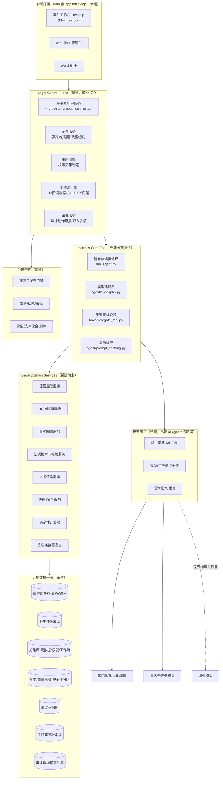
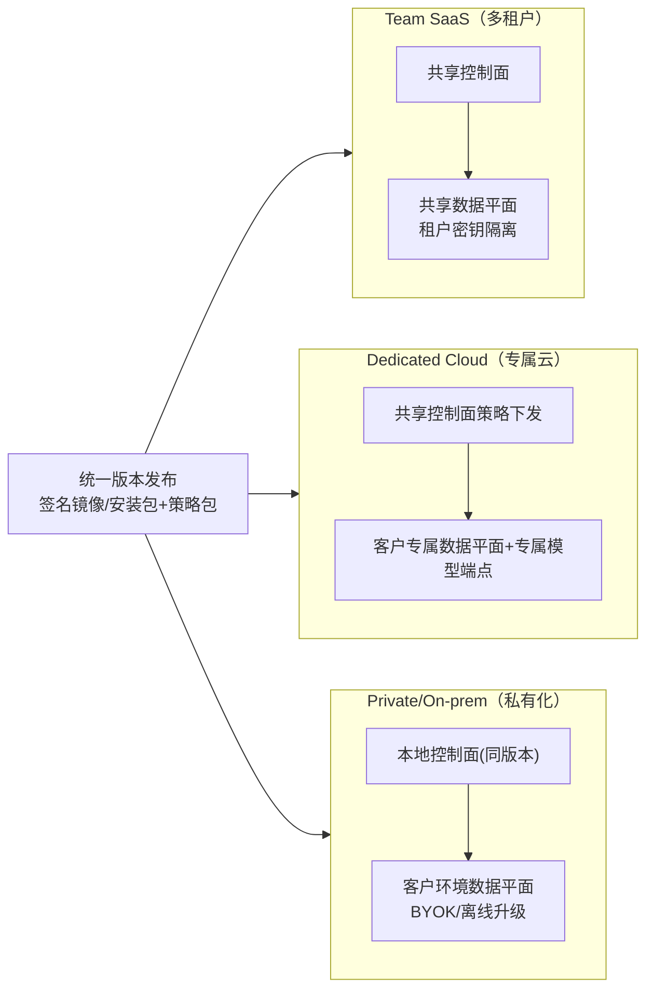

# Hermes Legal Matter OS 概要设计说明书

**版本：** V1.0（概要设计基线版）
**编制日期：** 2026 年 8 月 6 日
**编制依据：**
- 《Hermes 法律 AI 商业化规划》V1.0（下称"规划"，引用作"规划 §x.y"）
- 《Hermes Legal Matter OS 功能需求分析说明书》V1.0（下称"需求说明书"，引用作"FR-xx"）
- 当前分支（`商业化方案`）代码库审计事实（引用作具体文件路径）

**文档属性：** 技术设计基线；供架构、研发、安全与测试团队使用；详细设计（接口字段级、数据库 DDL）在 Alpha 阶段各模块设计文档中展开。

---

## 1. 引言

### 1.1 编写目的

本文档描述 Hermes Legal Matter OS 的总体技术设计：如何将当前分支上的 Hermes 通用智能体代码资产，演进为规划所定义的"法律控制面 + 法律领域服务 + Hermes 编排内核"三层商业产品。回答四个问题：

1. 现有代码哪些直接复用、哪些改造、哪些弃用（**资产映射**）；
2. 目标系统由哪些子系统构成、各自职责与边界（**逻辑架构**）；
3. 关键机制如何实现：工作流门禁、任务契约、权限交集、证据保全、引用链、审计链（**机制设计**）；
4. 三种交付形态（SaaS / 专属云 / 私有化）如何共用一套版本与策略控制面（**部署架构**）。

### 1.2 设计约束（不可违背）

| # | 约束 | 来源 |
|---|---|---|
| C1 | 提示缓存神圣性：系统提示词在会话内字节稳定；案件数据、权限、任务一律走动态数据对象，不进系统提示词 | 规划 §12.4、AGENTS.md |
| C2 | 窄核心：法律能力以业务工具 / 服务门控工具 / 独立服务 / MCP 提供，不增加 Hermes 常驻核心工具 schema | 规划 §2.4、§12.4 |
| C3 | 权限与数据过滤服务端强制，默认拒绝；不依赖前端隐藏或提示词 | 规划 §12.4 |
| C4 | 生产构建双重禁用 YOLO / `approval_mode=off` / 子智能体自动批准路径 | 规划 §2.3.4 |
| C5 | 生产案件智能体无通用终端、无自由外网、无未签名插件 | 规划 §2.3.1/§2.3.5 |
| C6 | 原件 WORM 不可变；模型输出永远不是数据库真值，须经 schema 校验与状态机 | 规划 §6.3、§12.4 |
| C7 | 原始案件材料默认不路由至境外模型（路由等级 A/B/C/D） | 规划 §6.2.5 |

### 1.3 术语

沿用需求说明书 §1.4 与规划附录 G。新增：

| 术语 | 含义 |
|---|---|
| Hermes Core Fork | 对当前分支核心代码的受控下游分支/包，持续跟踪上游安全修复 |
| Legal Control Plane（LCP） | 新建商业核心：租户、案件、角色、策略、伦理墙、审批、工作流、审计、模型路由、评测门禁 |
| Legal Domain Services（LDS） | 法律领域服务群：证据摄取、法源检索、事实图谱、要件矩阵、文书渲染、DLP、连接器 |
| 任务契约 | 智能体子任务的结构化输入/输出/授权/预算描述（FR-14-02） |

---

## 2. 总体设计

### 2.1 设计目标与原则

| 原则 | 落地方式 |
|---|---|
| 可验证优先于流畅 | Claim 对象 + 来源锚点 + 确定性验证器贯穿全链路（FR-12） |
| 隔离先于智能 | 先建租户/案件隔离与容器执行，再开放智能体能力（Alpha 门禁） |
| 人类实质判断内置 | 工作流状态机中 G0—G5 门禁为一等公民，非 UI 提示 |
| 供应商可替换 | 模型网关与法源双源校验；回归评测保证 48h 可切换 |
| 一套版本三种交付 | 同一镜像/安装包，部署形态仅由策略控制面配置决定 |

### 2.2 逻辑架构总览



### 2.3 当前代码资产映射（结合本分支实际结构）

| 现有资产（本分支路径） | 处理方式 | 目标位置 | 说明 |
|---|---|---|---|
| `run_agent.py`（AIAgent 会话循环，~373KB） | **保留** | Hermes Core Fork | 循环保留，外部包一层确定性工作流引擎；模型输出不能直接推进门禁 |
| `agent/conversation_loop.py`、`agent/prompt_caching.py`、`agent/prompt_builder.py`、`agent/system_prompt.py` | **保留** | Hermes Core Fork | 缓存稳定性是核心资产（约束 C1） |
| `agent/anthropic_adapter.py`、`bedrock_adapter.py`、`vertex_adapter.py`、`gemini_native_adapter.py`、`codex_responses_adapter.py`、`azure_identity_adapter.py` 等 | **抽取外置** | 模型网关 | 适配层保留，注册/路由/审计/留存策略由网关统一执行；新增中国区域供应商适配 |
| `tools/delegate_tool.py`、`agent/subagent_lifecycle.py`、`agent/delegation_context.py` | **改造** | Hermes Core Fork | 子智能体框架保留；注入法律角色卡、案件作用域、显式输入/输出契约；默认不递归保持 |
| `model_tools.py`（discover_builtin_tools / handle_function_call）、`tools/registry.py`（自动发现）、`check_fn` 机制 | **保留并强化** | Hermes Core Fork + LCP | `check_fn` 服务门控升级为 `租户∩案件∩角色∩任务∩授权` 交集判定（FR-15-01/02） |
| `toolsets.py`（`_HERMES_CORE_TOOLS`） | **裁剪** | Hermes Core Fork | 生产法律发行版仅保留只读检索类与业务语义工具；`terminal/process/execute_code/browser_*/computer_use/write_file` 等从生产工具面移除（约束 C5）；`_HERMES_WEBHOOK_SAFE_TOOLS` 证明已有按场景裁剪先例 |
| `tools/approval.py`、`tools/write_approval.py`、`hermes_cli/approval_mode.py` | **改造** | LCP 审批服务 | 升级为法律动作审批；构建与服务端双重删除 YOLO/`off`（约束 C4） |
| `tools/environments/`（local/docker/ssh/modal/daytona/singularity 终端后端） | **选择性复用** | 执行隔离层 | 容器化后端（docker/modal/daytona）用作任务沙箱底座；`local` 后端生产禁用 |
| `hermes_state.py`、`hermes_state_schema.py`、`hermes_state_search.py`（SessionDB + FTS5） | **限定用途** | Hermes Core Fork | 仅存会话/任务运行态；**不得**充当案件证据库（规划 §2.3.2） |
| `agent/memory_manager.py`、`agent/memory_provider.py` | **限定用途** | Hermes Core Fork | 案件内容默认不写入个人长期记忆；四域知识隔离由 LCP 策略执行（FR-17-03） |
| `agent/file_safety.py` | **降级为纵深防御** | Hermes Core Fork | 其自述"非安全边界"（规划 §2.3.1）；真正隔离由容器/微虚拟机承担 |
| `agent/redact.py`（`redact_pii`） | **替换** | 法律 DLP 服务 | 现有能力默认关闭且覆盖面不足（规划 §2.3.7）；新建中文法律 DLP |
| `hermes_cli/plugins.py`、`hermes_cli/mcp_catalog.py`、`tools/mcp_tool.py` | **改造** | 签名连接器宿主 | 生产默认关闭项目/用户/pip 插件；仅签名、审核、版本锁定连接器，独立进程运行 |
| `apps/desktop/electron/main.ts`、`preload.ts`（contextIsolation/nodeIntegration=false/sandbox 基线） | **fork 重做信息架构** | 案件工作台 Desktop | 安全基线沿用；UI 重构为"三栏一底座"（FR-20-01）；桌面审批交互保留 |
| `apps/desktop/src`（React/Vite 渲染层，708 TS + 496 TSX） | **部分复用** | 案件工作台 | 组件体系（shadcn/Tailwind）与构建链复用；案件树/矩阵/时间线/审阅器全新开发 |
| `gateway/`（消息平台网关） | **MVP 关闭** | — | 真实案件材料不经普通聊天平台流入（规划 §2.2）；后续仅用于受控通知 |
| `batch_runner.py`、`hermes_cli/kanban_*` | **参考** | 工作流引擎 | 并行批处理与看板多智能体协调的实现经验供工作流引擎借鉴 |
| `cli.py`（HermesCLI，~860KB） | **不进产品运行时** | 仅内部工具 | 商业产品以桌面/Web 为入口；CLI 保留为运维/诊断内部工具 |

### 2.4 目标代码布局（新仓库/发行版）

```
hermes-legal/
├── core/                     # Hermes Core Fork（跟踪上游，patch 集受控）
│   ├── run_agent.py / agent/ / tools/ / model_tools.py / toolsets.py
│   └── LEGAL-PATCHES/        # 法律发行版补丁集（工具裁剪、YOLO 移除、角色卡注入）
├── control_plane/            # Legal Control Plane（新建，Python/FastAPI 或 Go，见 §2.5）
│   ├── iam/  matters/  policy/  workflow/  approvals/  modelroute/
├── domain_services/          # Legal Domain Services
│   ├── ingestion/  ocr/  factgraph/  lawsources/  drafting/  dlp/  calc/  connectors/
├── governance/               # 评测门禁 / 审计链 / 告警 / 生命周期
├── apps/
│   ├── desktop/              # fork 自本分支 apps/desktop
│   ├── web/                  # 新建（沿用 apps/shared 与设计体系）
│   └── word-addin/           # 新建（Office.js）
├── deploy/                   # helm / terraform / 私有化安装包
└── eval/                     # 金标评测集与回归流水线（数据独立授权管理）
```

上游同步策略：`core/` 只通过 `LEGAL-PATCHES/` 的显式补丁集与上游 `main` 差异，每次上游升级跑"补丁重放 + 全量回归"，避免大规模合并冲突（规划 §2.4）。

### 2.5 技术选型

| 层 | 选型 | 理由 |
|---|---|---|
| 智能体内核 | 沿用 Python（本分支栈） | 复用最大资产；缓存/适配/审批成熟 |
| 控制面 API | Python FastAPI（默认）或 Go；最终决定在第 7 周"租户/案件服务"骨架时按团队栈确定 | 与内核同栈降低交互复杂度 |
| 关系库 | PostgreSQL（行级安全 RLS、审计触发器） | 租户/案件隔离的服务端强制基础 |
| 对象存储 | S3 兼容 + 对象锁/WORM；私有化用 MinIO/ceph | 原件不可变要求 |
| 索引 | OpenSearch/pgvector，按案件分区 | BM25 + 向量混合检索（FR-09-05） |
| 图 | 关系模型起步（facts/edges 表），规模需要时迁图库 | 避免过早引入图库运维成本 |
| 工作流引擎 | 确定性状态机（自研薄层 + 持久化队列，如 Temporal 或 Postgres 队列） | 门禁语义强、需可审计重放 |
| 任务沙箱 | 复用 `tools/environments/` 容器后端思路：每任务独立容器，只读案件视图挂载，egress 按域名/协议白名单 | 约束 C5 |
| 桌面 | Electron fork（现有安全基线） | 本地文件接收/Office 集成/私有化 |
| Web | React + Vite + shadcn/ui（沿用 `apps/desktop/src` 体系与 `apps/shared`） | 协作与管理 |
| Word 插件 | Office.js Add-in | 律师终改主场景 |
| OCR | 采购商业 OCR + 自建版面/坐标/质量层 | 规划 §15 Build/Buy/Partner |
| 审计事件库 | 追加写存储 + 哈希链（对象锁或 Kafka + WORM 落盘） | 不可抵赖 |

---

## 3. 子系统设计

### 3.1 Hermes Core Fork（智能体编排内核）

**职责：** 会话循环、提示缓存、多模型适配、子智能体委派、工具调度、审批回调、服务门控工具机制。

**保留不变量（受 C1/C2 保护，任何法律需求不得破坏）：**

1. 系统提示词会话内字节稳定；严格消息角色交替；
2. `discover_builtin_tools()` + `check_fn` 门控机制不变，但门控判定源改为 LCP 策略引擎下发的工具白名单；
3. 子智能体默认不递归委派；工具集继承并裁剪机制（`delegate_tool.py` 现有）正好用于角色卡裁剪。

**法律发行版改造点：**

| 改造 | 位置 | 内容 |
|---|---|---|
| 生产工具面裁剪 | `toolsets.py` / `LEGAL-PATCHES` | 生产 profile 仅含业务语义工具；通用终端/进程/代码执行/自由浏览器/计算机控制编译期与服务端双重排除 |
| YOLO 移除 | `hermes_cli/approval_mode.py`、`tools/approval.py` | 构建期删除 `--yolo`、会话级 YOLO、`approval_mode=off`；服务端二次校验，携带绕过参数的请求拒绝并告警 |
| 角色卡机制 | `agent/subagent_lifecycle.py` | 子智能体启动必须携带任务契约（FR-14-02），无契约拒绝执行 |
| 候选区写回 | `tools/write_approval.py` 思路推广 | 模型产出统一落"候选"命名空间，经状态机流转后才成为正式数据 |
| 会话库降级 | `hermes_state*.py` | 仅会话/任务运行态；不存案件原件、事实真值、审计 |

### 3.2 Legal Control Plane（LCP）

新建，商业产品核心。六个服务：

**3.2.1 身份与组织服务（IAM）**
- 五级范围模型（租户→办公室→团队→客户→案件）落入 PostgreSQL 行级安全；
- SSO（OIDC/SAML）、MFA、SCIM；临时访问与 Break-glass（FR-01-05/06）；
- 决策：身份不重复造轮，对接成熟 IdP（规划 §15）。

**3.2.2 案件服务（Matters）**
- 案件创建向导（G0 授权单）、高敏询问硬阻断（FR-02-04）、伦理墙与冲突标记（FR-02-03）、数据级别打标（FR-02-05）；
- 伦理墙实现：案件属性表 + 冲突关系表 + 策略引擎判定点，任何数据访问 SQL 强制注入案件作用域谓词（RLS + 服务层双重）。

**3.2.3 策略引擎（Policy）**
- 判定模型：`allow = 租户策略 ∩ 案件策略 ∩ 角色卡 ∩ 任务契约 ∩ 用户授权`，默认拒绝；
- 提供"策略模拟"接口供管理台预览；所有判定产生审计事件；
- 技术参考：OPA/Rego 或自研规则表，Alpha 期先以数据库规则表实现，避免引入新组件。

**3.2.4 工作流引擎（Workflow）**
- 13 阶段状态机 + G0—G5 门禁（需求 §2.4）；
- 状态持久化于关系库；门禁推进只能由"人工审批事件"或"确定性验证器通过事件"触发，**模型输出不是状态迁移的合法事件源**；
- 每阶段产物（原件清单、时间线、矩阵、备忘录、初稿、验证报告、导出清单）以版本化对象关联到状态迁移记录。

**3.2.5 审批服务（Approvals）**
- 法律动作分级：只读（免审批）/ 候选写入（免审批）/ 范围变更（单人）/ 外发·删除·跨案件·改保留策略（不可绕过，部分双人）；
- 复用内核审批回调管道，替换 UI 与策略源；审批记录与 Claim/成果版本绑定。

**3.2.6 模型路由服务（Model Route）**
- 模型注册表（供应商/区域/备案/训练留存条款/数据级别上限）；
- 路由等级 A/B/C/D（FR-16-02）：D 级数据在摄取时即阻断进入任何普通模型队列；
- 请求/响应只记哈希与元数据，不记明文推理链（FR-16-03）；
- 成本账本：按案件/任务聚合 Token、OCR、存储成本，支撑预算封顶与毛利分析。

### 3.3 智能体执行层（角色化多智能体）

**组织方式：** 任务状态机 + 角色化智能体 + 确定性验证器 + 人工总负责人（规划 §5.2）。智能体间不自由聊天，经版本化任务对象交换信息。

**角色卡 = 固定版本的四元组：** `系统提示词模板 + 工具白名单 + 输出 schema + 禁止事项`。十类角色（FR-14-01）的编制与红线：

| 角色 | 内核映射 | 关键工具（业务语义） | 红线 |
|---|---|---|---|
| 案件监督 | delegate 编排者 | 任务图/状态/成本查询 | 不输出最终法律结论 |
| 合规哨兵 | check_fn 强化 | 策略查询/DLP/审计查询 | 不读超判断所需全文 |
| 摄取 | 服务调用型 | ingestion API | 不改原件、无外网 |
| 事实 | 子智能体 | matter_read / candidate_fact_write | 不置"已确认" |
| 证据 | 子智能体 | factgraph 读写候选 | 不判定最终证明力 |
| 法律研究 | 子智能体 | lawsource 检索 | 必须返回不利法源与边界 |
| 对抗 | 子智能体 | 已授权事实+已验证法源只读 | 不编造对方事实 |
| 起草 | 子智能体 | 模板/引用服务 | 不引入未确认事实 |
| 验证 | 确定性验证器为主 | 原文定位/法源校验/计算器 | 不见起草自评分 |
| 输出 | 服务调用型 | 渲染/标识/导出清单 | 不发送、不覆盖已签版本 |

**执行隔离：** 每个子任务在独立容器中运行（复用 `tools/environments/` 容器后端模式），挂载只读/最小可写案件视图，egress 白名单，临时目录随任务销毁，预算超限强杀（FR-14-04/05）。

**提示注入防线：** 文档内容经 message 封装标记为不可信数据（现有 `agent/message_sanitization.py`、`tools/threat_patterns.py` 思路强化），工具白名单 + 无自由外网使注入无落点（FR-15-04）。

### 3.4 Legal Domain Services（LDS）

**3.4.1 证据摄取服务（ingestion）**
流水线：接收 → 隔离（AV/CDR/解压炸弹/宏脚本）→ 哈希封存（SHA-256 + 对象锁）→ OCR/版面 → 页级质量评分 → 去重/版本/附件关系 → 候选实体。每阶段幂等、可重试、留处理历史（FR-03）。现有 `tools/read_extract.py` 的 Office/PDF 解析仅作原型参考，法律级摄取重建（规划 §2.3.8）。

**3.4.2 OCR/版面服务（ocr）**
采购引擎 + 自建质量层：页坐标（bounding_box）、表格结构、手写/印章检测、低质页路由人工抽检。摘录寻址统一为 `document_id + page + bounding_box + text_hash`。

**3.4.3 事实图谱服务（factgraph）**
- 实体/事实/事件/证据映射的存储与查询；事实状态机（FR-05-01）在此实现；
- 关系模型起步：`entities / facts / fact_sources / evidence_links / issue_matrix` 表族；
- 所有写操作区分命名空间：`candidate_*`（模型）vs `confirmed_*`（人工）。

**3.4.4 法源检索与校验服务（lawsources）**
- 接入授权法源 API（北大法宝/威科/元典类）+ 国家法律法规数据库、人民法院案例库核验路径；
- 双源校验 + citator 式效力/时点判断（FR-09-02）；
- 检索记录（查询式、版本、命中、反向权威）持久化为研究备忘录；
- 设计要点：供应商可替换——定义内部 `LawSourceProvider` 接口，编排与门禁自建（规划 §15）。

**3.4.5 文书渲染服务（drafting）**
模板引擎 + 引用服务 + Word/PDF 渲染；只消费 `confirmed` 事实与已验证法源（FR-06-04 的技术执行点：渲染前查询矩阵视图，越界引用直接失败）；AI 标识策略在导出管道注入（FR-11-05）。

**3.4.6 法律 DLP 服务（dlp）**
中文法律实体识别（身份证/银行卡/医疗/案号/印章签名等 12 类，FR-17-01）；受控本地执行；字段级处理依据留痕；可逆令牌化用于"去标识外部模型"路由等级 C 的前置处理。

**3.4.7 确定性计算器（calc）**
金额/利息/期限计算为纯代码服务，输入留存、结果可重算；文书中所有数值结论必须经由它产出（FR-11-04）。

**3.4.8 签名连接器宿主（connectors）**
独立进程运行签名连接器（DMS/邮箱/OA/日历），最小 OAuth 范围，独立身份；复用 `hermes_cli/plugins.py` 加载器骨架但默认全关、白名单签名验证 + 版本锁定（FR-15-03）。

### 3.5 模型网关

物理形态：独立部署的网关服务（所有模型调用唯一出口）。
数据流：`智能体 → 网关（策略判定/DLP前置/路由/记账/审计）→ 供应商适配层（复用 agent/*_adapter.py）→ 模型`。
降级：主模型不可用→同等级备选；全网关不可用→只读降级模式（FR-16-05）。

### 3.6 治理平面

- **评测流水线（governance/eval）：** 离线单元 → 端到端 → 盲评 A/B → 对抗 → 回归 → 影子 → 小流量 + 自动回滚（FR-22-02）；任一模型/提示/检索器/OCR/法源/工具 schema 变更触发；
- **审计链：** 事件追加写 + 每日哈希锚定；导出签名清单 + 独立校验工具（FR-18）；
- **告警：** 蜜标文档/金丝雀实体、越权、错误路由、注入命中、未批准外发、审计缺失（FR-18-04）；
- **生命周期：** 保留策略引擎、法律保全优先、可验证删除（FR-19）。

### 3.7 体验平面

- **Desktop（fork `apps/desktop`）：** 保留 `electron/main.ts`/`preload.ts` 安全基线与 `backend-*` 进程管理；渲染层重构为三栏一底座（案件树 / 结构化工作区 / 来源审阅器 / 智能体底座）；桌面审批交互沿用并接入 LCP 审批服务；
- **Web：** 新建，面向协作、管理台、复核看板；复用桌面组件体系；
- **Word 插件：** 新建 Office.js 加载项，拉取待审文书、回写修订与审批；
- **聊天定位：** 仅任务发起与追问入口，非案件系统本体（FR-20-01 约束）。

---

## 4. 关键机制设计

### 4.1 权限交集判定链路

```
请求 → IAM 认证(用户/设备/会话)
     → 策略引擎: 租户∩案件∩角色∩任务∩授权  (任一否决即拒)
     → 数据访问层: RLS 谓词注入(案件作用域强制)
     → 审计: 判定结果+依据落链
```
负向测试（跨案件读取/检索必失败）纳入每次发布回归（Alpha 门禁）。

### 4.2 任务契约流转

1. 工作流引擎按阶段生成任务契约（FR-14-02 全字段）；
2. 内核以契约组装角色卡：裁剪工具白名单、注入授权材料视图（短期令牌）；
3. 子智能体产出五段结构（observations/inferences/unknowns/conflicts/provenance），schema 校验失败即任务失败；
4. 产出落候选区 → 验证器检查 → 需要人工的送审 → 状态机迁移；
5. 视图令牌随任务结束失效（权限可撤销，且不动系统提示词，满足 C1）。

### 4.3 引用与验证链（防幻觉主机制）

```
检索结果(带稳定锚点) → 引用约束生成(只能引用锚点)
→ Claim 对象落库 → 发布前验证器八项检查(FR-12-02)
→ 阻断项清零 → G4 人工批准 → 导出/外发(G5)
```
验证器为确定性代码：锚点存在性、页码/摘录哈希一致性、法源时点有效性、数值重算等不依赖模型自评；"引文是否支持命题"使用独立校验模型 + 抽检复核双轨。

### 4.4 审计哈希链

事件追加写：`event_n.hash = SHA256(event_n.payload ‖ event_{n-1}.hash)`；每日锚定至独立 WORM 区；导出附签名清单与校验工具；审计访问本身被审计，高敏正文二次授权（FR-18-02）。

### 4.5 密钥体系

- 分级：主密钥（KMS/HSM）→ 租户密钥 → 案件密钥；
- 索引、原件、派生件按案件密钥加密；跨案件泄露即便绕过应用层也无法解密；
- BYOK（专属云/私有化，FR-16-06）；密钥轮换纳入 V1 合规清单。

---

## 5. 数据设计（概要）

核心实体关系（详设阶段出 DDL）：

```
tenant ─ office ─ team ─ user
client ── matter(案件) ── matter_member / ethics_wall / data_label
matter ── evidence_doc(原件: hash/WORM) ── derived_doc(派生件+坐标)
matter ── entity / alias
fact(状态机+来源锚点) ── fact_source ── evidence_doc
issue(争点) ── element(要件) ── matrix_cell ── fact / evidence_link / law_citation
law_source(法源: 层级/时点/修订关系/授权)
claim(命题+支持/反对+时点+审阅状态) ── artifact(成果版本)
task_contract / task_run / approval_event
audit_event(哈希链) / retention_policy / legal_hold
value_metric(净工时/采纳/成本)
```

存储选型见 §2.5；分区原则：全文/向量索引按案件逻辑分区，过滤条件强制注入，禁止全局相似检索（规划 §6.2.2）。

## 6. 接口设计（概要）

| 类别 | 接口 | 形态 |
|---|---|---|
| 客户端↔LCP | REST/gRPC + WebSocket（任务进度/审批通知） | 全部经策略引擎 |
| LCP↔内核 | 任务契约提交、角色卡下发、候选回写、审批回调 | 进程内/本机服务，发行版打包 |
| 内核↔领域服务 | 业务语义工具（`matter_read`、`candidate_fact_write`、`lawsource_search`、`doc_render`…）经 check_fn 门控 | 服务 API 或 MCP |
| 网关↔供应商 | 复用 `agent/*_adapter.py` 适配族 | 统一出口 |
| 外部集成 | 法源 API、IdP(OIDC/SAML/SCIM)、DMS/邮箱/OA 连接器、对象存储/KMS | 签名连接器 + 最小授权 |

## 7. 安全设计要点

威胁模型十项控制按规划 §6.5 全量落位（跨租户泄露、提示注入、恶意文件、供应商泄露、内部越权、插件供应链、法源错误、证据污染、审计泄密、自动外发），对应机制分布：策略引擎 + RLS（泄露）、不可信内容封装 + 白名单（注入）、隔离区 + 沙箱解析（恶意文件）、网关 DPA/区域路由（供应商）、JIT + 双人 + 字段加密（内部）、签名 + 版本锁定 + 隔离进程（插件）、双源 citator + 门禁（法源）、WORM + 哈希链（污染与审计）、待发送包 + 不可绕过人审（外发）。

## 8. 部署架构



三种形态共用同一代码基线与策略控制面语义；差异仅是部署拓扑与密钥归属（FR-24-03）。私有化标准包：离线安装、离线升级、伙伴可交付，但核心数据/权限设计不可定制（规划 §11.6）。

## 9. 非功能设计

| 维度 | 设计目标 | 手段 |
|---|---|---|
| 可用性 | SaaS 99.9%/月；RPO 元数据≤5min、原件写入即多副本；RTO 核心查看≤4h | 多副本、幂等重试、降级只读、季度演练 |
| 性能 | 关键交互不中断连续工作；案件预算封顶 | 缓存（内核资产）、异步流水线、并发预算 |
| 可观测 | 审计即观测底座；成本/时延/质量看板 | 审计事件 + 指标管线（FR-18/22/23） |
| 可测试 | 行为契约与隔离不变量断言；真实路径 E2E（身份/权限/存储/文件 I/O） | 负向测试集 + 金标回归（规划 §12.4） |
| 可演进 | 上游 patch 重放；供应商可替换；配置化扩案由 | LEGAL-PATCHES、Provider 接口、playbook 配置 |

## 10. 演进路径（与路线图对齐）

| 阶段 | 架构交付 |
|---|---|
| 阶段 0（0—6 周） | fork 边界划定、LEGAL-PATCHES 骨架、威胁模型、案件/事实/Claim/审计数据模型 V0 |
| 阶段 1 Alpha（7—16 周） | IAM/案件/策略最小闭环、摄取+OCR+清单、事实时间线、案件问答、模型网关+境内模型、桌面三栏原型、执行隔离 v1 |
| 阶段 2 试点（4—6 月） | 要件矩阵、法源校验、对抗、起草、审批+导出、价值仪表盘 |
| 阶段 3 V1（7—12 月） | SSO/MFA/伦理墙完备、Word 插件、首批连接器、受控多智能体队列、BYOK、审计导出、等保配套 |
| 阶段 4 企业化（13—18 月） | 私有化标准包、第二案由 playbook、双源法源、客户门户、组合视图 |

---

**文档结束。** 本文档与《商业化规划》《功能需求分析说明书》配套；详细设计按子系统在 Alpha 阶段分别成文，任何偏离 §1.2 设计约束的实现须提交架构委员会评审。
