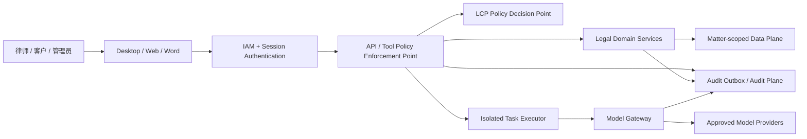
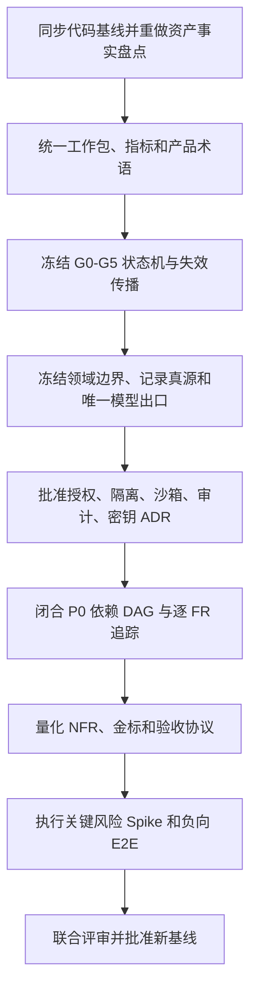

# Hermes Legal Matter OS 需求分析与概要设计评审报告

**文档版本：** V1.0

**评审日期：** 2026 年 8 月 11 日

**评审对象分支：** `商业化方案`

**比较基线：** `upstream/main...商业化方案`

**评审性质：** 产品、需求、架构、安全与代码一致性只读审查
**评审结论：** 有条件继续探索；暂不批准作为正式开发与验收基线

| 版本 | 日期       | 变更                                 | 状态   |
| ---- | ---------- | ------------------------------------ | ------ |
| V1.0 | 2026-08-11 | 首次形成完整评审、风险矩阵与整改门禁 | 待评审 |

> 本报告是产品与技术评审，不构成律师事务所出具的专项法律意见。涉及监管适用、数据跨境、律师执业规范、算法备案、安全评估、增值电信业务许可和等级保护定级的结论，仍应由具备相应资质的专业人员结合最终产品形态、服务对象、部署区域和合同结构确认。

---

## 目录

1. 执行摘要
2. 评审范围、基线与方法
3. 严重度定义与批准规则
4. 阻断性跨文档问题
5. 功能需求分析详细评价
6. 概要设计详细评价
7. 与 Hermes 当前代码的适配性评价
8. 合规与标准有效性抽查
9. 文档优点与可继承资产
10. 综合风险矩阵
11. 整改路线与交付顺序
12. 必须形成的 ADR 清单
13. 需求追踪与验收模板
14. 重新基线化退出条件
15. 对两份原文档的具体修订建议
16. 最终评价
17. 附录

---

## 1. 执行摘要

### 1.1 总体判断

《Hermes Legal Matter OS 功能需求分析说明书》和《Hermes Legal Matter OS 概要设计说明书》已经形成较完整的法律 AI 产品骨架。文档在产品边界、律师监督、证据来源、法源时点、模型供应商治理、人工门禁、数据分级和部署形态方面，明显优于一般“法律聊天机器人”方案。

但是，两份文档目前仍更接近“高质量产品与架构构想”，尚未达到可直接指导跨团队开发、测试、采购、合规评审和客户验收的正式基线水平。主要差距并不是功能数量不足，而是以下关键不变量尚未形成唯一、可执行、可测试的定义：

1. 案件工作包及其完成状态没有定义；
2. G0—G5 门禁模型前后不一致；
3. 新证据、事实、法源或权限变化不会明确使下游成果和批准失效；
4. `check_fn` 在拟议方案中被错误赋予案件级动态授权职责；
5. SessionDB 可能成为绕过案件隔离和生命周期治理的第二数据面；
6. “每任务独立容器”与 Hermes 当前子智能体实现不相符；
7. 多租户隔离只详细落在 PostgreSQL RLS，未覆盖对象、索引、图、队列、缓存、审计与会话；
8. 模型适配、策略和出口存在多个所有者；
9. 跨存储事务、审计原子性和故障恢复没有形成机制；
10. P0 范围、数据准备、性能指标和商业化生命周期仍不可执行。

因此，本报告建议：

- **允许继续：** 客户访谈、数据授权、UX 原型、证据摄取 PoC、法源供应商 PoC、模型网关 PoC、隔离执行器 Spike、金标设计；
- **暂缓承诺：** 完整 Alpha 工期、固定报价、正式安全承诺、按当前文档签署验收范围；
- **暂不批准：** 将当前 V1.0 标记为正式需求/概要设计基线并全面进入详细设计。

### 1.2 评分

以下综合分均按表内维度等权计算算术平均值，并四舍五入到整数，确保评分可以复算。评分用于反映文档基线成熟度，不是产品商业价值或最终实现质量评分。

#### 功能需求说明书

| 维度               |       评分 | 评价                                    |
| ------------------ | ---------: | --------------------------------------- |
| 产品定位与范围控制 |     88/100 | 首发案由、律师监督和禁止事项清楚        |
| 法律业务覆盖       |     78/100 | 主流程完整，异常流程和时效对象不足      |
| 安全与合规意识     |     86/100 | 威胁覆盖面强，但部分控制尚未可执行      |
| 需求原子性与优先级 |     52/100 | 多个复合需求使用 P0/P1，阶段依赖冲突    |
| 可测试与可验收性   |     43/100 | 关键术语、阈值、数据集和统计口径不足    |
| 权限与异常流程     |     55/100 | 有原则和公式，缺授权生命周期与负向路径  |
| 依赖与追踪一致性   |     45/100 | FR 编号较好，但追踪矩阵过粗且有错误引用 |
| **综合**           | **64/100** | 适合作为细化骨架，不宜直接作为验收基线  |

#### 概要设计说明书

| 维度                 |       评分 | 评价                                        |
| -------------------- | ---------: | ------------------------------------------- |
| 设计原则与风险意识   |     85/100 | 窄核心、提示缓存、人审、证据真值原则正确    |
| Hermes 资产映射      |     75/100 | 主体覆盖较好，但若干复用假设不成立          |
| 组件边界与职责       |     55/100 | 模型、Claim、矩阵、审计存在所有权重叠或缺位 |
| 数据模型与一致性     |     45/100 | 多存储一致性、租户归属和会话治理不足        |
| 工作流与审批         |     45/100 | 缺正式状态机、并发控制和失效传播            |
| 隔离与安全落地       |     50/100 | 控制目标正确，执行点和令牌生命周期不足      |
| 审计、密钥与生命周期 |     55/100 | 有框架，缺不可抵赖和可验证删除的完整机制    |
| 可用性、性能与灾备   |     45/100 | SLO、容量模型、RPO 分层和恢复顺序不足       |
| 部署与扩展性         |     60/100 | 三种交付形态方向正确，差异被明显低估        |
| 可测试与可验收       |     45/100 | 架构退出门禁和逐 FR 追踪不足                |
| **综合**             | **56/100** | 尚不能作为冻结后的概要设计基线              |

### 1.3 Go/No-Go 结论

| 决策对象            | 结论              | 条件                                                    |
| ------------------- | ----------------- | ------------------------------------------------------- |
| 产品方向            | Go                | 继续聚焦商业合同争议与律师工作台，不扩第二案由          |
| 客户共创与调研      | Go                | 使用真实但依法授权、隔离、去标识的数据                  |
| UX 与低耦合技术 PoC | Go                | 不预先固化尚未批准的授权和数据架构                      |
| Alpha 全量开发      | Conditional No-Go | 关闭本报告全部 P0，并批准核心 ADR                       |
| 正式安全承诺        | No-Go             | 完成全存储隔离、能力令牌、审计、恢复和负向 E2E 后再承诺 |
| 商业报价与固定验收  | No-Go             | 工作包、指标、阶段范围、权益和退出条款未形成基线        |

---

## 2. 评审范围、基线与方法

### 2.1 主要评审对象

1. [Hermes Legal Matter OS 功能需求分析说明书](./hermes-legal-ai-functional-requirements-spec-zh.md)
2. [Hermes Legal Matter OS 概要设计说明书](./hermes-legal-ai-high-level-design-zh.md)

关联参考：

3. [Hermes 法律 AI 商业化规划](./hermes-legal-ai-commercialization-plan-zh.md)
4. 当前 `商业化方案` 分支中的 Hermes 实现和仓库开发规则。

### 2.2 重点核验的代码资产

| 领域           | 主要文件或目录                                                                | 核验目的                                                |
| -------------- | ----------------------------------------------------------------------------- | ------------------------------------------------------- |
| 工具发现与执行 | `tools/registry.py`、`model_tools.py`、`toolsets.py`                          | 核验 `check_fn`、toolset、schema 与 dispatch 的真实边界 |
| 子智能体       | `tools/delegate_tool.py`、`agent/subagent_lifecycle.py`                       | 核验线程、容器、工具继承和自动批准机制                  |
| 会话存储       | `hermes_state.py`、`hermes_state_common.py`、`hermes_state_search.py`         | 核验会话正文、FTS 和租户/案件作用域                     |
| 审批           | `tools/approval.py`、`tools/write_approval.py`、`hermes_cli/approval_mode.py` | 核验 YOLO、审批和恢复路径                               |
| Desktop        | `apps/desktop/`、`apps/shared/`、`tui_gateway/`                               | 核验真实 transport、会话能力和 GUI 工具装配             |
| 插件           | `hermes_cli/plugins.py`                                                       | 核验宿主内加载与独立进程安全边界                        |
| 工程规则       | `AGENTS.md`                                                                   | 核验窄核心、提示缓存和会话级能力原则                    |

### 2.3 分支状态

审查时：

- 当前分支：`商业化方案`；
- 跟踪分支：`origin/商业化方案`；
- 取证时间：`2026-08-11（Asia/Shanghai）`；
- 当前提交：`ffa565d467c39d8ef00ae13b8eca0c17cc40af13`；
- `upstream/main` 提交：`936dd7346fd7fd8107af1ce7fc019c07c001c1bd`；
- 与上游的 merge-base：`326bdfb7a27e292a25aa1a8a073e6fac43460a98`；
- 相对 `upstream/main`：落后 67 个提交、领先 6 个提交；
- 商业化文档为该分支新增内容；
- 工作区在审查前无已知用户修改需要覆盖。

这意味着概要设计中“基于当前代码库审计事实”的表述具有时效风险。正式基线化前应同步上游并重新执行资产映射审查。

### 2.4 评审方法

本报告使用以下五组检查：

1. **需求质量检查：** 完整性、一致性、原子性、优先级、依赖、异常流、可测试性、可验收性；
2. **架构不变量检查：** 租户隔离、案件隔离、最小权限、提示缓存、工具面稳定、不可变证据、人工门禁、模型唯一出口；
3. **代码一致性检查：** 文档声称的复用、改造和安全边界是否与当前实现一致；
4. **商业闭环检查：** 客户开通、权益、配额、计量、试用、续费、暂停、退出和数据返还；
5. **合规有效性抽查：** 对文档已经引用的中国现行规则和标准进行名称、状态与技术承接点核验。

### 2.5 审查限制

- 本次为文档与静态代码审查，没有对尚未实现的商业系统执行运行时渗透测试或性能压测；
- 对法律法规的核验仅用于判断需求是否遗漏技术承接点，不替代正式法律意见；
- 对收入、市场规模和价格假设未进行财务尽调；
- 对 OCR、法源数据库、模型供应商和云服务商未进行采购级尽调；
- 评分用于表示基线成熟度，不代表产品最终商业价值。

---

## 3. 严重度定义与批准规则

| 级别    | 定义                                                               | 处理规则                               |
| ------- | ------------------------------------------------------------------ | -------------------------------------- |
| P0 阻断 | 会直接破坏授权、隔离、证据完整性、人工门禁、核心验收或阶段可执行性 | 正式基线化前必须关闭，不接受仅记录风险 |
| P1 高   | 会显著增加数据泄露、错误法律成果、返工、延期、运维或商业失败概率   | Alpha 相应模块详细设计前必须关闭       |
| P2 中   | 不阻止 PoC，但会降低一致性、可维护性、用户体验或审计质量           | 收费 V1 前关闭，或经书面风险接受       |
| P3 低   | 表述、格式、导航和一般文档质量问题                                 | 后续编辑周期修正                       |

“关闭问题”必须同时具备：

1. 原文已修订；
2. 责任组件和唯一所有者已确定；
3. API、事件或数据契约已承接；
4. 正向、负向和故障测试已定义；
5. 相关 ADR 已批准；
6. 追踪矩阵可定位到验收证据。

---

## 4. 阻断性跨文档问题

本节 P0 是“若按当前商业化文档实施，将在进入正式基线或生产系统前形成的阻断风险”，不是对通用 Hermes 当前已经发生相应法律多租户安全事件的断言。风险评级衡量的是拟议复用方式与法律生产目标之间的差距；其中涉及的法律租户、案件授权和法律会话数据面尚未按本方案落地。

### P0-01：若按文档将 `check_fn` 用作案件级动态授权，将形成阻断性设计错误

#### 文档证据

- 需求要求用 `check_fn` 实现案件角色工具白名单：`功能需求说明书:329`；
- 概要设计要求把 `check_fn` 升级为“租户∩案件∩角色∩任务∩授权”：`概要设计说明书:139`；
- Core 不变量继续把 LCP 白名单作为 `check_fn` 判定源：`概要设计说明书:205`；
- 内核与领域服务接口继续经 `check_fn` 门控：`概要设计说明书:394`。

#### 代码事实

- `tools/registry.py:257-265`：`check_fn` 有 30 秒 TTL、60 秒 last-good 容错缓存；
- `tools/registry.py:287-340`：缓存键为函数与 profile，不含用户、案件或任务；
- `model_tools.py:276-397`：工具定义本身还有独立缓存；
- `model_tools.py:1437-1443`：普通工具最终按名称进入 registry dispatch；
- `AGENTS.md` 明确规定 `check_fn` 只用于可达性或用户开关，不得承载会话级表面能力和案件授权。

#### 风险

1. 某案件的允许结果可能被同一长驻进程中的其他会话复用；
2. 人员离职、伦理墙更新或案件提级后，授权不能即时撤销；
3. 工具是否出现在 schema 中被误当成真正的安全边界；
4. 动态改变工具 schema 会破坏会话级提示缓存稳定性；
5. schema 隐藏本身不能约束内部 API、直接 dispatch 或未来新增的调用路径，因而不能被视为授权证明。

#### 必须整改

1. `check_fn` 只检查服务是否配置、依赖是否可达；
2. 新任务或新角色创建新会话，并一次性确定命名 `legal-*` toolset；
3. 会话生命周期内不修改系统提示词和工具 schema；
4. 每次工具调用经过不可绕过、异常即拒绝的服务端 PEP；
5. PEP 调用 LCP/PDP，根据短期能力令牌和当前策略重新判定；
6. 能力令牌至少绑定 `tenant_id`、`matter_id`、`user_id`、`task_contract_id`、`tool`、`action`、`object_scope`、`policy_version`、`audience`、`expiry` 和 `nonce`；
7. 领域服务和存储层继续执行 RLS/对象级授权。

#### 关闭证据

- ADR：工具面与授权边界；
- 调用时序图；
- 令牌 schema 和撤销协议；
- 跨租户、跨案件、过期、撤权、策略版本漂移、重放攻击负向 E2E；
- system prompt 与 tool schema 会话内字节稳定回归测试。

### P0-02：若法律会话沿用当前 SessionDB，将形成无案件边界的第二数据面

#### 文档证据

- 需求仅称 SessionDB 不得作为正式案件证据库：`功能需求说明书:518`；
- 概要设计仅将其限定为会话/任务运行态：`概要设计说明书:143、216`。

#### 代码事实

- `hermes_state_common.py:207-264` 的 `sessions` 表没有 `tenant_id` 或 `matter_id`；
- `hermes_state_common.py:266-290` 的 `messages` 表保存 `content`、`reasoning`、`tool_calls` 等完整内容；
- `hermes_state_search.py` 的 FTS 面向会话库搜索，没有正式案件授权维度；
- 会话中实际会出现事实摘录、律师批注、模型输出和工具结果，即使它不被命名为“证据库”，仍属于案件数据。

#### 风险

- 绕过 PostgreSQL RLS 和案件伦理墙；
- 绕过案件密钥、保留策略、法律保全和删除流程；
- `session_search` 可能检索到其他案件正文；
- 模型上下文和推理数据无法纳入客户退出及删除证明。

#### 必须整改

生产架构明确选择并批准以下之一：

1. **统一数据面方案：** 会话和消息迁入 LCP 管理的关系存储，`tenant_id`、`matter_id` 强制非空并执行 RLS；或
2. **物理隔离方案：** 每租户独立 SessionDB、独立密钥和进程边界，禁用跨库会话搜索。

无论选择何种方案，都必须把会话正文、模型上下文、工具结果和推理元数据加入数据分类、保留、法律保全、出口和删除矩阵。

#### 关闭证据

- Session 数据 ADR；
- 数据分类和生命周期矩阵；
- 跨租户会话搜索负测；
- 客户退出和法律保全演练记录；
- 会话数据恢复、导出和可验证删除测试。

### P0-03：若直接把现有子智能体机制视为生产隔离，将无法实现“每任务独立容器”

#### 文档证据

- 将 `tools/environments/` 作为任务沙箱底座：`概要设计说明书:142、187`；
- 声称每个子任务在独立容器运行：`概要设计说明书:270`。

#### 代码事实

- `tools/delegate_tool.py:63-76`：子智能体由线程池工作线程执行；
- `tools/delegate_tool.py:1614-1641`：在宿主进程内直接创建新的 `AIAgent`，且可共享父会话数据库；
- `tools/delegate_tool.py:2298-2338`：使用 ThreadPoolExecutor 调度；
- `tools/environments/` 主要提供在特定后端运行终端命令的能力，不等同于把完整智能体运行时放进独立安全域。

#### 风险

- Python 进程、模型凭证、插件、内存和网络客户端没有隔离；
- 某子任务被提示注入后可能触达同一宿主进程中的共享状态；
- `task_id`、工作目录和工具裁剪被误认为容器级安全边界；
- 预算强杀和临时目录销毁无法保证清除宿主进程内状态。

#### 必须整改

新建法律任务执行器，而不是仅配置现有终端 backend：

- 每任务独立进程、容器或微虚拟机；
- 独立短期身份和能力令牌；
- 只读/最小可写案件视图；
- 受控 RPC，不直接共享父进程对象；
- 网络出口白名单；
- CPU、内存、磁盘、时间、调用次数和费用硬限额；
- 任务取消、撤权和结束后的确定性销毁；
- 运行时镜像签名、SBOM 和补丁策略。

#### 关闭证据

- Task Executor ADR；
- 容器/进程信任边界图；
- 凭证不可见、网络不可达、挂载只读、资源强杀、销毁后不可恢复等 E2E；
- 逃逸和提示注入红队结果。

### P0-04：核心验收对象“案件工作包”没有可执行定义

#### 文档证据

- 术语表称工作包定义见 §3.13，但 §3.13 实际为审批模块：`功能需求说明书:42、301`；
- 北极星指标依赖每个案件工作包节省净工时：`功能需求说明书:69`；
- 价值仪表盘和使用门禁依赖工作包数量、完成率：`功能需求说明书:408、580`。

#### 风险

- 不同团队可采用不同计数口径；
- 同一案件拆分多个工作包可能人为放大使用量和效率；
- 付费、试点成功和验收结果无法复现；
- 产品范围、任务编排和成果版本没有统一聚合根。

#### 必须整改

新增独立 FR，至少定义：

1. 工作包适用的案件阶段和文书类型；
2. 必选构件与可选构件；
3. 每个构件最低质量和状态；
4. 绑定的证据、事实、法源、Claim 和成果版本；
5. 必须通过的门禁；
6. 完成、撤回、作废、重开和重新计数规则；
7. 一个案件、一个争点、一个成果与工作包的基数关系；
8. 工时、成本、采纳率和完成率的分母。

#### 关闭证据

- 工作包 JSON Schema/领域模型；
- 三个代表性案件实例；
- 计数和状态转换测试；
- 商业计量与验收共同签字确认。

### P0-05：G0—G5 门禁定义矛盾且缺少正式状态机

#### 文档证据

- 总流程声明 G0—G5 均为人工实质放行节点：`功能需求说明书:126`；
- 材料完整性和低置信页抽检属于 G1：`功能需求说明书:131-132`；
- FR-13 只列 G0、G2、G3、G4、G5，遗漏 G1：`功能需求说明书:305`；
- 归档另使用未编号的“归档门”：`功能需求说明书:142`；
- 概要设计只说明“13 阶段 + G0—G5”：`概要设计说明书:236-239`。

#### 风险

- 未确认来源和完整性的材料可能进入事实抽取；
- 实现团队可能创造不同的 G1、归档门和审批语义；
- 并发审批、驳回、超时、重开和回退无法统一；
- 审计记录无法证明某成果究竟通过了哪些前置条件。

#### 必须整改

建立唯一门禁状态机，逐门定义：

- 责任角色；
- 前置状态和必需产物；
- 自动验证项和人工判断项；
- 通过、驳回、豁免、超时、取消；
- 重开和回退规则；
- 职责分离和自批准禁止；
- 审批绑定版本；
- 审计事件；
- 对下游导出和编辑权限的影响。

#### 关闭证据

- 状态图、事件表和权限表；
- 并发审批 optimistic locking 设计；
- 每个门禁正向、驳回、超时、重开、回退测试；
- 归档门正式编号或定义为独立生命周期状态。

### P0-06：上游变化不会明确使下游成果和批准失效

#### 文档证据

- 事实允许被后续材料推翻或更新：`功能需求说明书:228`；
- 要件矩阵、文书和 Claim 依赖已确认事实与法源：`功能需求说明书:241、243、297`；
- 当前只要求外发前查看版本差异：`功能需求说明书:307`；
- 概要设计的任务和发布链仍是线性描述：`概要设计说明书:339-354`。

#### 风险

- 已通过 G4/G5 的成果可能引用已经变更的事实或失效法源；
- OCR 修正后原摘录坐标和哈希不再有效，但下游仍显示“已验证”；
- 新增伦理墙、权限撤销或材料版本替换不会阻止旧成果导出；
- 审批仅绑定对象 ID 时，会错误覆盖新版本。

#### 必须整改

1. 维护事实、证据、法源、计算结果、Claim、矩阵和成果之间的不可变依赖 DAG；
2. 每个节点记录输入版本集合和内容哈希；
3. 来源版本、哈希、OCR 坐标、权限、事实、法源效力或验证器版本变化时，计算受影响闭包；
4. 下游对象自动转为 `stale`；
5. 回退至最早受影响门禁；
6. `stale` 对象不可批准、不可外发、不可作为新成果的已确认输入；
7. 审批绑定成果哈希、输入版本、策略版本、验证器版本和差异集。


#### 关闭证据

- 依赖图 schema；
- 失效传播算法；
- 新证据、事实修改、法源撤销、OCR 重跑、权限撤销五类 E2E；
- 已批准旧版本不可导出的负向测试。

### P0-07：多租户隔离未覆盖全部数据平面

#### 文档证据

- 数据平面包含对象、派生件、关系库、索引、图、成果和审计：`概要设计说明书:104-112`；
- 隔离实现主要描述 SQL 谓词和 RLS：`概要设计说明书:223-229、329-337`；
- 索引仅写“强制注入过滤条件”：`概要设计说明书:386`；
- SaaS 采用共享数据平面：`概要设计说明书:406-408`；
- 概要 ER 图没有明确连接租户、案件与全部子对象：`概要设计说明书:373-383`。

#### 风险

对象路径、预签名 URL、向量检索、图查询、队列重放、缓存命中、审计查询中的任何一个漏过滤，都可能导致跨案件泄露。数据库 owner、superuser、`BYPASSRLS` 或连接池上下文残留也可能绕过 RLS。

#### 必须整改

- 所有案件聚合根和子对象带不可变 `tenant_id + matter_id`；
- 使用复合外键保证归属，不只依赖应用赋值；
- PostgreSQL 使用非 owner、`NOBYPASSRLS` 服务角色和 `FORCE ROW LEVEL SECURITY`；
- 每事务通过 `SET LOCAL` 注入已验证上下文并验证连接池清理；
- 对象存储使用案件级前缀、受限预签名 URL、KMS encryption context；
- OpenSearch/向量、图、队列、缓存、审计分别定义 PEP；
- 禁止只靠客户端或查询构造器追加过滤条件。

#### 关闭证据

- 全存储隔离 ADR 和信任边界图；
- 读、写、检索、向量、缓存、导出、队列、备份恢复的跨租户负向 E2E；
- 连接池上下文污染和数据库 owner 绕过测试；
- 孤儿对象和错误归属扫描器。

### P0-08：模型适配、策略和出口存在多个所有者

#### 文档证据

- 逻辑图将模型适配层放在 Core：`概要设计说明书:80-85`；
- 资产表又要求把 adapter 抽取到模型网关：`概要设计说明书:137`；
- Core 职责仍包含多模型适配：`概要设计说明书:200`；
- LCP 内另有模型路由服务：`概要设计说明书:245-249`；
- 独立模型网关又执行策略判定、DLP、路由、记账并声称是唯一出口：`概要设计说明书:305-309`。

#### 风险

- Core 可能持有供应商凭证并绕过网关；
- LCP 与网关可能使用不同的模型注册表或数据等级策略；
- 区域路由、留存、计费和审计可能产生不一致；
- 故障降级时可能恢复到不符合数据等级的模型。

#### 必须整改

- Core 仅保留 `ModelGatewayClient`；
- Core 和 LDS 不持有供应商凭证；
- LCP 是策略、模型注册表和供应商状态的唯一真源/PDP；
- 网关是路由、DLP、凭证、计费和审计的唯一 PEP；
- 网关执行版本化策略快照；
- 基础设施 egress 确保只有网关能访问供应商；
- 明确 LCP 不可达、策略过期、流式中断和供应商部分失败时的 fail-closed 规则。

#### 关闭证据

- 模型出口 ADR；
- 凭证和网络信任边界；
- 错误区域、数据等级越界、过期策略和 fallback 负测；
- 供应商切换与计费对账演练。

### P0-09：跨存储一致性与业务动作—审计事件原子性没有设计

#### 文档证据

- 核心数据分布于至少七类存储：`概要设计说明书:104-112`；
- 所有策略判定都要求产生审计：`概要设计说明书:231-234`；
- 摄取只声明幂等、可重试：`概要设计说明书:276-277`；
- 审计作为独立追加写系统：`概要设计说明书:311-316`。

#### 风险

- 原件已封存但元数据未提交；
- 门禁已推进但审计未写入；
- 事实已确认但索引仍返回旧版本；
- 重试重复写入候选事实或审批；
- 删除已完成但索引、缓存或备份仍保留正文。

#### 必须整改

1. 明确每类对象的唯一记录真源；
2. 关系事务内同时写业务状态与 transactional outbox；
3. 消费者使用全局事件 ID 和幂等键更新索引、图、审计和成果库；
4. 高风险动作在审计 outbox 成功写入前禁止提交；
5. 定义 saga、补偿、死信、重放、孤儿扫描、索引重建和周期性对账；
6. 明确对象状态，如 `quarantined → sealed_pending_metadata → active`。

#### 关闭证据

- 数据真源和事件所有权表；
- outbox/event schema；
- 故障注入、重复投递、乱序、部分提交和重放 E2E；
- 一致性扫描和修复运行手册。

---

## 5. 功能需求分析详细评价

### 5.1 需求文档结构评价

需求说明书采用“产品边界—角色—流程—FR—NFR—数据—接口—约束—验收—追踪”的组织方式，整体框架合理。109 个功能需求编号保持唯一和连续，说明编制者已经有意识地把商业规划下沉为可管理条目。

当前主要问题是：很多表格中的一个“需求”实际上包含多个不同优先级、不同责任组件和不同验收方式的能力；部分业务规则停留在原则或目标描述，缺少对象、状态、失败路径和测量协议。以下问题应在下一版中逐项解决。

### FR-F01：P0 范围与依赖关系不能闭合

**严重度：P0**

#### 证据

- FR-03 的 P0 材料接收包含客户门户，但客户门户本身为 P2：`功能需求说明书:205、392`；
- 案件创建和归档要求选择、执行保留策略：`功能需求说明书:192、197`；
- 保留策略引擎标为 P0/P1，追踪矩阵却排在 V1：`功能需求说明书:367、622`；
- 文档写“三端首发”，但 Word 插件为 P1，Web 没有单独的 P0 能力边界：`功能需求说明书:373、380、526`。

#### 影响

- Alpha 团队无法判断哪些能力必须完成；
- 排期会把后阶段依赖隐含带入当前阶段；
- 验收时可能出现“功能已完成，但依赖未交付”的争议；
- 固定报价和项目里程碑无法建立可靠工作分解。

#### 建议

建立 `需求 → 前置需求 → 外部依赖 → 数据依赖 → 合规依赖 → 阶段 → 验收` DAG。每个需求 ID 只能有一个优先级和一个目标阶段；必须依赖的能力不能晚于依赖者交付。

#### 关闭条件

- Alpha 所有 P0 依赖均位于 Alpha 或更早阶段；
- 客户门户、保留策略、Web 和 Word 的首发边界不再矛盾；
- 每个 P0 能独立定位到一组验收用例。

### FR-F02：核心效率指标定义、方向和实验口径冲突

**严重度：P0**

#### 证据

- “净工时”被定义为基线总工时减去 AI 后全部工作时间，实质上是“节省工时”：`功能需求说明书:51`；
- 北极星称其为所节省净工时，但效率目标又写“净工时下降 ≥30%”：`功能需求说明书:69-70`；
- 计量要求把上传、纠错、等待、核验和审阅全部计入：`功能需求说明书:407`。

#### 影响

- 人员工时、流程历时和系统等待被混在同一指标；
- 同一试点可因解释不同被计算为成功或失败；
- 无法公平比较不同复杂度案件；
- 无法判断节省来自自动化、排队、工作转移还是质量下降。

#### 建议

分别定义：

| 指标           | 建议定义                                               |
| -------------- | ------------------------------------------------------ |
| 基线人工工时   | 无 AI 流程中所有参与人的有效投入时间之和               |
| AI 后人工工时  | 使用产品后所有参与人的有效投入时间之和，包括复核与返工 |
| 节省人工工时   | 基线人工工时减 AI 后人工工时                           |
| 端到端周期     | 工作包开始至完成的自然时间                             |
| 系统等待时间   | OCR、模型、队列和外部系统处理时间                      |
| 复核负担       | 律师用于核验、纠错、重跑和二次审批的时间               |
| 单位工作包成本 | 人工、模型、OCR、存储和实施摊销成本之和                |

同时定义计时起止、闲置识别、并行工作分摊、复杂度分层、样本量、缺失数据、异常值和置信区间。

### FR-F03：Alpha 金标数据要求与已知可用数据矛盾

**严重度：P1**

#### 证据

- FR-22 要求 100 个授权去标识案件，Alpha 期 50 个：`功能需求说明书:398`；
- 约束与假设只承诺至少 20 个代表案件可合法用于开发评测：`功能需求说明书:560`。

#### 影响

- Alpha 发布门禁在项目开始时就可能不可满足；
- 研发可能在同一小样本上反复调提示并评测，造成数据泄漏和指标虚高；
- “虚构法源 0”等零容忍指标因样本过小而没有统计意义。

#### 建议

增加独立 Data Readiness Gate：

- 每类案件复杂度和材料形态的配额；
- 授权范围与撤回机制；
- 去标识质量和不可回推抽检；
- train/dev/test 与盲评集隔离；
- 法律专家双标及资深裁决；
- 数据不足时缩小 Alpha 范围，而不是降低评测完整性。

### FR-F04：大量验收描述不可量化

**严重度：P1**

#### 典型证据

- “主流 IdP”“即时生效”：`功能需求说明书:180、182`；
- “低质页可识别”：`功能需求说明书:209`；
- “不可回推抽检”“实时告警”：`功能需求说明书:349、361`；
- 性能阈值计划在 Alpha 期才标定：`功能需求说明书:439-443`；
- “盲评不低于人工”“关键攻击成功数 0”：`功能需求说明书:578、585`。

#### 建议的验收字段

每个非功能或质量需求至少补充：

1. 测试数据集及版本；
2. 样本量和分母；
3. 工作负载和环境；
4. P50/P95/P99 或准确率、召回率、误报率；
5. 通过阈值与置信区间；
6. 严重度分类；
7. 测量窗口；
8. 失败后的阻断、降级或风险接受流程。

Alpha 可以校准目标，但正式开发开始前必须先有最低门槛。

### FR-F05：权限需求缺少动作—资源矩阵和生命周期

**严重度：P1**

#### 证据

- 当前主要是角色描述和权限交集公式：`功能需求说明书:109-122`；
- 身份需求未完整覆盖角色分配、回收、委托、外部用户和服务账号：`功能需求说明书:173-184`；
- “部分动作双人复核”没有列明动作集合和独立性规则：`功能需求说明书:308`。

#### 缺失内容

- `action-resource-scope` 权限目录；
- deny-overrides 和冲突策略优先级；
- 角色授予者资格；
- 委托、代理、临时权限和到期回收；
- 人员离职和紧急撤权；
- 服务账号与机器身份；
- 外部客户、专家和供应商身份；
- 作者自批准禁止；
- 双人复核的独立性；
- Break-glass 使用、复核和自动到期。

#### 关闭条件

形成角色—动作—资源—条件矩阵，并有跨角色、过期、撤权、自批准、委托越界和 Break-glass 负向 E2E。

### FR-F06：利益冲突检查不是完整业务流程

**严重度：P1**

#### 证据

- G0 要求确认冲突检查状态：`功能需求说明书:130`；
- FR-02 主要描述客户、对方、关联方标记及团队阻断：`功能需求说明书:194`。

#### 缺失内容

- 名称标准化、曾用名和别名；
- 关联企业、控股关系和实际控制人；
- 历史客户、潜在客户、关键证人和对方律师；
- 模糊命中和人工裁决；
- 冲突豁免、客户知情同意和批准证据；
- 检查服务不可用时 fail-closed；
- 新增或修改当事人后的自动重检；
- 冲突状态变化对伦理墙和已运行任务的即时影响。

#### 建议

新增冲突候选状态机：`unreviewed → possible_match → cleared/conflict/waived → superseded`，并将确认结果绑定实体版本、检查规则版本和批准记录。

### FR-F07：L4 数据缺少“晚发现”处置流程

**严重度：P1**

#### 证据

- 普通产品禁止国家秘密等 L4 材料：`功能需求说明书:97、107`；
- 当前主要在案件创建时询问并阻断：`功能需求说明书:195`；
- 敏感识别实际可能到上传、OCR 或 DLP 后才发生：`功能需求说明书:205、348`。

#### 风险

材料可能已经进入普通对象存储、索引或模型队列后才被发现。

#### 必须补充

- 摄取隔离区前置检测；
- 晚发现后立即停止解析、索引和模型调用；
- 冻结派生件和成果；
- 收窄权限并告警；
- 安全事件登记；
- 经批准的迁移、返还、清除或转专门系统流程；
- 重新开放条件和完整证据链。

### FR-F08：首发包含“时效”，但没有时效领域对象

**严重度：P1**

#### 证据

- 产品首发争点簇明确包含时效：`功能需求说明书:28`；
- 现有能力只有通用金额、利息和期限计算器：`功能需求说明书:288`。

#### 建议

新增 P0“时效与程序期限对象”，至少包括：

- 期限类型；
- 触发事实和证据锚点；
- 起算规则；
- 中止、中断、延长、重新起算事件；
- 除斥期间和程序期限；
- 法定节假日及顺延规则；
- 适用法源及 legal-as-of；
- 最早/最晚日期和不确定性；
- 计算器输入、结果和版本；
- 律师确认状态和提醒责任人。

系统不得把不完整事实下的日期推断显示为确定期限。

### FR-F09：证据摄取只有主成功路径

**严重度：P1**

#### 证据

摄取需求主要描述接收、查毒、哈希、OCR、去重和清单：`功能需求说明书:201-212`。

#### 缺失异常

- 密码保护和加密文件；
- 损坏、格式不支持和解析器崩溃；
- 部分上传、断点续传、取消和重复提交；
- 病毒/宏/恶意文件误报及申诉解除；
- 超大压缩包、解压炸弹、嵌套附件；
- OCR 人工修订、重新解析和页码/坐标重建；
- 附件缺失、页数不一致和上传回执争议；
- “关键文件”如何被定义和发现尚未上传的缺件。

#### 建议

形成摄取状态机、错误码、重试幂等、人工工作队列、隔离解除、锚点失效和材料完整性对账规范。

### FR-F10：商业权益与客户生命周期缺失

**严重度：P1**

#### 证据

- 文档给出付费客户目标：`功能需求说明书:73`；
- 组织开通和系统管理主要覆盖技术租户、角色和策略：`功能需求说明书:179、411-418`。

#### 缺失内容

- SKU 和合同权益；
- 席位和并发任务；
- 案件、存储、OCR、模型和导出额度；
- 试用、付费、续约、到期、宽限、暂停和只读；
- 超额、降级和人工审批；
- 专属云/私有化离线许可证；
- 客户退出、数据返还、配置导出和删除证明；
- 账单争议和用量对账。

自动计费可以后置，但 entitlement 和租户生命周期不能缺失，否则产品无法稳定开通、限制、续费和关闭客户。

### FR-F11：需求追踪矩阵不具备逐项追踪能力

**严重度：P1**

#### 证据

- 当前追踪矩阵仅到 FR 模块级：`功能需求说明书:600-627`；
- 没有逐 ID 的设计组件、API、数据、测试、Owner 和状态；
- 已存在至少三处错误引用：`功能需求说明书:232、309、340`。

#### 建议

矩阵细化到每个需求 ID，并至少追踪：来源、用户场景、优先级、依赖、负责组件、API/事件、数据对象、安全控制、测试、Owner、目标阶段、状态和验收证据。

P0 需求追踪覆盖率必须达到 100% 才能冻结基线，并通过自动脚本校验 FR 引用和编号。

### FR-F12：复合需求使用混合优先级

**严重度：P2**

多个需求标记为 `P0/P1`，例如 FR-09-01、FR-11-01、FR-11-03、FR-11-05、FR-14-01、FR-19-01、FR-24-01。一个 ID 同时包含不同阶段的能力，会导致范围、估算和验收失真。

建议拆成原子需求，例如：

- P0：基础保留策略选择与阻止提前删除；
- P1：复杂保留规则、客户自定义和备份证明。

### FR-F13：“发送”用语与“不提供发送能力”的边界不一致

**严重度：P2**

文档明确不做自动发送：`功能需求说明书:92`，但流程仍称“导出/发送”，审批也称“外部动作”：`功能需求说明书:141、308`。FR-21 才说明只生成待发送包：`功能需求说明书:391`。

建议全局统一为“批准并导出待发送包”，并增加生产构建不存在法院提交、邮件发送或客户自动回复通道的负向验收。

### FR-F14：工时与行为度量缺少隐私和 opt-in 规则

**严重度：P2**

系统计划采集净审阅时间、操作、返工和主观负担：`功能需求说明书:309、407-409`，但隐私要求没有说明：

- 律师和员工告知；
- 使用目的；
- 租户或个人选择退出；
- 管理员能看到的粒度；
- 绩效考核使用限制；
- 保存期限；
- 聚合和去标识；
- 产品遥测是否向第三方发送。

非必要产品分析应显式 opt-in；不得通过遥测暗中建立律师个人绩效画像。

### FR-F15：个人信息权利请求缺少处理流程

**严重度：P2**

`功能需求说明书:351` 只列出访问、复制、更正和删除等名称，未定义：

- 请求人身份核验；
- 代理请求；
- 受理和答复 SLA；
- 拒绝理由及申诉；
- 下游处理者同步；
- 导出格式；
- 备份和模型供应商副本；
- 与法律保全、律师保密义务和他人权利冲突时的处理。

### FR-F16：客户端兼容和无障碍基线不足

**严重度：P2**

客户端需求主要描述三栏布局和 Electron 安全开关：`功能需求说明书:371-382`，缺少：

- Windows/macOS 支持版本；
- 浏览器矩阵；
- Word/Office 版本；
- 键盘全流程；
- 屏幕阅读器；
- 200% 缩放、高对比度；
- 中文输入法与复杂表格；
- 大卷宗、低带宽和断线恢复；
- Desktop/Web/Word 功能一致性规则。

### 5.2 需求说明书建议补充的正式章节

下一版需求说明书建议增加以下章节，而不是继续把内容散入现有表格：

1. 案件工作包领域定义；
2. G0—G5 统一门禁目录；
3. 时效与程序期限对象；
4. 权限动作—资源矩阵；
5. 利益冲突检查状态机；
6. 材料摄取失败与晚发现处置；
7. 商业权益和租户生命周期；
8. 数据主体权利及法律保全冲突；
9. 计量与试验协议；
10. Data Readiness Gate；
11. 客户端兼容与无障碍；
12. 逐 FR 追踪矩阵和变更影响分析。

---

## 6. 概要设计详细评价

### 6.1 架构总体评价

概要设计提出“体验平面 + Legal Control Plane + Hermes Core Fork + Legal Domain Services + 模型网关 + 数据平面 + 治理平面”的分层方向，能够承接法律工作台而不是简单聊天机器人的目标。真正的问题在于若干责任同时分布于多个平面，或者只有安全目标而没有唯一执行点、状态模型和事务语义。

下一版概要设计的目标不应继续增加组件，而应回答四个问题：

1. 谁是每个领域对象的唯一写入者；
2. 谁在每次访问中不可绕过地执行授权；
3. 哪个存储是记录真源，派生存储如何重建和对账；
4. 任何上游变化、故障或撤权发生时，系统进入什么确定状态。

### ARC-F01：核心领域对象缺少唯一所有者

**严重度：P0**

#### 证据

- Claim 被定义为核心设计原则：`概要设计说明书:56`，但子系统清单没有独立 Claim/Provenance 责任组件；
- 要件矩阵是核心数据模型：`概要设计说明书:378`，目标代码布局和 LDS 清单却没有明确 matrix/issue 服务：`概要设计说明书:154-171`；
- LCP 术语定义包含审计：`概要设计说明书:44`，六个 LCP 服务中没有审计服务，审计又位于治理平面：`概要设计说明书:218-249、311-316`；
- 事实图谱、矩阵、Claim、成果、审批之间的写入边界没有说明。

#### 风险

- 多个服务直接写同一组表；
- 事务边界不明确；
- 数据变更无法确定由谁发布事件；
- API、权限、审计和版本演进发生耦合；
- 详细设计团队会自行创造互不兼容的所有权模型。

#### 建议

增加 bounded context/context map，至少明确以下聚合：

| 聚合或上下文                 | 建议唯一写入者          | 主要读者                         |
| ---------------------------- | ----------------------- | -------------------------------- |
| Matter/Conflict/Ethics Wall  | Matter Service          | Policy、Workflow、Clients        |
| Evidence/Derived Document    | Ingestion Service       | Fact、Claim、Review、Export      |
| Fact/Entity/Fact Source      | Fact Service            | Matrix、Claim、Drafting          |
| Issue/Element/Matrix         | Matter Analysis Service | Workflow、Drafting、Review       |
| Law Source/Citation Snapshot | Law Source Service      | Claim、Drafting、Validator       |
| Claim/Provenance             | Claim Service           | Validator、Drafting、Approval    |
| Artifact Version             | Artifact Service        | Approval、Export、Client UI      |
| Workflow/Gate Decision       | Workflow Service        | Client、Audit、Task Orchestrator |
| Approval                     | Approval Service        | Workflow、Export、Audit          |
| Audit                        | Audit Collector         | Security、Compliance、Export     |

每个聚合必须标明命令、查询、领域事件、读投影和禁止的跨库直写。

### ARC-F02：工作流数据模型不足以实现门禁、并发和失效传播

**严重度：P0**

#### 证据

- 设计只描述 13 阶段和 G0—G5：`概要设计说明书:236-239`；
- 数据模型只有 `task_contract/task_run/approval_event`，没有明确的 `workflow_instance/stage_run/gate_decision`：`概要设计说明书:381`；
- 发布链只描述阻断清零后 G4/G5：`概要设计说明书:347-354`。

#### 必须新增的概要对象

- `workflow_definition/version`；
- `workflow_instance`；
- `stage_run`；
- `gate_decision`；
- `approval_request/decision`；
- `artifact_dependency`；
- `invalidation_event`；
- `reopen_reason`；
- `expected_version`；
- `global_event_id`。

每次状态迁移都必须验证 expected version，并把触发事件、责任人、输入版本和审计 ID 写入同一可靠提交链。

### ARC-F03：角色卡组装语义未明确，存在破坏提示缓存不变量的风险

**严重度：P1**

#### 证据

- C1 要求系统提示词会话内字节稳定：`概要设计说明书:29`；
- 角色卡定义包含“系统提示词模板”：`概要设计说明书:255`；
- 每个任务契约由内核“组装角色卡”：`概要设计说明书:341-345`。

#### 风险

如果同一子智能体会话被多个任务复用，动态 objective、授权材料、预算或禁止事项进入 system prompt，就会破坏缓存；若任务切换同时改变工具 schema，也会破坏同一不变量。

#### 建议

- 一个角色/任务对应一个新子智能体会话；
- 固定角色模板只在会话创建时确定；
- 任务契约、授权材料、预算、legal-as-of 和视图令牌作为动态用户/工具数据传递；
- 任务或角色变化时新建会话，不修改旧会话；
- 为 system prompt 和 tool schema 建立会话内字节稳定回归测试。

### ARC-F04：任务能力令牌缺少即时撤销语义

**严重度：P1**

#### 证据

- 策略引擎要求动态判定：`概要设计说明书:231-234`；
- 任务令牌只规定“随任务结束失效”：`概要设计说明书:345`。

#### 缺失场景

- 用户离职或停用；
- 律师从案件移除；
- 新增伦理墙；
- 案件从 L2 提级为 L3/L4；
- Break-glass 被终止；
- 任务取消；
- 策略版本紧急撤回；
- 令牌泄露与重放。

#### 建议

使用短 TTL、nonce、audience、策略版本、任务版本和撤销版本。敏感调用执行本地策略版本校验或 PDP introspection；撤权事件应主动取消任务、销毁视图并阻止后续写回。

### ARC-F05：审计哈希链不足以支持“不可抵赖”承诺

**严重度：P1**

#### 证据

- 技术选型写“对象锁或 Kafka + WORM”：`概要设计说明书:192`；
- 实际机制只有 `SHA256(payload || previous_hash)` 和每日锚定：`概要设计说明书:356-358`。

#### 缺失机制

- 事件规范序列化；
- 全局或租户链分区；
- 严格序列号和并发 CAS；
- 重复、乱序和尾部截断检测；
- 可信时间；
- HSM 签名或 Merkle 根；
- 锚定失败和补锚；
- 签名密钥轮换；
- 恢复后链连续性校验。

Kafka 本身不是 WORM。下一版应把“可检测篡改”“证据完整性”和法律意义上的“不可抵赖”分开表述，避免作出超过技术机制的承诺。

### ARC-F06：案件密钥不能自动保证应用层绕过后仍不可解密

**严重度：P1**

#### 证据

`概要设计说明书:360-364` 声称按案件密钥加密后，即使应用层被绕过也不能跨案件解密。

#### 问题

如果同一个应用服务身份可以调用 KMS 解开任意案件 DEK，那么绕过 RLS 后依然可以解密。索引如何在案件密钥下可搜索、轮换如何重建、备份如何恢复也尚未说明。

#### 建议

- Envelope Encryption；
- KMS grant 与 encryption context 强绑定 `tenant/matter/service/task`；
- 分离密钥管理员和数据管理员；
- 限制应用服务可解密范围；
- 明确 DEK 缓存、轮换 rewrap、吊销、BYOK、备份密钥和 crypto-erasure；
- 搜索索引和派生件单独定义密钥与重建策略。

### ARC-F07：WORM、法律保全、删除和备份没有统一生命周期

**严重度：P1**

#### 证据

- 原件被设为 WORM：`概要设计说明书:105、277`；
- 生命周期只用一句“法律保全优先、可验证删除”概括：`概要设计说明书:316`。

#### 建议状态机

```text
active
  → archived
  → delete_requested
      → hold_blocked
      → deletion_pending
          → tombstoned
          → backup_expired
          → verified_erased
```

必须规定对象锁期内如何处理删除请求，法律保全覆盖哪些派生件、索引、缓存、备份和审计；供应商副本如何取得删除回执；删除证明包含哪些证据。

### ARC-F08：模型网关故障时“全系统只读”与业务连续性冲突

**严重度：P1**

#### 证据

- 概要设计规定全网关不可用时只读：`概要设计说明书:309`；
- 需求要求仍可查看原件、编辑人工事实、查看成果和导出：`功能需求说明书:341`；
- 灾备目标只写核心查看：`概要设计说明书:424`。

#### 建议

模型网关故障只应停止 AI 调用，不应冻结律师人工工作。应保持：

- 原件查看和定位；
- 人工新增、修改事实；
- 已有矩阵和成果查看；
- 确定性计算和验证；
- 已批准版本导出；
- 审批和任务取消；
- 明确显示数据新鲜度和 AI 不可用状态。

为每个外部依赖建立功能降级矩阵，而不是统一“只读”。

### ARC-F09：NFR 和灾备目标不可测，关键控制数据可能允许丢失

**严重度：P1**

#### 证据

- 性能目标只有“关键交互不中断连续工作”：`概要设计说明书:425`；
- 权限和工作流属于元数据，但元数据 RPO 允许 5 分钟：`概要设计说明书:107、424`。

#### 风险

恢复后可能丢失最近的权限撤销、审批或门禁状态；无法进行容量规划；99.9% SLA 与 4 小时恢复目标之间缺少服务边界。

#### 建议

定义基准案件规模、页数、文件大小、并发用户、并发任务、OCR 速率、队列深度、打开原件和检索的 P95/P99、限流与背压。

RPO 分层建议：

- 策略、权限撤销、审批、门禁、审计：RPO 0 或恢复后默认回退至更保守状态；
- 普通案件元数据：≤5 分钟；
- 索引、图和缓存：允许由记录真源重建；
- 原件：确认成功前不得对用户显示已封存。

### ARC-F10：关键技术选型仍是开放式二选一

**严重度：P1**

#### 证据

- FastAPI 或 Go：`概要设计说明书:181`；
- OpenSearch 或 pgvector：`概要设计说明书:184`；
- Temporal 或 PostgreSQL 队列：`概要设计说明书:186`；
- 对象锁或 Kafka + WORM：`概要设计说明书:192`。

这些方案的事务、重放、取消、运维、灾备和人员能力完全不同。概要设计可以暂不锁定厂商，但必须先锁定语义：顺序、至少一次/至多一次、幂等、重放、取消、持久化、隔离、RPO/RTO 和私有化约束，并在 Alpha 基座前选择首发实现。

### ARC-F11：SaaS、专属云和私有化差异被过度简化

**严重度：P2**

#### 证据

`概要设计说明书:402-418` 称三种交付形态主要差异是部署拓扑和密钥归属。

#### 实际还需区分

- 控制面到客户数据面的信任链；
- 无公网和离线策略缓存；
- 本地 IdP、KMS、OCR、模型和法源替代；
- 镜像仓库、签名升级、回滚和漏洞补丁；
- 离线许可证；
- 遥测默认值和客户批准；
- 运维访问、远程支持和审计；
- 数据驻留和备份位置；
- 客户自带密钥失效后的恢复责任。

应保持同一代码基线，但建立不同 deployment profile、组件清单、网络区和支持责任矩阵。

### ARC-F12：连接器供应链控制不足

**严重度：P1**

#### 证据

`概要设计说明书:302-303` 只规定签名、白名单和版本锁定。

#### 还需要

- 权限 manifest；
- SBOM 和依赖锁；
- publisher trust root；
- 签名密钥轮换和撤销；
- kill switch；
- 升级前权限差异审查；
- 网络出口白名单；
- 受限 IPC；
- 独立进程/容器资源限制；
- 供应商退出和旧版本禁用；
- 连接器访问和数据导出审计。

### ARC-F13：架构验收和需求追踪不足

**严重度：P1**

概要设计的 NFR 和演进路线主要是原则性描述：`概要设计说明书:420-438`。应补充：

`FR → 责任组件 → API/事件 → 数据实体 → 安全控制 → 失败模式 → 测试 → 验收证据`

并设置架构退出门禁，包括跨租户负测、策略撤销、审批并发、上游变化失效、审计链校验、队列重放、模型误路由、KMS 故障、连接器撤销和全量恢复演练。

### 6.2 建议的目标责任边界

| 层/组件             | 应负责                                              | 不应负责                                     |
| ------------------- | --------------------------------------------------- | -------------------------------------------- |
| Hermes Core         | 会话编排、任务客户端、工具调用协调、结果回传        | 案件授权真源、供应商凭证、证据真值、门禁真值 |
| Legal Control Plane | 租户、案件、策略、能力令牌、工作流、审批、模型策略  | 原件解析、模型调用执行、客户端本地文件访问   |
| Legal Data Plane    | Evidence、Fact、Matrix、Claim、Artifact 的记录真源  | 任意跨案件检索、未授权模型上下文             |
| Task Executor       | 隔离运行子任务、资源预算、视图挂载、销毁            | 长期保存案件真值或共享宿主凭证               |
| Model Gateway       | 唯一模型出口、供应商凭证、DLP、路由、计费、调用审计 | 决定案件成员或改变业务门禁                   |
| Connector Host      | 独立执行已签名连接器、最小权限、受控 IPC            | 在 Core 进程内任意 import 用户代码           |
| Audit Plane         | 追加写、签名锚定、验证、导出                        | 修改业务对象或替代业务数据库                 |
| Client Surfaces     | 展示、直接操纵、审批交互、来源定位                  | 作为授权或数据隔离的最终执行点               |

### 6.3 建议的信任边界



关键不变量：

1. 客户端、提示词和工具 schema 不是授权边界；
2. 所有业务调用都经过 PEP；
3. Core、Task Executor 和 LDS 都不能绕过模型网关；
4. 所有数据访问同时受租户和案件约束；
5. 高风险动作只有在业务状态和审计 outbox 一致提交后才成功。

---

## 7. 与 Hermes 当前代码的适配性评价

本节严重度表示“文档方案若以该方式复用现有代码时的适配阻断程度”。除明确指出的当前代码事实外，不应将条件性风险解读为 Hermes 当前已经存在法律多租户漏洞。

### CODE-F01：若按设计复用，`check_fn` 的可用性探针语义无法承担细粒度权限

**严重度：P0**

当前 `tools/registry.py` 明确围绕依赖可用性、缓存和瞬时故障容错设计 `check_fn`。它没有租户、用户、案件、任务等调用上下文，不适合通过改造闭包来承载动态授权。

复用建议：保留 `check_fn` 作为“LDS/MCP/外部依赖是否可用”的门；另建标准化 tool request authorization middleware/PEP。

### CODE-F02：SessionDB schema 的真实定义位置被资产映射遗漏

**严重度：P2（资产映射准确性）**

概要设计列出 `hermes_state.py`、`hermes_state_schema.py` 和 `hermes_state_search.py`，但 `sessions/messages` 的核心 schema 实际位于 `hermes_state_common.py:207-290`。下一次代码资产审计应以符号和实际依赖链为准，不应只按文件名或历史理解映射。本项遗漏本身是资产映射质量问题；若法律会话继续保存完整案件内容而无案件边界，其 P0 数据治理风险已在 P0-02 单独评价。

### CODE-F03：若作为生产隔离复用，宿主内线程子智能体并不是安全沙箱

**严重度：P0**

当前 `delegate_task` 的工具继承和上下文隔离可作为任务编排参考，但不能直接宣称为法律任务执行隔离。可以复用：

- 任务/父子身份；
- 工具集求交；
- 事件与进度回传；
- 中断和预算；
- 子会话生命周期。

不能直接复用为安全边界：

- 线程池执行；
- 宿主进程内 `AIAgent`；
- 共享会话库；
- 宿主内插件和凭证；
- 终端环境 backend。

### CODE-F04：YOLO 和自动批准入口比设计列出的范围更广

**严重度：P1**

概要设计主要提到 `hermes_cli/approval_mode.py`、`tools/approval.py` 和 `tools/write_approval.py`，但法律发行版还必须处理：

| 入口             | 证据位置                                             |
| ---------------- | ---------------------------------------------------- |
| 子智能体自动批准 | `tools/delegate_tool.py:63-115`                      |
| 默认配置         | `hermes_cli/config_defaults.py:1772-1780`            |
| CLI `--yolo`     | `hermes_cli/_parser.py:235-240`                      |
| Gateway `/yolo`  | `gateway/slash_commands.py:3794`                     |
| Desktop `/yolo`  | `apps/desktop/src/lib/desktop-slash-commands.ts:171` |
| 会话持久化与恢复 | `hermes_state.py:5109`                               |

建议不要只删除前端按钮或 CLI 参数，而是在法律生产 profile 中设置不可被租户、配置文件、恢复会话或直接 API 覆盖的服务端硬策略，并对所有入口测试。

### CODE-F05：“只读工具”不等于“案件安全工具”

**严重度：P1**

需求要求案件智能体只能使用案件语义工具：`功能需求说明书:328`。概要设计一处写保留“只读检索类与业务语义工具”：`概要设计说明书:140`，另一处又写仅含业务语义工具：`概要设计说明书:212`。

当前核心工具面中的 `read_file`、`web_search`、`session_search` 等即使只读，也可能读取案件外文件、未授权网络内容或其他会话。法律版应使用独立命名 toolset/MCP，例如：

- `legal_matter_read`；
- `legal_evidence_locate`；
- `legal_candidate_fact_write`；
- `legal_lawsource_search`；
- `legal_artifact_render`。

案件视图和授权必须由后端服务限定，而不是把通用文件工具改个显示名称。

### CODE-F06：Desktop 复用描述遗漏真实 JSON-RPC 后端链路

**严重度：P1**

当前 Desktop 的关键边界是：

- Electron 优先启动 `hermes serve`；当所解析的旧 runtime 不支持 `serve` 时，兼容回退到 `dashboard --no-open`（`apps/desktop/electron/main.ts:1912-1916、1981-1985`）；
- 后端由 `tui_gateway` 提供 JSON-RPC/WebSocket；
- Renderer 通过 `apps/shared` 的 `JsonRpcGatewayClient` 通信；
- GUI 工具能力按会话 source/platform 装配，而不是由后端进程环境变量推断。

概要设计的资产映射主要描述 `apps/desktop`，接口章节却直接写 REST/gRPC + WebSocket：`概要设计说明书:148、320、392`。

必须明确：

1. 保留并扩展 JSON-RPC 契约，还是重写 transport；
2. 哪些 API 属于案件控制面，哪些属于桌面会话；
3. Desktop 会话如何建立可信 capability；
4. `legal_desktop` toolset 如何由 session source 装配；
5. 远程 Desktop、共享后端和本地 Desktop 的信任差异。

### CODE-F07：现有插件加载器不是独立进程连接器宿主

**严重度：P1**

概要设计同时要求复用 `hermes_cli/plugins.py` 和独立进程运行连接器：`概要设计说明书:147、303`。当前插件加载器会在 Hermes 宿主进程内：

- 创建模块 spec；
- `exec_module(module)`；
- 调用 `register(ctx)`；
- 注册工具、hook 和 middleware。

证据：`hermes_cli/plugins.py:1903-1952、2063-2079`。

可复用范围应限定为 manifest 格式、配置发现和部分注册语义。安全连接器宿主必须另建独立进程/容器、签名验证前置、最小能力令牌、受限 IPC 和网络策略。

### CODE-F08：模型 adapter 抽取会影响 Core 当前调用链，需制定迁移方式

**严重度：P1**

将 `agent/*_adapter.py` 全部抽到模型网关并非简单移动文件。当前 adapter 与 Core 的消息格式、流式响应、推理项、缓存字段、工具调用和供应商兼容逻辑存在耦合。下一版设计应说明：

- Core 内部统一请求/响应协议；
- 网关协议版本；
- tool call 和 reasoning item 的透传；
- 流式断点、取消和重试；
- prompt cache 归属和计费；
- 旧 adapter 的过渡兼容层；
- 上游同步时 adapter 变更如何重放。

### 7.1 代码复用结论表

| 资产                        | 结论         | 备注                                       |
| --------------------------- | ------------ | ------------------------------------------ |
| Agent conversation loop     | 条件复用     | 保持提示缓存和消息交替，不承载业务门禁真值 |
| Tool registry/toolsets      | 条件复用     | toolset 可复用，`check_fn` 不作任务授权    |
| Delegate/subagent lifecycle | 参考复用     | 编排和事件可复用，需新 Task Executor       |
| SessionDB                   | 限定或替换   | 必须纳入正式租户/案件治理                  |
| Approval plumbing           | 条件复用     | 需全面删除自动批准入口并服务端强制         |
| Desktop UI/build chain      | 条件复用     | 明确 shared/tui_gateway/JSON-RPC 迁移      |
| Plugin loader               | 不作安全宿主 | 仅复用 manifest/发现思想                   |
| Terminal environments       | 参考复用     | 不能替代智能体进程/容器隔离                |
| Model adapters              | 迁移复用     | 经稳定网关协议外置，Core 不持有供应商凭证  |
| Gateway messaging platforms | 首发关闭     | 后续只做受控通知，不传真实案件正文         |

---

## 8. 合规与标准有效性抽查

### 8.1 已确认方向基本正确的内容

1. 《个人信息保护法》要求在处理敏感个人信息、自动化决策、委托处理、对外提供和跨境等场景进行个人信息保护影响评估；评估报告和处理情况记录至少保存三年。需求说明书对 PIPIA 和三年保存的方向基本正确。[国家市场监督管理总局：《中华人民共和国个人信息保护法》](https://www.samr.gov.cn/wljys/gzzd/art/2023/art_3ef1e889c1e644d4b65b5f5c7f432386.html)
2. `GB/T 22239-2019`、`GB/T 35273-2020`、`GB/T 43697-2024`、`GB/T 45654-2025` 的标准编号和现行状态核验无明显错误。
3. 文档没有简单以“B2B”为由断言免除生成式 AI、算法备案、安全评估或电信许可义务，而是要求结合实际服务范围形成专项意见，这一表述稳健。

### 8.2 缺少 `GB 45438-2025` 强制性标识标准

**严重度：P1**

需求说明书要求遵守《人工智能生成合成内容标识办法》，但 NFR 标准清单没有明确列出配套的强制性国家标准 `GB 45438-2025 网络安全技术 人工智能生成合成内容标识方法`：`功能需求说明书:458-460`。

《标识办法》对适用服务的显式标识、文件元数据隐式标识、下载/复制/导出以及不带显式标识内容的日志保留提出具体要求。概要设计只写“在导出管道注入 AI 标识”：`概要设计说明书:294`，不足以形成可验证设计。

官方来源：

- [国家网信办：《人工智能生成合成内容标识办法》](https://www.cac.gov.cn/2025-03/14/c_1743654684782215.htm)
- [全国标准信息公共服务平台：GB 45438-2025](https://openstd.samr.gov.cn/bzgk/std/newGbInfo?hcno=F32EA2A561F1886CD8D606513512D547&refer=outter)

建议新增：

- 适用性判断记录；
- 文本、Word、PDF 等导出物的显式标识位置；
- 文件元数据字段及互操作测试；
- 用户请求无显式标识版本的策略；
- 标识不可被普通编辑/导出意外移除的测试；
- 标识日志、内容编号和服务提供者编码的留存规则。

### 8.3 “数字律师事务所”营销需维持工作助手边界

**严重度：P2/合规观察项**

2026 年 7 月 15 日施行的《人工智能拟人化互动服务管理暂行办法》适用于面向境内公众、模拟自然人人格并提供持续性情感互动的服务；不涉及持续情感互动的知识问答、工作助手等服务被明确排除。[国家网信办：《人工智能拟人化互动服务管理暂行办法》](https://www.cac.gov.cn/2026-04/10/c_1777558395078289.htm)

本产品按当前定位更接近专业工作助手，通常不应仅因使用“多智能体”或角色名称就当然落入该办法。但是，为保持这一产品边界，建议增加负向需求：

- 不把 AI 角色宣传为具有真实律师身份或执业资格；
- 不使用虚构执业证号、签名、承诺或自然人身份；
- 不以情感陪伴、依赖培养或持续人格关系为目标；
- 清楚提示用户正在与 AI 系统交互；
- 角色卡用于职责分工，不用于制造人格真实性；
- 营销名称和 UI 经合规审核。

### 8.4 仍需专项确认的适用性问题

下一轮正式法律意见至少应回答：

1. SaaS、专属云、私有化各自是否以及何时构成面向境内公众提供生成式 AI 服务；
2. 自研模型、调用已备案模型、私有模型和客户自带模型分别需要哪些备案、登记或安全评估；
3. Word/PDF 草稿是否以及何时必须加入显式/隐式标识；
4. 律师事务所作为客户时，平台方、律所和模型供应商分别属于个人信息处理者还是受托处理者；
5. 原始材料、去标识片段、模型日志和法源查询是否发生跨境；
6. 法源数据库、案例、裁判文书和模板的展示、缓存、派生和模型使用权；
7. 数据返还、删除、备份和法律保全的合同优先顺序；
8. 是否涉及 ICP、EDI、等保定级、密码应用、电子签名或电子认证要求；
9. 律师协会、司法行政部门和客户行业监管是否提出额外专业要求；
10. 产品错误、模型错误和律师审核不足情况下的责任与保险安排。

### 8.5 合规控制矩阵建议字段

| 字段      | 说明                                 |
| --------- | ------------------------------------ |
| 法律/标准 | 规范名称、版本和生效状态             |
| 适用触发  | 产品形态、数据、用户或地域条件       |
| 责任主体  | 平台、律所、模型商、连接器商或客户   |
| 义务      | 需要完成的具体事项                   |
| 产品控制  | 对应功能、策略和禁止项               |
| 数据/日志 | 需要保存或最小化的证据               |
| 负责人    | 法务、DPO、安全、产品或运维          |
| 测试/审计 | 如何证明持续符合                     |
| 例外      | 例外批准人与到期时间                 |
| 状态      | 未评估、适用、不适用、实施中、已验证 |

---

## 9. 文档优点与可继承资产

### 9.1 产品定位清楚

- 明确产品是律师监督下的案件工作系统，不是面向公众的自动法律意见机器人；
- 明确不代替律师、不承诺结果、不自动外发、不自动签署；
- 首发聚焦商业合同争议，没有同时扩展刑事、家事和多案由；
- 把聊天降为任务入口，而不是案件系统本体。

### 9.2 法律可追溯设计基础较好

- 原件 WORM 与派生件分离；
- 页级、坐标级来源锚点；
- 候选数据与人工确认数据分离；
- Claim 对象同时保存支持和反对来源；
- 法源包含效力层级、公布、生效、失效和修订关系；
- 确定性验证器负责哈希、页码、时点和计算，不依赖模型自评。

### 9.3 人工责任内置于流程

- G0—G5 的方向正确；
- 模型输出不能直接推进门禁；
- 重要事实和成果必须由律师确认；
- 导出前有统一审核清单；
- 双人复核、Break-glass 和职责分离已有意识。

### 9.4 安全威胁覆盖面较广

文档已经覆盖跨租户泄露、提示注入、恶意文件、供应商泄露、内部人员越权、插件供应链、法源错误、证据污染、审计泄密和自动外发。下一步主要是把这些风险从“原则列表”转化成执行点、状态、数据契约和自动测试。

### 9.5 与 Hermes 关键原则整体方向一致

- 尊重系统提示词会话内稳定；
- 法律能力优先放在业务工具、服务、插件或 MCP 边缘；
- 不把 SessionDB 当正式证据库；
- 生产移除通用终端、自由外网和未经签名插件；
- 使用行为契约和真实路径 E2E，而不是只写快照测试。

因此，本报告的结论不是推翻现有方案，而是保留其产品和法律可信框架，重做最关键的授权、数据、运行时和状态语义。

---

## 10. 综合风险矩阵

评分方法：概率和影响均按 1—5 分，风险分为二者乘积。20—25 为严重，12—19 为高，6—11 为中，1—5 为低。

| ID   | 风险                                                     | 概率 | 影响 | 初始分 | 等级 | 首要控制                   | 建议风险所有人  |
| ---- | -------------------------------------------------------- | ---: | ---: | -----: | ---- | -------------------------- | --------------- |
| R-01 | 若以 `check_fn` 承载案件授权，缓存可能导致跨会话复用授权 |    4 |    5 |     20 | 严重 | 每次调用服务端 PEP/PDP     | 安全架构师      |
| R-02 | 若沿用当前 SessionDB/FTS，可能发生跨案件数据泄露         |    4 |    5 |     20 | 严重 | 正式数据面 RLS 或物理隔离  | 数据架构师      |
| R-03 | 若将宿主内线程子智能体当作生产隔离，可能发生越权         |    4 |    5 |     20 | 严重 | 独立 Task Executor         | 平台负责人      |
| R-04 | 新证据后旧成果仍可导出                                   |    4 |    5 |     20 | 严重 | 依赖 DAG、stale 和门禁回退 | 工作流负责人    |
| R-05 | 对象/向量/图/缓存跨租户泄露                              |    3 |    5 |     15 | 高   | 全数据面 PEP 和负测        | 安全架构师      |
| R-06 | 审计与业务提交不一致                                     |    4 |    5 |     20 | 严重 | Transactional outbox       | 数据架构师      |
| R-07 | Core 绕过模型网关                                        |    3 |    5 |     15 | 高   | 唯一出口、凭证隔离、egress | 模型治理负责人  |
| R-08 | G0—G5 语义不一致造成错误放行                             |    4 |    5 |     20 | 严重 | 正式状态机和版本审批       | 法律业务负责人  |
| R-09 | P0 依赖后阶段能力导致延期                                |    4 |    4 |     16 | 高   | 需求依赖 DAG               | 产品负责人      |
| R-10 | 金标集不足或数据泄漏                                     |    4 |    4 |     16 | 高   | Data Readiness Gate        | 数据/评测负责人 |
| R-11 | 无法证明节省工时或 ROI                                   |    4 |    4 |     16 | 高   | 指标与实验计量协议         | 产品负责人      |
| R-12 | 插件/连接器供应链攻击                                    |    3 |    5 |     15 | 高   | 签名、SBOM、撤销、沙箱     | 安全架构师      |
| R-13 | 密钥设计不能阻止跨案件解密                               |    3 |    5 |     15 | 高   | KMS grant 与加密上下文     | 安全架构师      |
| R-14 | WORM 与删除/保全合同冲突                                 |    4 |    4 |     16 | 高   | 统一生命周期和删除证明     | 合规负责人      |
| R-15 | 模型故障冻结人工工作                                     |    3 |    4 |     12 | 高   | 功能级降级矩阵             | SRE 负责人      |
| R-16 | 期限/时效漏判                                            |    3 |    5 |     15 | 高   | 正式期限对象和人审         | 法律业务负责人  |
| R-17 | L4 材料晚发现后已外泄                                    |    3 |    5 |     15 | 高   | 隔离区和晚发现响应         | 安全负责人      |
| R-18 | 标识标准实施不完整                                       |    3 |    4 |     12 | 高   | GB 45438 合规测试          | 合规负责人      |
| R-19 | 私有化离线环境不可维护                                   |    3 |    4 |     12 | 高   | 部署 profile 和签名升级    | 平台/SRE        |
| R-20 | 员工工时遥测引发隐私与信任问题                           |    3 |    3 |      9 | 中   | 告知、最小化、opt-in       | 隐私负责人      |

风险登记册还应记录：触发信号、现有控制、剩余风险、整改状态、目标门禁、验收证据和接受剩余风险的具名批准人。

---

## 11. 整改路线与交付顺序

### 11.1 整改目标

整改目标不是继续扩充功能清单，而是把现有方案从“方向正确”提升为：

1. 产品、法律、架构和安全术语唯一；
2. P0 范围依赖闭合；
3. 每项需求可设计、可测试、可审计；
4. 每个安全承诺都有不可绕过的技术机制；
5. 文档描述与同一 Hermes 代码基线一致；
6. 可以作为详细设计、研发实施和正式验收的受控基线。

整改应以产物和门禁推进，不建议在核心定义和安全架构未决时承诺固定发布日期。

### 11.2 责任角色

| 角色              | 最终责任                                           |
| ----------------- | -------------------------------------------------- |
| 产品负责人        | 产品范围、工作包、优先级、指标和需求基线           |
| 法律业务负责人    | 法律工作流、时效、冲突检查、律师责任边界和专业验收 |
| 合规/隐私负责人   | 数据分类、法律依据、跨境、标识、保留与删除         |
| 总体架构师        | 上下文边界、唯一写入者、ADR 一致性和总体基线       |
| 安全架构师        | 身份权限、租户隔离、任务沙箱、密钥、审计和威胁模型 |
| 数据架构师        | 数据模型、记录真源、依赖图、索引和跨存储一致性     |
| AI/模型治理负责人 | 模型网关、供应商策略、提示缓存、评测与模型风险     |
| 平台/SRE 负责人   | 部署、网络出口、灾备、可观测和运行证据             |
| 测试负责人        | 可测化、追踪矩阵、负向测试、回归和验收证据包       |
| 商业运营负责人    | SKU、席位、额度、试用、到期、许可证和客户退出      |

每项必产文档应只有一个最终责任人；会签人可以有多个，但不能以“集体负责”代替明确决策。

### 11.3 总依赖关系



### 11.4 阶段 R0：建立可靠审查基线

#### 必产成果

1. 《商业化代码资产与复用边界清单》；
2. 《商业化分支与 upstream/main 差异及影响报告》；
3. 《评审问题台账与决策日志》；
4. 《文档版本和变更控制规范》；
5. 审查基线 commit SHA。

#### 工作内容

- 同步或重放商业化分支到拟采用的上游基线；
- 逐项核验 Core、Desktop、TUI Gateway、SessionDB、工具注册、子智能体、插件和审批机制；
- 把资产分为“直接复用、条件复用、仅参考、必须新建、生产禁用”；
- 为每个发现建立编号、Owner、状态、解决文档、验证证据和目标门禁。

#### R0 门禁

- 后续文档引用同一代码 SHA；
- 每个“当前系统支持”声明都能定位到代码；
- 不再基于旧分支行为作安全决策；
- 未决问题均有唯一责任人。

### 11.5 阶段 R1：关闭产品语义与范围问题

#### 必产成果

1. 《案件工作包定义与验收规范》；
2. 《G0—G5 工作流状态机规范》；
3. 《指标与实验计量协议》；
4. 《P0/P1/P2 范围与依赖 DAG》；
5. 《Data Readiness Gate 与金标数据计划》；
6. 修正后的需求说明书。

#### 通过证据

- 两个独立验收人员对同一工作包得出相同完成判断；
- G0—G5 在需求、设计、流程图和测试中完全一致；
- 新证据、OCR 修订、事实变化、法源失效和权限撤销均能演示下游失效；
- 不再存在 P0 依赖 P1/P2 前置能力；
- Alpha 金标数量与实际可合法获得的数据一致；
- 所有 P0 指标已有可重复的测量协议。

### 11.6 阶段 R2：冻结架构和安全边界

#### 必产成果

- 核心领域与唯一写入者 ADR；
- Toolset、`check_fn` 与逐调用授权 ADR；
- 全数据面租户/案件隔离 ADR；
- Session 数据治理 ADR；
- 模型网关唯一出口 ADR；
- Task Executor 与连接器宿主 ADR；
- 跨存储一致性与 outbox ADR；
- 审计、密钥、保全和删除 ADR；
- 提示缓存与角色会话 ADR；
- Desktop/Web/Word 接口契约 ADR。

#### R2 门禁

- 所有安全 ADR 为“已接受”，不再处于“方案 A 或方案 B”；
- 每个核心聚合有唯一写入者；
- 所有数据面有租户和案件隔离规则；
- 授权不依赖 UI、提示词、schema 隐藏或客户端自律；
- Core 无模型供应商凭证和直连出口；
- 子智能体和连接器不以宿主内线程/import 作为生产隔离。

### 11.7 阶段 R3：补齐业务、合规与商业闭环

#### 必产成果

1. 《利益冲突检查规则与处置规范》；
2. 《诉讼时效及程序期限领域模型》；
3. 《材料摄取失败与隔离流程》；
4. 《L4 数据晚发现应急响应流程》；
5. 《权限生命周期与职责分离矩阵》；
6. 《商业权益与许可证生命周期》；
7. 《法律法规—产品控制—测试证据矩阵》；
8. 《SaaS/专属云/私有化能力差异矩阵》；
9. 《客户退出、数据返还与删除证明规范》；
10. 《法源授权和供应商退出规范》；

#### R3 门禁

- 每项强制义务均能定位到产品控制和测试；
- 权限矩阵明确 deny-overrides、自批准禁止、委托、撤销和外部用户到期；
- 产品可以完成购买、开通、使用、到期、只读、退出和数据返还闭环；
- 三种部署形态的联网、密钥、升级、遥测、支持和恢复差异已冻结。

### 11.8 阶段 R4：可测化和证据准备

#### 必产成果

1. 逐 FR 追踪矩阵；
2. NFR/SLO/容量与灾备验收规范；
3. 安全与越权测试计划；
4. 金标数据和模型评测协议；
5. 关键故障注入计划；
6. 合规证据包目录。

#### R4 门禁

- 每个 P0 至少有正常、关键异常、权限/安全测试；
- P0 逐项追踪覆盖率 100%；
- 文档不再使用无阈值的“主流、即时、实时、低质、合理、不低于”等验收词；
- 测试失败可以反向定位到需求、组件和风险；
- 验证脚本可以重复执行并输出可归档证据。

### 11.9 阶段 R5：关键风险 Spike

| Spike        | 必须证明的结论                                    | 最低证据                   |
| ------------ | ------------------------------------------------- | -------------------------- |
| 多租户隔离   | 共享连接池、索引和缓存下无跨租户通路              | 真实组件负测、日志和结果   |
| 授权撤销     | 活跃任务在撤权后不能继续读写                      | 短期令牌与撤销 E2E         |
| Session 数据 | 会话、FTS、导出和恢复满足案件隔离                 | 两租户并发演练             |
| 任务沙箱     | 子智能体不可读宿主凭证、他案或自由外网            | 容器逃逸/egress 负测       |
| 模型唯一出口 | Core 和 LDS 无法直连供应商                        | 网络策略和凭证扫描         |
| 工作流失效   | 上游变化令成果 stale 并阻止导出                   | 五类变化端到端演示         |
| Outbox/恢复  | 故障和重放后不丢、不重、不产生孤儿                | 故障注入结果               |
| 审计链       | 修改、删除、插入、重排、截断均可发现              | 独立校验报告               |
| 删除/保全    | 保全阻止删除，释放后完成全链清除                  | 在线、索引、缓存、备份证据 |
| 无自动批准   | CLI、Gateway、Desktop、Agent、子智能体均不可 YOLO | 全入口自动化测试           |

每个 Spike 必须保留环境、代码 SHA、输入数据、步骤、原始日志、判定、已知限制、对应 ADR/FR 和责任人签署。

### 11.10 可以并行与必须串行的事项

#### 可以并行

- 合规矩阵与商业权益生命周期；
- 租户隔离 ADR 与模型网关 ADR；
- 任务沙箱 Spike 与金标数据准备；
- 工作流原型与 UX 原型；
- NFR 工作负载定义与部署模式设计。

#### 必须串行

1. 工作包定义完成后才能冻结 KPI；
2. G0—G5 完成后才能冻结审批 API 和 DDL；
3. 唯一写入者确定后才能冻结跨存储事务；
4. 授权边界确定后才能冻结能力令牌；
5. 隔离 ADR 完成后才能批准 SessionDB、搜索和对象存储设计；
6. P0 依赖闭合后才能发布 Alpha 范围；
7. 验收可测化后才能宣称需求基线完成；
8. 高风险 Spike 通过后才能批准全面实现。

---

## 12. 必须形成的 ADR 清单

| ADR     | 决策主题                   | 必答问题                                          | 主要批准人      |
| ------- | -------------------------- | ------------------------------------------------- | --------------- |
| ADR-001 | 信任边界与进程拓扑         | 哪些组件同进程、同集群、跨网络；边界如何强制      | 总体/安全架构师 |
| ADR-002 | Toolset、`check_fn` 与授权 | schema 显隐、可达性、逐调用授权和撤权如何分工     | 安全架构师      |
| ADR-003 | 全数据面租户/案件隔离      | RLS、对象、索引、图、缓存、队列、备份如何隔离     | 安全/数据架构师 |
| ADR-004 | Session 数据治理           | 会话存哪里、如何搜索、保全、导出和删除            | 数据架构师      |
| ADR-005 | Task Executor              | 子任务采用何种进程/容器、身份、挂载、网络和销毁   | 平台/安全负责人 |
| ADR-006 | 模型网关唯一出口           | 凭证、路由、DLP、预算、fallback 和 egress 归谁    | 模型治理负责人  |
| ADR-007 | 记录真源与跨存储一致性     | outbox、幂等、saga、DLQ、重建和对账               | 数据架构师      |
| ADR-008 | G0—G5 与失效传播           | 状态、事件、并发、版本、stale 和回退              | 产品/法律/架构  |
| ADR-009 | 审计与可信锚定             | 序列化、顺序、签名、时间、WORM 和验证             | 安全负责人      |
| ADR-010 | 加密、KMS 与 BYOK          | DEK、grant、context、轮换、撤销和恢复             | 安全/SRE        |
| ADR-011 | 保全、删除和备份           | 对象锁、索引、缓存、备份和证明如何一致            | 合规/SRE        |
| ADR-012 | 连接器供应链               | manifest、签名、SBOM、撤销、IPC 和沙箱            | 安全/平台       |
| ADR-013 | 提示缓存与角色任务会话     | system prompt、tool schema 和动态任务数据如何分离 | Core 负责人     |
| ADR-014 | Desktop/Web/Word 契约      | JSON-RPC、REST/gRPC、session capability 如何演进  | 客户端/架构     |
| ADR-015 | 故障降级与人工连续作业     | 每个外部依赖失败时哪些功能继续                    | SRE/产品        |
| ADR-016 | 三种部署 profile           | 联网、密钥、升级、遥测、许可和支持差异            | 平台/商业       |
| ADR-017 | 法源版本与结果复现         | 法源快照、授权、legal-as-of、模型/提示/验证器版本 | 法律/AI 负责人  |
| ADR-018 | 商业权益与许可证           | SKU、席位、额度、到期、只读和离线许可             | 商业运营负责人  |

每份 ADR 至少包含：状态、上下文、问题、决定、替代方案、选择理由、负面后果、安全不变量、迁移计划、回滚方式和验证证据。

---

## 13. 需求追踪与验收模板

### 13.1 逐项需求追踪矩阵

| 字段          | 必填内容                             |
| ------------- | ------------------------------------ |
| FR ID/版本    | 稳定需求编号和版本                   |
| 用户/业务目标 | 为什么需要该能力                     |
| 优先级/阶段   | 单一 P0/P1/P2 和目标门禁             |
| 前置依赖      | 需求、外部服务、数据和合规依赖       |
| 领域 Owner    | 唯一业务责任组件                     |
| API/命令/事件 | 实现契约                             |
| 数据对象      | 记录真源和关键字段                   |
| 授权控制      | action、resource、scope、PEP/PDP     |
| 合规控制      | 对应法律/标准和证据                  |
| 正常测试      | 主成功路径                           |
| 异常测试      | 故障、超时、重试、取消和恢复         |
| 安全负测      | 越权、跨租户、重放、绕过             |
| 验收阈值      | 数据集、分母、阈值和窗口             |
| Owner/状态    | 责任人、状态、目标评审               |
| 验收证据      | 测试报告、日志、截图、签字或演练记录 |

建议实际矩阵格式：

| FR       | 优先级 | 阶段  | 领域服务 | API/事件 | 数据对象 | 安全控制 | 依赖 | 测试 | Owner | 状态  |
| -------- | ------ | ----- | -------- | -------- | -------- | -------- | ---- | ---- | ----- | ----- |
| FR-XX-YY | P0     | Alpha | —        | —        | —        | —        | —    | —    | —     | Draft |

### 13.2 验收用例模板

```text
Test ID:
关联 FR / ADR / 风险:
测试目标:
代码与配置版本:
数据集及授权状态:
前置条件:
操作步骤:
期望状态迁移:
期望业务结果:
期望审计事件:
期望权限判定:
失败/回滚行为:
可重复证据:
批准人:
```

### 13.3 安全不变量测试目录

至少包括：

- 跨租户和跨案件读、写、搜索、导出；
- 撤权即时性；
- 直接调用底层 API 和 registry dispatch；
- `check_fn` 缓存误用；
- tool schema 与提示缓存稳定；
- 新证据导致成果失效；
- 审计失败时 fail-closed；
- 队列重复、乱序、延迟和丢失；
- 对象成功但数据库失败的孤儿清理；
- 模型网关旁路；
- 法律保全与删除冲突；
- 备份恢复和密钥撤销；
- 插件签名、撤销和权限升级；
- 提示注入、参数注入和恶意文档；
- 恢复旧会话后的新权限；
- 所有 YOLO/自动批准入口。

---

## 14. 重新基线化退出条件

### Gate A：需求基线门

- 无未关闭 P0；
- 案件工作包、Claim、证据锚点、G0—G5 等核心术语唯一；
- P0 优先级和依赖无矛盾；
- P0 验收标准全部量化；
- P0 逐项追踪覆盖率 100%；
- Alpha 数据准备条件可满足。

### Gate B：架构门

- 所有关键 ADR 已接受；
- 每个核心聚合有唯一写入者；
- 信任边界和数据流通过安全评审；
- 工作流、版本绑定和失效传播形式化；
- 所有数据面隔离规则明确；
- 不再存在关键技术的开放式二选一。

### Gate C：技术可行性门

- 授权、Session、沙箱、RLS/对象/索引隔离、egress 和审计 Spike 通过；
- 不存在跨租户读写路径；
- 不存在直接模型供应商出口；
- 关键安全不变量有自动化测试；
- 模型故障时人工工作流可继续。

### Gate D：数据与合规门

- Alpha 金标集数量、授权、代表性和隔离满足要求；
- 数据分类、保留、保全、删除和退出流程已批准；
- 法规/标准适用矩阵完成；
- 法源许可和使用边界确认；
- `GB 45438-2025` 等适用强制要求有产品控制与测试。

### Gate E：Alpha 启动门

- 每个 P0 有 Owner、依赖、工作量评估和测试；
- 剩余高风险有具名接受人；
- 灾备和手工作业方案可执行；
- 需求、设计、ADR 和资产映射引用同一代码基线；
- 产品、法律、合规、架构、安全、测试和商业负责人完成联合签署。

### Gate F：试点上线门

- 无未关闭严重安全问题；
- 关键攻击成功数为零，并已定义攻击集和严重度；
- 盲评、事实质量、引证质量和效率指标达到统计门槛；
- 撤权、保全、删除、恢复和模型故障完成演练；
- 试点客户责任边界、数据使用、支持和退出条款签署完成。

### 决策规则

- 任一 P0 未关闭：**No-Go**；
- 关键 ADR 未决：**No-Go**；
- 金标数据或隔离证据不足：**No-Go**；
- 仅剩有 Owner、证据计划和风险接受人的 P1/P2：可 **Conditional Go**；
- 所有门禁满足：可批准新基线并进入相应阶段。

---

## 15. 对两份原文档的具体修订建议

### 15.1 功能需求说明书修订清单

| 修订区    | 当前问题                      | 建议动作                                 | 目标产物                     |
| --------- | ----------------------------- | ---------------------------------------- | ---------------------------- |
| 文档属性  | 标为 V1.0，但仍有 P0 定义缺口 | 在关闭 P0 前改为“评审稿/候选基线”        | 明确状态和批准记录           |
| §1.4 术语 | 工作包错误指向 §3.13          | 新增完整工作包定义并修正引用             | 工作包领域模型               |
| §1.6 指标 | 净工时概念冲突                | 拆分人工工时、节省工时、周期和等待       | 计量协议                     |
| §2.4 流程 | G1 遗漏、归档门未编号         | 统一 G0—G5 和归档状态                    | 门禁目录与状态图             |
| FR-01/02  | 权限与冲突检查过粗            | 加动作资源矩阵、授权生命周期和冲突状态机 | 权限/冲突规范                |
| FR-03     | 摄取只覆盖成功路径            | 增加失败、隔离、恢复和锚点失效           | 摄取状态机                   |
| FR-05—12  | 缺依赖版本和 stale            | 增加依赖 DAG、版本绑定和失效传播         | Provenance/Invalidation 需求 |
| FR-09     | 时效不完整                    | 新增时效与程序期限对象                   | P0 时效需求                  |
| FR-13     | G1 缺失、审批粒度不清         | 对齐门禁，列明双人复核动作               | 审批矩阵                     |
| FR-14/15  | 动态角色卡和 `check_fn` 越界  | 改为新会话静态 toolset + 调用时 PEP      | 任务与授权契约               |
| FR-16     | 网关降级过度                  | 明确 AI 停止、人工继续                   | 降级矩阵                     |
| FR-17/19  | 晚发现、保全和删除不闭环      | 增加完整生命周期                         | 数据生命周期状态机           |
| FR-20     | 三端首发与 P1 冲突            | 明确 Alpha 端和功能一致性                | 客户端范围矩阵               |
| FR-22     | 50/100 与 20 案冲突           | 增加 Data Readiness Gate                 | 数据计划                     |
| FR-23     | 行为追踪隐私不足              | 增加告知、最小化、opt-in                 | 计量隐私要求                 |
| FR-24     | 缺商业权益                    | 增加 entitlement 和租户生命周期          | 商业运营需求                 |
| NFR-02/03 | 缺工作负载、P95/P99、RPO 分层 | 制定可测 SLO 与恢复目标                  | NFR 验收规范                 |
| NFR-04    | 缺 GB 45438 技术承接          | 增加适用性、元数据和导出测试             | 合规控制矩阵                 |
| §9 追踪   | 只到模块级                    | 展开至每个 FR                            | 逐项追踪矩阵                 |

### 15.2 概要设计说明书修订清单

| 修订区        | 当前问题                                    | 建议动作                               | 目标产物          |
| ------------- | ------------------------------------------- | -------------------------------------- | ----------------- |
| 文档属性      | 自称“概要设计基线版”过早                    | P0 关闭前改为候选设计                  | 批准状态清晰      |
| §2.2 总览     | 模型 adapter 与路由多所有者                 | Core 仅留 Gateway Client               | 唯一模型出口图    |
| §2.3 资产映射 | `check_fn`、Session、沙箱、插件复用假设错误 | 按直接/条件/参考/新建/禁用重分类       | 新资产映射        |
| §2.4 代码布局 | Claim、Matrix、Audit Owner 不明确           | 增加上下文和唯一写入者                 | Context Map       |
| §2.5 选型     | 多项仍是 A/B 二选一                         | 先锁语义再批准首发实现                 | 选型 ADR          |
| §3.1 Core     | 仍包含多模型适配和动态门控                  | 收窄 Core 职责                         | Core 边界 ADR     |
| §3.2 LCP      | 缺能力令牌、撤权和审计服务归属              | 补 PDP/PEP、token 和事件               | 授权架构          |
| §3.3 智能体   | 宿主线程被视为容器隔离                      | 新增 Task Executor                     | 进程与网络边界    |
| §3.4 LDS      | 缺矩阵、Claim、Artifact 所有权              | 补领域服务和命令/事件                  | 领域所有权表      |
| §3.5 网关     | 全故障统一只读                              | 改为功能级降级                         | 降级矩阵          |
| §3.6 治理     | 审计和生命周期过于概念化                    | 补原子性、签名、保全、删除             | 审计/生命周期 ADR |
| §3.7 体验     | 未映射 shared/tui_gateway                   | 明确 transport 和 session capability   | 客户端契约        |
| §4.1 权限     | 只有逻辑链，没有令牌和撤销                  | 增加逐调用授权时序                     | PEP/PDP 时序图    |
| §4.2 任务     | 动态角色卡可能改 system/tool schema         | 一个任务一个新会话                     | 缓存不变量设计    |
| §4.3 引用     | 缺上游变化失效                              | 增加依赖闭包和 stale                   | 失效传播设计      |
| §4.4 审计     | 简单哈希链承诺不可抵赖                      | 补签名、顺序、锚定和恢复               | 审计 ADR          |
| §4.5 密钥     | 未证明跨案解密隔离                          | KMS grant/context 和职责分离           | 密钥 ADR          |
| §5 数据       | ER 缺租户/案件归属和工作流对象              | 补复合归属、workflow/gate/invalidation | 数据模型 V1       |
| §6 接口       | REST/gRPC 与现有 JSON-RPC 关系不清          | 明确保留、迁移或适配                   | 接口目录          |
| §8 部署       | 三形态差异过度简化                          | 增加 profile 和责任矩阵                | 部署矩阵          |
| §9 NFR        | 指标不可测、RPO 过粗                        | 工作负载、SLO、RPO 分层                | NFR 设计          |
| §10 路线      | 缺架构退出门禁                              | 加 Gate A—F 和 Spike                   | 受控路线图        |

### 15.3 已知交叉引用修正

| 位置                 | 当前引用              | 应改为               |
| -------------------- | --------------------- | -------------------- |
| `功能需求说明书:42`  | 案件工作包见 §3.13    | 指向新建的工作包章节 |
| `功能需求说明书:232` | 矛盾/缺口清单见 FR-08 | FR-07                |
| `功能需求说明书:309` | 价值仪表盘见 FR-21    | FR-23                |
| `功能需求说明书:340` | 回归评测见 FR-20      | FR-22                |

建议增加自动检查：

- FR ID 唯一性和连续性；
- 文内 FR 引用存在性；
- 章节锚点存在性；
- 优先级字段只能是单值；
- P0 依赖阶段不得晚于本需求；
- 追踪矩阵覆盖率。

---

## 16. 最终评价

### 16.1 产品层面

值得继续。将 Hermes 从通用智能体演进为“律师监督下的案件工作系统”，比做通用法律问答或直接宣称“AI 律师”更有商业可行性，也更容易形成可验证的效率价值。首发聚焦商业合同争议、材料梳理、事实时间线、证据缺口、法源验证和受控起草，是合理的窄入口。

### 16.2 需求层面

覆盖面已经足够，下一阶段不应继续增加功能模块，而应优先解决工作包、G0—G5、时效、权限、异常流程、商业权益、指标和逐项追踪。当前需求适合指导访谈和原型，不适合作为固定范围合同或测试验收附件。

### 16.3 架构层面

分层方向基本正确，但核心安全属性仍以原则性描述为主，尚未落成不可绕过的身份、状态、数据、事务和执行隔离机制。尤其是 `check_fn`、SessionDB、子智能体线程、全数据面租户隔离、模型唯一出口和跨存储审计原子性，必须在详细设计前解决。

### 16.4 商业化层面

目前已经描述了用户价值和部署形态，却缺少完整的客户商业生命周期、可复现效率指标和固定验收单位。若直接销售，最容易出现的不是“模型不够聪明”，而是客户无法确认交付范围、效果、数据退出和责任边界。

### 16.5 正式建议

> 当前文档已经形成较完整的法律 AI 产品骨架，但仍以原则性安全和目标性需求描述为主，尚未把这些原则落实为不可绕过的授权、状态、数据、事务和运行时隔离机制。因此，建议批准继续开展受控原型、技术 Spike、数据准备和客户研究；暂不批准冻结 Alpha 全量范围、承诺正式验收或全面进入详细设计。完成本报告 P0 整改、关键 ADR、逐项追踪和高风险 Spike 后，再提交新基线联合评审。

---

## 17. 附录

### 附录 A：关键证据索引

#### A.1 功能需求说明书

| 主题                  | 位置                          |
| --------------------- | ----------------------------- |
| 产品边界与首发范围    | `功能需求说明书:24-30、88-99` |
| 案件工作包错误引用    | `功能需求说明书:42`           |
| 净工时和北极星        | `功能需求说明书:51、69-73`    |
| 权限角色与交集        | `功能需求说明书:109-122`      |
| G0—G5 流程            | `功能需求说明书:124-142`      |
| 身份、案件和冲突      | `功能需求说明书:173-199`      |
| 摄取                  | `功能需求说明书:201-212`      |
| 事实变更和下游依赖    | `功能需求说明书:228-243`      |
| 时效/计算器           | `功能需求说明书:288`          |
| 审批门禁              | `功能需求说明书:301-309`      |
| `check_fn` 与工具治理 | `功能需求说明书:328-340`      |
| L4、DLP、告警         | `功能需求说明书:348-361`      |
| 生命周期              | `功能需求说明书:363-369`      |
| 客户端与三端          | `功能需求说明书:371-382`      |
| 连接器和门户          | `功能需求说明书:384-392`      |
| 金标和评测            | `功能需求说明书:394-401`      |
| 价值度量              | `功能需求说明书:403-409`      |
| 系统管理              | `功能需求说明书:411-418`      |
| NFR                   | `功能需求说明书:422-471`      |
| 数据与知识平面        | `功能需求说明书:475-518`      |
| 接口                  | `功能需求说明书:522-545`      |
| 假设                  | `功能需求说明书:549-562`      |
| 质量门禁              | `功能需求说明书:566-596`      |
| 追踪矩阵              | `功能需求说明书:600-627`      |

#### A.2 概要设计说明书

| 主题               | 位置                     |
| ------------------ | ------------------------ |
| 设计不变量         | `概要设计说明书:25-35`   |
| 逻辑架构           | `概要设计说明书:62-129`  |
| 代码资产映射       | `概要设计说明书:131-152` |
| 目标布局与技术选型 | `概要设计说明书:154-192` |
| Core               | `概要设计说明书:198-216` |
| LCP                | `概要设计说明书:218-249` |
| 角色化智能体       | `概要设计说明书:251-272` |
| LDS                | `概要设计说明书:274-303` |
| 模型网关和治理     | `概要设计说明书:305-316` |
| 客户端             | `概要设计说明书:318-323` |
| 权限和任务契约     | `概要设计说明书:327-345` |
| 引用、审计和密钥   | `概要设计说明书:347-364` |
| 数据模型           | `概要设计说明书:368-386` |
| 接口与安全         | `概要设计说明书:388-400` |
| 部署               | `概要设计说明书:402-418` |
| NFR 与路线         | `概要设计说明书:420-438` |

#### A.3 Hermes 代码

| 主题                      | 位置                                                     |
| ------------------------- | -------------------------------------------------------- |
| `check_fn` TTL 与缓存维度 | `tools/registry.py:240-365`                              |
| 工具调用 dispatch         | `model_tools.py:1127-1505`                               |
| Session schema            | `hermes_state_common.py:207-312`                         |
| 子智能体线程与自动批准    | `tools/delegate_tool.py:60-115`                          |
| 子 `AIAgent` 创建         | `tools/delegate_tool.py:1614-1655`                       |
| 子任务线程池执行          | `tools/delegate_tool.py:2298-2340`                       |
| 插件宿主内加载            | `hermes_cli/plugins.py:1903-1952、2063-2079`             |
| GUI toolset               | `toolsets.py:39-41、267-271`                             |
| Desktop Gateway           | `tui_gateway/server.py`、`apps/shared/`、`apps/desktop/` |

### 附录 B：待管理层决策的问题

1. 首发客户是中小律所、规模所、公司法务还是专属云客户？
2. 首发部署优先 SaaS、专属云还是私有化？
3. 首发是否真正要求 Desktop、Web、Word 三端同时可用？
4. 是否接受会话正文进入正式案件数据面？
5. 商业计费单位是席位、案件、工作包、用量还是组合？
6. 模型、OCR 和法源成本超额时如何处理？
7. 是否承诺原始数据不出境、模型零训练和最短留存？
8. 哪些动作必须双人复核，谁不得审批自己的成果？
9. 法源数据是否已经获得展示、缓存、派生和退出权？
10. 私有化是否必须支持无公网、客户 KMS、本地 OCR/模型和离线许可？
11. 模型、法源、审计或 KMS 故障时，允许哪些人工工作继续？
12. Alpha 的“质量不低于人工”究竟采用何种非劣效界值和样本量？
13. 客户删除请求与律师保密、法定义务及法律保全冲突时由谁裁决？
14. 是否允许外部客户或专家进入案件协作空间？
15. 产品责任、专业责任保险和客户合同中的风险分配如何设计？

### 附录 C：建议术语状态词

| 对象     | 建议状态示例                                                                          |
| -------- | ------------------------------------------------------------------------------------- |
| 事实     | candidate / disputed / confirmed / superseded / withdrawn                             |
| 法源     | candidate / verified / effective / amended / repealed / unavailable                   |
| Claim    | draft / validated / reviewed / approved / stale / rejected                            |
| 成果     | draft / validated / approved / exported / superseded / void                           |
| 工作包   | planned / active / blocked / ready_for_review / completed / reopened / void           |
| 门禁     | pending / passed / rejected / waived / expired / revoked                              |
| 摄取文件 | uploading / quarantined / rejected / sealed_pending_metadata / active / superseded    |
| 删除     | requested / hold_blocked / pending / tombstoned / backup_expired / verified_erased    |
| 任务     | queued / running / paused / cancelling / cancelled / failed / completed / invalidated |

这些状态仅作为建模起点，最终应由领域负责人和架构委员会批准。

### 附录 D：风险接受记录模板

```text
风险 ID：
风险描述：
关联 FR / ADR / 组件：
未关闭原因：
现有控制：
剩余概率与影响：
可能影响的数据、客户与法律义务：
监测信号：
临时缓解：
到期门禁：
业务风险接受人：
安全/合规会签人：
复审日期：
```

### 附录 E：建议批准记录

| 角色              | 姓名 | 结论 | 条件/保留意见 | 日期 |
| ----------------- | ---- | ---- | ------------- | ---- |
| 产品负责人        |      |      |               |      |
| 法律业务负责人    |      |      |               |      |
| 合规/隐私负责人   |      |      |               |      |
| 总体架构师        |      |      |               |      |
| 安全架构师        |      |      |               |      |
| 数据架构师        |      |      |               |      |
| AI/模型治理负责人 |      |      |               |      |
| 平台/SRE 负责人   |      |      |               |      |
| 测试负责人        |      |      |               |      |
| 商业运营负责人    |      |      |               |      |

---

**报告结束。**
